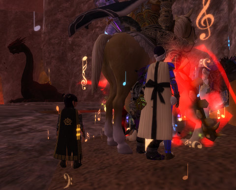
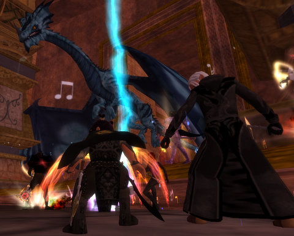

Back to: [West Karana](/posts/westkarana.md) > [2008](/posts/2008/westkarana.md) > [December](./westkarana.md)
# EQ2: Raids always can use another troub...

*Posted by Tipa on 2008-12-19 01:20:34*

Dream of Mirror Online got rolled back to yesterday evening. Everything I wrote about in my last post -- gone, like it never happened. I suppose I shouldn't be upset, because I still had the fun and the memory hasn't faded, but now it means I have to level my alchemy again, do that trash quest again, make my level again, do all that gathering again...

UGH. I HATE THAT.

So I decided I would wait a few days to cool down and try to make back what I lost Saturday, when we should be well and truly snowed in anyway. Tonight, I figured I'd spend some time in EQ2, where they hardly ever destroy hours of work any more.

I was kinda casually LFG, but didn't really expect to get one -- troubs aren't all that desired in groups, but there's plenty of solo stuff to do. I was working on some Frostfell quests, when I got a tell from someone I didn't know asking if I was VP flagged, and if so, did I feel like raiding?

I really didn't -- just having returned home from driving to Rhode Island and back -- but I'd just been telling Stargrace how much I missed raiding, so... I equipped my Worker's Sledgemallet, said hello in a really forceful way to the first Freeport guard I came across, zapped to Jarsath Wastes and ran to VP at bard speed.

They were at... Edona? Don't remember the name. It was one of the dragons I killed with Clan of Shadows way back when. Went beautifully, until just at the end when some adds got loose, but we recovered and finished the fight.

Next up was Druushk. I wasn't the only person there who was kinda hoping we'd pop over and kill Leviathan first; Druushk is the final mob for my mythical epic. The second to last mob, Leviathan, I killed last before epics were introduced.

Anyway, even though there was no possibility I would get my epic tonight, there's the chance that if I can convince these people that they really could use a troub, it might happen someday :) And maybe I'll meet some new people on this server and finally have people to group with!

So that would be nice.

We didn't manage to kill Druushk, unfortunately. Seems we'd miss clicking a statue or something, and everyone would suddenly get tired and need to lie down for awhile. The pulls got better, but some folks had to leave, so they decided to head to Protector's Realm and do a money and orb run.

It all is so completely clear to me now that I need to buckle down and get some resist adornments made for my gear. Aside from cold resists, I'm about 1-2K TOO LOW for raiding on every resist, and some are truly terrible. 

Anyway. Always fun to raid. I can't do it hardcore, but a couple of times a week? Love to.

## Comments!

**[Another Average Guy](http://anotheraverageguy.wordpress.com)** writes: get back to PWN

---

**Wrapye** writes: Resist adornments add so little that they are not worthwhile. It is better to get gear that has better resists on them.

You can probably get some in the new TSO instances and get some good resist gear, or at least get some shards to have gear made for you.

---

**[Tipa](https://chasingdings.com)** writes: Yeah, I loaded up on adornments, but only got a little over a hundred in all resists by going for, at Stargrace's suggestion, +WIS adornments. I'm definitely going to have to start finding groups for TSO instances.

---

