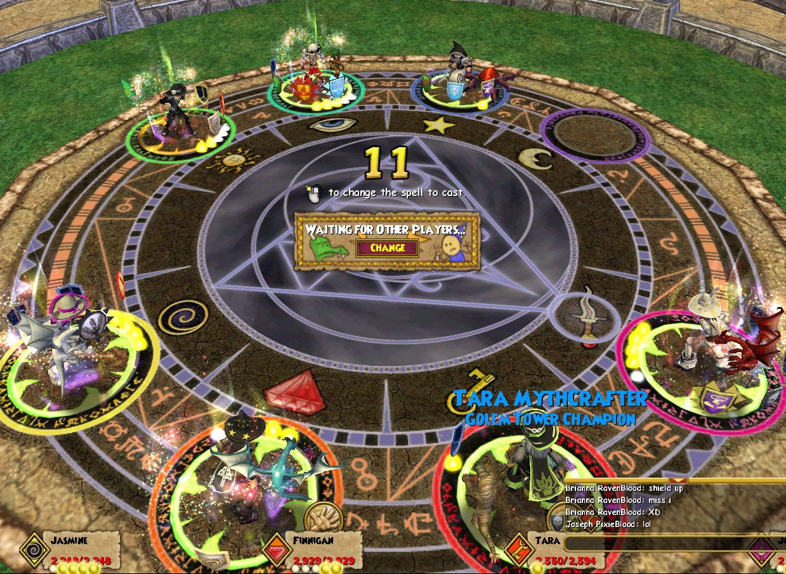

Back to: [West Karana](/posts/westkarana.md) > [2008](/posts/2008/westkarana.md) > [December](./westkarana.md)
# Wizard 101: Killing me softly with your spells

*Posted by Tipa on 2008-12-20 19:39:10*

  
*High level players gathered at the duel masters*

Wizard 101's surprise announcement of a full PvP Arena system to accompany the PvE-focused excitement of the next world, Dragonspyre, early next year shocked and electrified the community. It's one thing to beat easy and predictable computer opponents in the W101 game of magical cards. Battling human players is a whole different story. You can't truly say you're a master wizard until you can beat human opponents.

Can Wizard 101 deliver both a kid friendly game and also satisfying PvP?

  
*About to lose a 1v1 duel*

Dueling has always been in the game; one of the first quests you get in Wizard 101 takes you to the Arena to learn the finer points of battling with cards. The new Arena system builds on the old one. You still go to the Arena, but instead of heading down the stairs and into the Arena, you speak with one of the two guards on duty. Tweedle Dee (the one on the left) matches people up for ranked missions, from individual 1v1 duels to 4v4 *grand mêlées*, and lets you peek in on duels and battles in progress.

Tweedle Dum (on the right) sets you up for practice duels. Unlike the ranked missions, battling here won't change your ranking. Here, though, you can just play for fun or wager on the outcome of duels. When you tell someone to put their money where their mouth is, Tweedle Dum is the man to see to let you work it out on the hot sands of the dueling ground.

  
*Filling up the team for a 4v4 battle*

Unfortunately for PvP anyway, there is no smack talking on the dueling fields. And since there is no team-specific chat, casually suggesting to your group that everyone focus on the Life wizard on the other team is going to be clearly heard by the other side, who likely have different ideas of what to do with their main healer. This makes it hard to coordinate attacks among team mates. All you can do is hope your team mates figure out what you're doing and follow along.

  
*Us vs Them on the killing fields of the Arena*

Not that there's terribly much variation. In 1v1 duels, wizards tend to use very short decks that focus on multiplying a specific attack to end the duel in spectacular 3000+ damage fashion. My very first duel, I was killed by a necromancer who had two traps on me, two blades hovering over him, and I just couldn't find my myth/death shield fast enough to blunt the blow. I knew darn well what was coming, but I couldn't avoid it, and learned my lesson.

In duels, shields are your best friends.

The larger 3v3 and 4v4 fights are all about the group damage spells. You'll never kill the other team by focusing on just one; the others will just heal them, as everyone has heal spells either in their deck or their sideboards. Massive group damage is the only way to keep people worrying about themselves and not about helping out their team mates.

  
*My evil twin. I so totally killed her in battle*

There is something truly satisfying about surviving an arena match full of people who likely are better geared and higher level than yourself. I've never seen so many level 50 people as I have seen today. It's been virtually impossible for Johnny-come-latelies such as myself, who took my own sweet time leveling, to level past the mid-40s since KingsIsle removed the experience for repeating instances.

  
*Comparing PvP (left) and PvE (right) gear*

MMO PvP has always suffered the twin Achilles heels of level and gear imbalance. W101 is not particularly a level-focused game, except as far as the level and quality of the spells you have in your deck. You can, after all, just buy those cards at the various card vendors, so even a level 1 wizard can (potentially) cast the most damaging spell in the game if they have the treasure card for it.

Gear is also not an issue, since every single person -- without exception -- that I fought today was outfitted either completely in RMT gear (which you can buy with vast amounts of in-game gold if you don't want to pay real bucks for the stuff), or in a combination of RMT and Oni gear (as I am).

RMT gear gives you good resists across the board, improves the damage of every spell you cast, improves your chance of getting power pips, and all around, is just good stuff to have in a duel.

Diego, the horse guy who instructs new wizards in the art of the Arena, also sells special PvP-oriented gear that can be bought only with Arena tickets. You get 3 of these tickets for losing a ranked Arena battle, and 10 for winning one. If you are the world's best player and win every one of your Arena duels, then just 105 of them later, you can afford the above robe, roughly comparable to the robe I won from the Jade Oni, pre-Oni loot nerf.

Neither robe at all compares with the RMT robe, though. Both the PvP robe and the Oni robe only boost Life damage and resists, where RMT robes improve ALL resists and ALL damage, and toss in a spell to boot.

Balancing PvP gear is a tough job no matter what the game. Here in W101, they have chosen to balance their PvP gear according to the best PvE gear of the same rank; but few duelers at max level won't have the RMT armor, which dwarfs both the PvP and PvE gear. I imagine KingsIsle still has some PvP gear balancing to do; either to make it easier to obtain, or markedly superior to the RMT armor, or possessing some special attacks that are only useful in duels. As it is now, folks will just use the RMT armor.

Once you have queued up for a match, you can go about your business and you'll be ported to the Arena when your teams are ready to battle. This doesn't seem to work while in minigames, though, which is too bad, since they have a fun new minigame I was having a good time with today.

The lack of guilds or clans has been somewhat eased by having the teams you form persist from battle to battle, which is a nice touch -- but I would still really prefer to have a guild or a clan so we could discuss fights and strategies without the rest of the world listening in.

As a Life wizard, there is no way I can match the sheer damage output of other classes, but I can definitely make it very tough for an opposing team to take my team down. I would definitely prefer, then, to stick with 3v3 or 4v4 fights where my particular powers can shine. 1v1 duels are fun, though... but it often comes down to keeping shields up and heals going. Almost all the duelists I met today were *extremely* well prepared for battle, with tightly focused short decks and sideboards full of useful cards.

Duels are not something you can sleepwalk through, and that is likely the best reason of all to join the fight.

## Comments!

**[Jason](http://www.channelmassive.com)** writes: I just wanted to stop by and thank you for all of your W101 coverage Tipa. 

Even though I'm not playing it right now, I plan on giving it a shot.

Keep it coming.

Jason (resident drunken idiot of Channel Massive)

---

**[mbp](http://mindbendingpuzzles.blogspot,com)** writes: Hi Tipa, I have always been sceptical about W101 because it seemed like an adults game that was being marketed at kids. From your blog posts I can see that the game is developing real depth and I note that you have already convinced others to play (adults as far as I can tell). Perhaps my skepticism is misplaced. As one of the games greatest evangelists what do you think? Did they position the game wrongly. Could it be more successful if they just accepted it is an adult game and got rid of the chat restrictions or are they right to try and pull in the kids?

---

**[Tipa](https://chasingdings.com)** writes: @mbp Most of us adult players would have preferred that KingsIsle position W101 as a family game, like DOMO, and not so much just to kids. It's clear the chat filter is nothing more than an annoyance for everyone, and the lack of community features such as guilds or custom chat channels is a probkem. The game itself is well-implemented and fun, though, and so there are bunches of adults who play.

If they made an adult-only server with no chat restrictions, it would make a lot of people happy.

---

**Colin WaterBreeze** writes: Hey I am in the picture. Red and green my pets name is muffin the elf

---

**[Wizard 101: A Friday Night Date &laquo; Bio Break](http://biobreak.wordpress.com/2009/01/03/wizard-101-a-friday-night-date/)** writes: [...] bloggers have given their time and enthusiasm to the game, and I suggest checking out their posts: West Karana, The Common Sense Gamer, Mystic Worlds, Hudson’s Hideout and Stylish Corpse.  If adults who [...]

---

