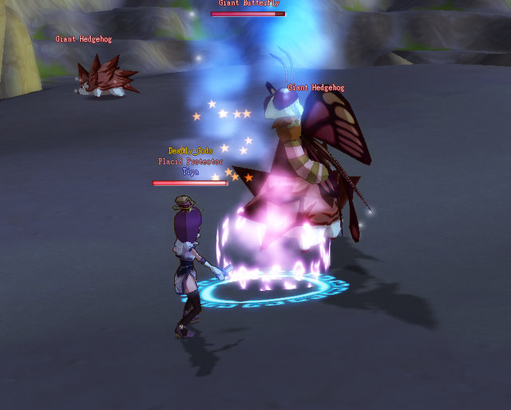
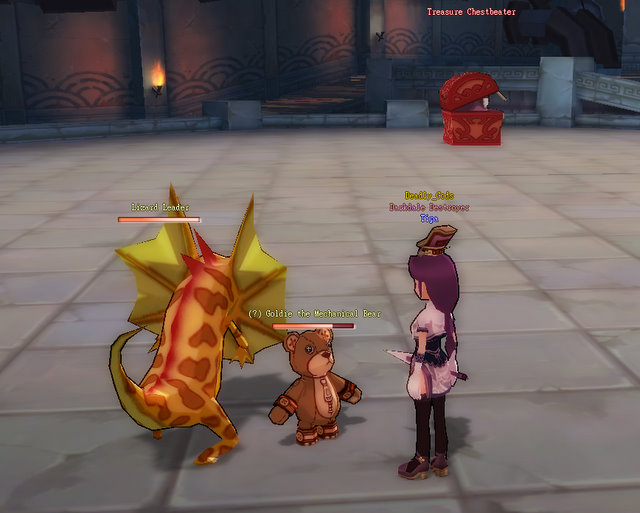

Back to: [West Karana](/posts/westkarana.md) > [2008](/posts/2008/westkarana.md) > [December](./westkarana.md)
# DOMO: Level 25, but Alchemy is hard :(

*Posted by Tipa on 2008-12-22 08:50:27*

  
*Taking on the Giant Butterfly outside the bandit camp in Copperhorn Mountain*

Nobody is as impatient at my slow progress through Dream of Mirror Online as I am. I wanted this weekend to be all about the Alchemy. I lost my Alchemy levels (as well as Thief level 24) in the Great Rollback Disaster, and I wanted to make that all back, but mostly the Alchemy.

I have this grand design for my weapon upgrades. I REALLY want to make my own level 20 weapon. The bonuses for a crafted Hunting Knife made with Excellent-grade materials make it a FAR better bargain than the one you can buy from a vendor. Plus, its Earth bonus damage would make it a great companion to my level 23 Damp Knife, which carries a Water bonus.

The only thing standing between me and my new dagger is gaining level 10 in Alchemy. Any player can craft things up to level 9. To make the dagger, I'd have to allocate Commoner points to extend my Alchemy cap to level 19, and also extend my Meditation skill to 19, as the recipe takes Blue Powder, which cannot be gathered by anything less. I was lucky to get a Commoner's Spring from doing the Drill Sergeant quest in Swan Lake Basin, which gave me five points to allocate, and I got another Commoner point from handing a refined Dino Oil to an NPC in Copperhorn Mountain. Dino Oil is refined from 20 Dried Lizards found off the many and various lizards of Copperhorn Mountain; and so I spent most of Sunday lurking about there.

  
*I came across the Sandstone Lady Bug after turning in my Dino Oil for a Commoner Spring*

There's no better way to really get to know a place in DOMO than by getting the zone's kill quests. The kill quests for Copperhorn Mountain are given by the Darkdale Destroyer, just up the stairs as you enter Darkdale. The mobs are, on the whole, WAY easier than the mobs in Placid Plains, and about the same level. There were lots of people there. I got a group fairly quickly and we ground out the kills -- altogether fewer kills needed than in the Placid Plains quests. If you're level 18-23, coming here might be a better idea than heading straight to the Plains. Though I did get an excellent group there the other night... I guess it always is all about the groups.

Many, many lizards, plants, moths and hedgehogs later, I hunted down the two bosses in the zone, slaughtered them, and earned the title of Darkdale Destroyer. The Darkdale Village Elder wouldn't offer me the quest to unlock the local dungeon, so it seemed (having gotten 24 back along the way) a good idea to try and clear out some older quests and perhaps reach 25.

  
*Trying (and failing) to solo the Treasure Map instance in the Eversun Inn Basement*

I'd captured one of the Copperhorn lizards in a mirror, and my pet had hit 18 and gained a very cool magic armor buff, and I was higher level, too, so I thought that maybe this time I'd be able to take on the treasure chest at the deepest part of the Inn Basement dungeon.

Twenty minutes later, when the instance timer ran out, both Teddy and the lizard would be dead, and I'd be just a sliver of health away from joining them.

Itziar suggested I get a cask group and ask them to help. Well, I would have, but there were no cask groups around when I entered the instance. Soon, though, one showed up, and I got myself invited in. After we cleared the platform of casks, in we went (and there was another person who also needed it, so it was all good).

  
*With friends to help, the Treasure Map instance went much better*

My usual solo tactic was to do as much damage as I could without dying, run off, rest and heal, then rush back in and repeat. This tactic was too slow to win. Tanking the mobs with a level 15-24 group didn't look like it would work too well either, but we managed to finish off the chest, the goo that came after it, and the four adds it summoned. It was a close and narrow thing, but we finally got that done and got a huge amount of experience from it.

I stayed in the group for awhile, pulling and doing some AEing. When the healer (lv 15) complained she wasn't getting much xp with me in the group, I asked to be allowed to stay just for 10% more xp so I could reach level 25. She said okay, I leveled, gave my thanks, and headed out.

  
*Itziar tells me the pink line joining us means this sprite and I feel a love connection. Um. I don't think so!*

I'd made back my level amd gotten another, but my alchemy was still in trouble. Crafting items with the stuff I'd harvested before the rollback had earned me alchemy level 8; when I redid those same steps after, I'd only gotten to 7. I did herding for awhile to get some more down, and made 8 on my first combine. I then did some meditation for awhile and afterward made some Iron Axes, level 18 weapons for Mercenaries from a level 8 recipe, but didn't manage to hit 9 again.

So, today while at work: Meditate for some more Red Powders, and keep making weapons until I hit the Holy Grail of level 10. Then use advanced meditation to obtain some Blue Powders, make my Hunting Knife, do some kill quests to level it up, then upgrade it to a level 25 dagger.

That should be enough for one night...

## Comments!

**Aliesthan** writes: I'm sorry, but I've got to correct you...
My chars name is ItziAr :p
Besides that, what's that about Excellent-grade materials?

---

**[Tipa](https://chasingdings.com)** writes: Oops, corrected :)

From what I can gather, the quality of materials used affect the variable damage bonus of the weapon, and store bought weapons are not the best quality. Thus, it is always better to find a crafted item than a store-bought item.

---

**[Faith](http://frankensugar.com)** writes: This is a sincere question: does the game get more fun? Or how can I keep myself interested long enough to get past the beginning? I just can't seem to motivate myself.

---

**[Tipa](https://chasingdings.com)** writes: I found it got a lot more fun once I got to level 10 and was able to try different jobs. Unlike modern US MMOs, though, it's not really a very fast paced game. You have to expect a game where leveling is not really the focus. In most modern MMOs, leveling is all there is, followed by end game stuff.

I don't even know if there IS an end game in DOMO.

---

