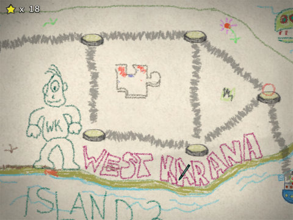
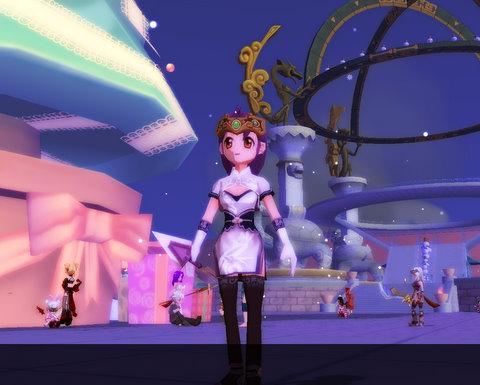

Back to: [West Karana](/posts/westkarana.md) > [2008](/posts/2008/westkarana.md) > [December](./westkarana.md)
# Crayon Physics Deluxe & DOMO Christmas

*Posted by Tipa on 2008-12-23 07:50:19*

Ripped right from the refrigerator door, [Crayon Physics Deluxe](http://www.crayonphysics.com/) answers the age-old question, "What if those drawings I made in kindergarten were REAL? And I had to guide a ball around them to collide with stars for points?"

The developer has just released the beta/demo, so it's only the first two worlds and a partially functional level editor, but it's cool to think of inventive ways to bring your drawings to life as incredible, crudely-drawn, machines.

Level editor? Sure, I couldn't resist making one of my own.

What music student has never been felt trapped on a staff! Will you trickle down the triplet? Sneak past the hemi-demi-semiquaver? Out-ferment the fermata? (Okay, I forgot to put the fermata in...). One glissando too many, and you could find yourself dropping straight into the bass line... and nobody wants that.

Crayon-based physics puzzle fun. Love it. The full game should be coming out fairly soon... I hope.

After all the meditation I did yesterday, I was only able to get my alchemy in Dream of Mirror Online up one more point, to 9. Just one more to go. I thought that by buying a slightly better kind of incense that I would be conjuring up some blue fragments, but nope, all red. I seriously can't imagine the sort of effort it's going to take to get alchemy from 10 to 15 or 20.

Itziar clued me in to DOMO's Casino Night, where you buy tokens to use in slot machines in the hopes of winning snowballs which you can use to purchase stuff from snowman vendors. I dropped a couple thousand gold into those machines, winning me loads and loads of steaming ... prizes ... and all I could afford from the snowball vendors was some sort of pet saddle which won't work on my pet. So, pretty pointless.

They brought DOMO down last night to add in the holiday decorations. When it came up again, winter was everywhere! I don't know about you, but I'm right in the middle of REAL winter right here. I even got my car stuck in a snowdrift last night. So, mostly in my video games, I want to see warm things. 

Anyway.

Gameiro is working on alchemy too, so he's going to build his forestry up, which will make light armor crafting a lot easier. For some reason, that takes a lot of wood.

I also finally finished downloading and patching that other game, so I played that some while waiting for DOMO to come back up. It's... full of really, really small text.

## Comments!

**Aliesthan** writes: Where were you meditating?
As far as I've experimented (and what i've found in the forums :p) you have to move to diferent spots to gain higher level materials. 
Let's take for example meditating:
If you meditate in the eversun temple, you will only obtain red powder, no matter what inciense you use.
In the other hand, if you go to the Eversun South meditating area, and you use the lvl 2 inciense, you will pick blue fragments with a low chance of gathering red fragments instead (like 5% or less). So, if you want a 100% chance of gathering blue fragments, you should go to... the Blakatoa map.
Link to Reference for Gathering spots -> http://forums.aeriagames.com/viewtopic.php?t=53490

On other sort of things, it seems that last night "Casino Night" had the worse rewards in weeks. Only thing i found useful was the 10 snowballs prize, a pill that boosts exp & drop rate by 50% for 1 hour. Some people were complaining for the lack of big prizes (150+ snowballs) as normally those are Item mall costumes.
Anyway, I found it quite enjoyable although it was a bit tedious to buy the cheap tokens one at a time.

So... Can we know now what game is the one you started playing? :p

---

**[Tipa](https://chasingdings.com)** writes: Ugh. Yeah I'm even now standing in Eversun Temple, collecting red fragments. Oh, well.

I was even thinking of moving to the Eversun South place... well, assuming what I harvest today is enough to boost me to Alchemy 10, I guess I'll be out in Eversun looking for blue. I haven't been to Blakatoa yet, though... even though it's quite far, maybe it's a good excuse to explore :)

Thanks!

As for the mystery game? Um, everything will be revealed in good time :)

---

**[Saylah](http://notadiary.typepad.com/mysticworlds)** writes: OMG, I've been waiting for Crayon Deluxe forever! It was the first toy I put on my tablet PC in the summer. I played through the original and the fan generated additional levels until there was nothing left to do but wait for it.

---

**[Tipa](https://chasingdings.com)** writes: I've been waiting for this for MONTHS. I pre-ordered it awhile back; soon as I saw the email announcing it in my inbox, it was being installed :)

---

**Norikue** writes: Here's a similar link to the one Aliesthan has. http://domocamp.com/domowiki/index.php?title=Alchemy\_Ingredients

Domocamp also has listings for most of the recipe pots. I think they are lacking with the newer zones right now.

---

**[Tipa](https://chasingdings.com)** writes: Very useful links :) I used yours last night to find the meditation area in Blakatoa which, let me tell you, is not incredibly obvious. It's out behind some houses.

---

**dalenna** writes: domo is awesome it is my favorite thing to go to ^u^

---

