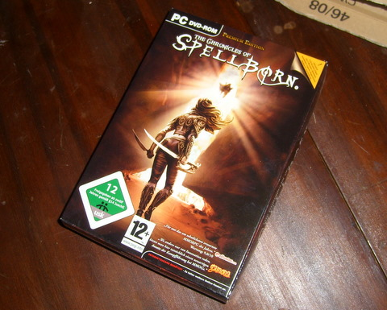

Back to: [West Karana](/posts/westkarana.md) > [2008](/posts/2008/westkarana.md) > [December](./westkarana.md)
# Not sold in a store near you...

*Posted by Tipa on 2008-12-24 08:04:26*

... if you live in North America, South America, United Kingdom, Albania, Andorra, Australia, Bosnia & Herzegovina, Bulgaria, Croatia, Cyprus, Czech Republic, Estonia, Greece, Hungary, Italy, Israel, Latvia, Lithuania, Malta, Moldova, Poland, Romania, Serbia & Montenegro, San Marino, Slovakia, Slovenia, Spain or Turkey, anyway.

The art book is pretty :) Comes with a map and a flyer for the soundtrack CD, too. The art book is in English, the manual is in German, but both are written in a type that is too small for me to read, so I hope neither contained important info.

I haven't installed it yet...

## Comments!

**Beau** writes: yay! I have been flying to France every week to play, and I am liking the full version a lot.
 
 I just upgraded my account, without the box.
 
 Anyway, I am playing on the Intl. PVE server...I'll look for ya after Xmas! :)

 Beau

---

**[Tipa](https://chasingdings.com)** writes: Flying to France to play? Now THAT'S dedication :)

I'll look for ya!

---

**[Sente](http://adingworld.wordpress.com)** writes: Too bad you can not read the manual, I was going to ask if you could see if it contained any important information...:)

I'm also on Dravhavre (International PvE).

---

**Arboris** writes: It's a really fun game, and don't worry about the manual, it's quite easy (and people actually use the zone chat, so if you have a question, just shout ;) )

---

