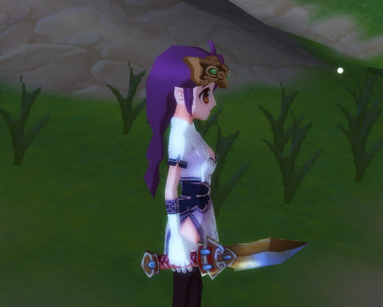
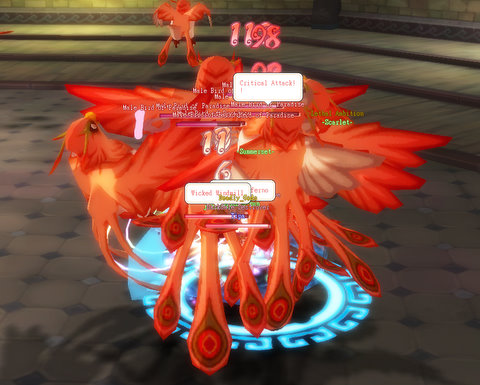
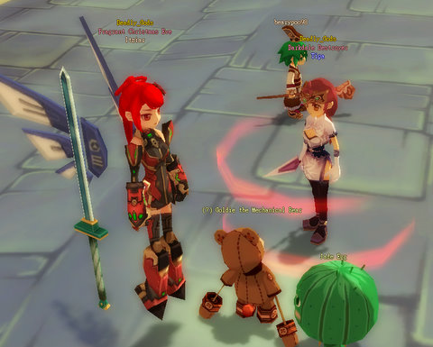
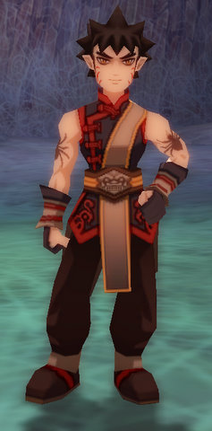

Back to: [West Karana](/posts/westkarana.md) > [2008](/posts/2008/westkarana.md) > [December](./westkarana.md)
# DOMO Mission night

*Posted by Tipa on 2008-12-24 08:47:38*

You don't lose xp when you die in one of Dream of Mirror Online's missions, which is very nice of the devs, because, who'd do them then? We died A LOT. It was mission night in the "Deadly Gods" guild, and we went all over the Mirror Worlds, advancing the plot lines that take you through the game.

First, though... I got my alchemy to 10 (FINALLY! And with plenty of powders left over, too!), and made my Hunting Knife. It took two tries, but I had enough blue powder for three, so I wasn't worried. I had to level up the dagger in order to upgrade it, and that was just about the time I got invited to a Male Bird of Paradise group in the Phoenix Tower. There was a lower level thief in the team, so I figured I'd get to use my AE abilities.

Nope. I was asked to pull. So I did. Soon, another group came by and set up shop on the other side of the room. There's plenty of spawns in the room, so I wasn't worried, but they were aggressive pullers.

REALLY aggressive. Sometimes they'd even AE the mobs I was luring back to my group and yank them to theirs. Many times I'd stand toe-to-toe with their puller, wrestling for the mob. They were ALL OVER our side of the room. Super frustrating. By the time the group broke up, though, I had dinged 26 and was 3/4 of the way through to 27. Not bad, and since my Thief goal is to get to 30 before dropping back to another job, likely Musician, I am progressing really well.

Itziar wanted me to stop by after the group to get a picture, because I was to blame for the new DOMO addiction. I'd talked to Itziar lots, but we'd never actually met, so I was thrilled to get together for a photo-op in Eversun city.

A sylph. A dirty, no good, rotten sylph. They're too GOOD to touch the ground or to hold their weapons.

Well. This is the modern era. I will allow myself to be seen with sylphs. CERTAIN sylphs.

I meditated awhile, then headed to the Inn Basement to try and pilfer a Chef's Knife recipe from a Caskmaster for Gameiro, but no luck there. While doing my best to make those wisecracking barrels shut their boozy faces, the guild invited me to come along on some plot missions.

Well, duh :) Of course I'd come.

The first mission took place in the Pandora's Box mirror world, from a mirror deep inside Neptune's Tower. Our job was to defeat one of the great animal spirits that were turning beasts against people, the Great Northern Turtle Spirit. Defeating him is as close to a raid as anything in DOMO.

It didn't end well. In fact, we didn't even scratch him before we all died. So that one goes on the back burner until we're all 40 or so.

We did the Black Widow one, another one I can't remember the name of, and my mission, against the Crossbone Swordsman.

I got to be the star of my own little movie :) It seemed I was usually just out of the frame for the cinematics to everyone else's movies, totally a spear carrier in someone else's film. But this one was all about me. When the movie ended and the fight began, the swordsman only had a chance to use his AE 50% HP attack once before he died.

After that, it was off to the Farrell Family Crypt to defeat Octavius, one of the good guys from another mission. One of the earliest decisions you make in DOMO is to choose sides in the battle of people vs the beasts -- you can choose to kill all monsters, or choose to try and bridge the yawning chasm between beast and person. I chose the latter. So in the missions, friends in one person's mission can be enemies in another.  Such was the case with Octavius, an NPC who looked so much like Goku from Dragonball Z that whenever he'd show, the team chat would be filled with "HIS POWER IS OVER 9000!" and such.

He'd been the hero in the previous mission, holding off hordes of the evil Empire Guard by himself while those members of the team who survived the initial assault (not me) peeled one after another of the guards off and killed them.

In the Farrell Crypt fight, he was the enemy, and when he hit, we hurt bad afterward. The first three or so times we tried this, we had no Doctor, and hence no healing. And then a Doctor joined the guild :) Two tries later, we finally had Octavius and his two evil spiders dead.

By then it was very late, I had to go. It was a fun night in DOMO, though.

And I finally made my Hunting Knife (squeeee!)

## Comments!

**Aliesthan** writes: WHAAAAT???
No more cookies for you... humph.

---

**Gameiro** writes: Hey Tipa, grats on the Knife and Alchemy. I found a good soul yesterday who had the recipe for my Chef's knife so I am now walking around sporting a giant gold-like chopping knife. Thx for offering to help out, am planning on reverting to my commoner and using the spring I got from the Dino sauce quest to get logging up some more. See you IG some time soon hopefuly

---

**[Tipa](https://chasingdings.com)** writes: @Aliesthan awwwwww *sniff* I'm sorry :( Can I have just ONE cookie?

@Gameiro Woot! Grats! Itziar is doing advanced meditation so I'm hoping I can beg powders from her when needed, and if you're doing forestry, I should probably switch to something else. Herding or mining seem like obvious choices... anything you'd need particularly?

---

