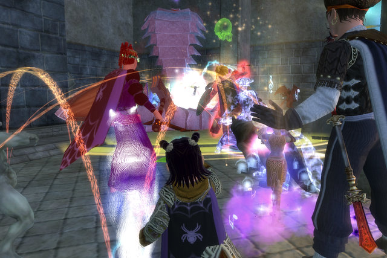
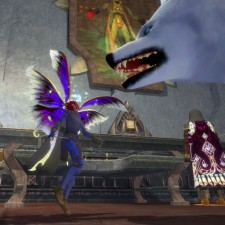
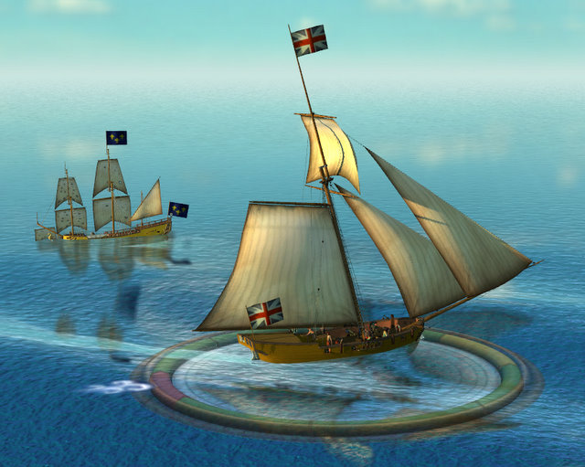

Back to: [West Karana](/posts/westkarana.md) > [2008](/posts/2008/westkarana.md) > [December](./westkarana.md)
# A look back at 2008

*Posted by Tipa on 2008-12-24 14:20:44*

2008 has been an absolutely amazing year for MMOs, and my personal progress through them.

Last year at this time, I'd just found the absolutely most perfect EQ2 guild -- they were great raiders, loved grouping, and were fantastic people besides. With Clan of Shadows, I managed to do every flagging raid for Ruins of Kunark and was ready to step in and do my best to help the guild as they conquered Veeshan's Peak. It wasn't to be; I didn't make the full membership vote. It wasn't even close. That disappointment, along with other things to fill my evenings, eventually led to the end of raiding. Without raiding, though, I didn't have much incentive to log in anymore. I tried to make things work with another guild, Delusions of Grandeur, but it just wasn't CoS. I guess if I couldn't make it in CoS, I didn't want to settle for a lesser guild.  

I started poking around back on EverQuest. I really missed my characters there. Not raiding, so much, but the friends, community and camaraderie that makes EQ unique. A lot of people commented that they'd love to play through EQ again, if they didn't have to do it alone. So I thought we might do together what we'd never do alone, and along with ten or so fellow former EQ players, started Nostalgia the Guild on the Luclin server. NtG peaked in mid-summer when we got to dragon killing level and put the hurt on two of the three bosses of the original EQ, Lord Nagafen and Lady Vox. (We never killed the third, Phinegal Atropos, as a guild). SOE's summer Living Legacy program had the unexpected side effect of boosting the power of our armor and weapons to raid levels, and a lot of things became possible with very few people. Although fairly diminished, NtG still meets Fridays to explore Old Norrath.  

Stargrace took the Nostalgia idea and brought it forward 500 years to the devastated Norrath of EverQuest II. I eventually transferred half my characters from Befallen to Najena to join the guild there. I'm getting the urge to raid and group again, so I may be moving some of them back to Befallen... the loneliness of a server I have no history with dooms me to pickup groups with players I have never met and will never meet again. Nostalgia EQ2's two active members aren't enough to build a group or a raid... so there's not much to do unless I want to do it alone. I hate playing by myself.  

In February, I restarted my Neopets account with the sole goal of reaching and beating level 100 of their Shapeshifter mini-game. Shapeshifter starts out as the kind of brain twister that is fun to solve, but quickly goes well beyond the bounds of anything that can be solved by unaided humans in a normal lifetime. So this supposed kids game is really a test of your ability to develop an algorithm that can solve an enormous non-directed decision tree before the Sun goes nova. With help and encouragement from other solvers, I developed a Python program I called Shifter that could solve the hardest levels in no more than a day, and often far faster. On April 1st, 2008, I solved the last puzzle and was the Neopets Shapeshifter Champion for the entire month.  

February also started my short-lived affair with Pirates of the Burning Sea. My son wanted to give it a try, so I bought a copy for him, intending to buy a copy for myself if I liked it. He grew bored with it. I liked it a lot, and made a character on his account, got up to a fairly decent level and was getting my free trading skills up, working through the storyline, and getting involved in some really exciting battles at sea.

It was on Station Pass, too! This was somewhat of a killer, actually. My son is not on the Station Pass, so I would have had to start paying for one or pay the PotBS subscription fee to keep playing, all the time I could be playing it for nothing extra if I just had my own account.

I wasn't sure I wanted to start all over again, or pay to buy another copy of the game, so I just let it lapse. There were plenty of issues, but the game had amazing character and ship customization, absolutely gorgeous and tense battles, and I even liked the story. Sailing back and forth on the Caribbean though, not so much. Having to depend on a wide variety of people to make goods, definitely not so much. I wanted to play, but I just didn't have the time or the money.  

I felt sure that by the end of the year, I'd be totally engulfed in the one sure-fire hit MMO of the year, Flagship Studio's Mythos. I've played a lot of Diablo clones, and even some, like Cronous, that try and take the action RPG into the MMO realm, but none had nailed it like Mythos. Even before they expanded the heavily instanced Overworld into a more world-like map with zoning only for cities and dungeons, I felt they had made perhaps the ultimate casual MMO... Rumors of money trouble inside Flagship turned out to be truth, and over a tumultuous weekend, Hellgate: London, their other title, was taken by their Asian publishing partner, and Mythos was dead.

I would like to be playing Mythos right now.  

**Insert Massively Logo Here!**In March, a major new chapter of my life began when I was hired to blog about breaking MMO news for Massively.com. The pressure of writing so many articles, keeping a full time job, trying to keep Nostalgia rolling, and raiding in EQ2 eventually left me unable to do any of these things well. I put my full time job first, where it had to be, and focused on real life issues, like getting my son enrolled in college and figuring out how to pay for it (answer: I didn't. I am broke all the time now :( ). My Massively adventure ended after an ill-fated trip to the SOE Fan Faire put me in massive (sorry) debt, and my job was cut down to doing EQ2 guides, a task for which I was incredibly unsuited, since I was hardly playing EQ2 at all at that point (which continues to this day), and I'd never written a guide to anything in my life :P Massively and I parted ways in September.  

I went back to writing just for West Karana, where I planned to change the direction of the blog from just chronicling my adventures in mainstream MMOs to seeking out, playing and being an advocate for lesser known MMOs.

It's not that I don't like the AAA, high budget, huge marketing department MMOs. I just find them too similar to each other. So many players look eagerly to a new MMO to banish the blahs they feel with the game they currently play. They play the new MMO for awhile, discover that it's essentially the same as the game they already played, and pronounce the entire genre dead.

I was looking through MMORPG.com's list of games, and some of them looked totally, wildly different from anything I had ever played. Somewhere in those hundreds of games would have to be dozens that went in a new direction.

Oh yeah, there were. BUNCHES!

In early July, I discovered Wizard 101, probably via Massively. This was an entire MMO built around a wildly kooky collectible card game. I was absolutely and utterly hooked. This was the sort of thing I'd been looking for -- an MMO that was just entirely out of left field. It was superficially a kid's game but quickly turned into a game requiring strategy and teamwork and great skill in deck building. I played until they turned out the beta lights, took a couple week's break, then started right in on the live game.

If anyone wanted to dip their toes into MMO gaming, I wouldn't give them a copy of EverQuest II or World of Warcraft. I'd sit them down in front of Wizard 101, right where the Headmaster of Ravenwood School of Wizardry is giving a test to see what sort of wizard you are. It's not Hogwart's by another name. It's something new, unique and fun. Wizard 101 was one of the breakout hits of 2008, and I expect wonderful things from it in 2009.  

My on-again, off-again relationship with City of Villains flipped "on" again for awhile in July and August. I love the idea of a super-hero, comic book game, and I like what NCsoft has done with the game since they acquired it from Cryptic, and the character creator is unparalleled, but... the repetitive gameplay just can't keep me for long. I started to get into their crafting system, but after awhile I just stopped logging in. I'm still subscribed, for now, because I am waiting for the mission designer coming in Issue 14 or 15. I want to see what that is like.  

Spore owned my gaming time for a few weeks in September. I really wanted to like the game and very much enjoyed building new creatures, vehicles and space ships. I just didn't get into the space game that is the majority of the time spent playing -- you breeze through the other portions in an hour or less. It still has a place on my hard drive.  

Recently, I've chucked pretty much every game into the back seat in order to play Dream of Mirror Online. I played this game briefly earlier in the year, and it made a very good impression, but the huge number of games out at that time pushed it away before I'd gotten to level 10, where the jobs, and the game itself, open up. As I played it, I couldn't help remembering the last game that made me feel this way -- the original EverQuest. I began to notice a lot of similarities between the games -- death penalties, slow leveling, an emphasis on community over leveling, wide open zones and dungeons -- it was EverQuest! A Taiwanese game company had managed, somehow, to meld EQ's gameplay and community with the Asian anime-flavored, cinematic games. Absolutely stunned me, and I am having a lot of fun playing it.  

Honorable mentions: Guild Wars -- I want to play this more. Why don't I? I don't know! Probably because I hate playing alone. Florensia -- another Asian import. I loved the fact that it had a cool land game AND a pirate-themed sea game, but it reminded me of DOMO so much, I figured I'd just play DOMO (good call). Vanguard -- even though it runs crappy on my machine, I still pick it up now and again, and it still has a spot on my hard drive. Spellborn -- this was intended to be a major part of my fall gaming, but it has been pushed to next year. I still have high hopes for the game, if not for the publisher's commitment to the title.

2008 was a very intense year for MMO gaming, full of tales of intrigue and adventure -- and that's just the marketing departments! Some of this year's biggest releases -- WoW's expansion, Age of Conan, Warhammer Online -- I just could not find time for. 2009 isn't looking as intense as 2008, but it might well be SOE's time to shine if they can get The Agency and Free Realms out the door. Champions Online is also scheduled for the year, and perhaps DC Universe Online as well, giving NCsoft's City of Heroes a run for its money and market share. News of Star Trek Online and Star Wars: The Old Republic should keep people thirsting for more space-themed adventure in 2010. And, Spellborn!

Happy holidays, fellow gamers :)

## Comments!

**Shawn Schuster** writes: For me, as a reader and one-time fellow co-worker of yours, I must say that your progression through 2008 on this blog has been astounding. You are hands down my favorite blog to read about the lesser-known MMOs and I really appreciate all the work you do here. Actually, I'm sure it's not even work to you, but it's still an amazing amount of passionate writing you do about our favorite topic. Happy Holidays, and here's to 2009!

---

**Shawn Schuster** writes: Er, former co-worker, is what I meant :)

---

**[Pete S](http://dragonchasers.com)** writes: Wow, what a great post. I can't remember what I was playing last week, let alone last January!!!

Happy Holidays to you, too!

---

**Gnewton** writes: Great stuff as usual Tipa. =) 

I miss NtG... but I'm still working on Fridays... Might change that soon. Have LOTS of changes going on in my life. We'll see where that leads me.

Happy Holidays, Merry Christmas, and Happy New Year to you and your family Tipa!!!

/hugs from Gnewt!

---

**almagill** writes: Best wishes to you and yours, Tipa.
Hope that you all have an excelent Christmas.

And a big thank you for a wonderful, funny, informative blog that has kept me entertained all through '08.

---

**[Openedge1](http://simple-n-complex.blogspot.com/)** writes: WoW...can you believe it is almost over as well? Impressive work on your part.
Also a big thank you for pulling me through a tough situation this year (my first year in blogging myself), and letting me know we all have a voice no matter how informative, cranky, sensitive (or insensitive) people can be...

Cheers

---

**[Danshir](http://themmoexperience.blogspot.com)** writes: 2008 has been a great year for MMOs! It's also the year a nice author of West Karana helped a noob of an author get his legs going for his own blog. I've always enjoyed reading over here since I stumbled upon it around Novemeber*I'm really new to this eh?* yet Tipa's mastery of weaving a story out of her experiences is worth at the very least some cookies.

Also I shake my fist at her! She got me into DOMO and I can't stop =(.

Happy Holidays everyone, and a great new year!

Note - 09 is going to be the year! Jumpgate/TOR/Spellborn/Star Trek, we're going to see *hopefully* more original MMOs instead of WoW clones.

---

**[Lars](http://mmomentofzen.blogspot.com/)** writes: *I’m getting the urge to raid and group again, so I may be moving some of them back to Befallen… Nostalgia EQ2’s two active members aren’t enough to build a group or a raid… so there’s not much to do unless I want to do it alone. I hate playing by myself.*

Re: EQ2 -- There are plenty of great raiding guilds on Najena. Why not apply to one of them if that's what you are inclined to do?

I can understand not wanting to play alone. While I'm of no help on the raiding front (Stargrace knows how my guild's raids tend to go :) ), I always love to group for instance runs or help out on quests, etc. PST!

I love your blog because you review so many different games. Even though many of them I would never get around to trying myself, I get a chance to experience their varied game mechanics and lore and what not through you. 

While you might not see much to look forward to in 2009, I am actually quite excited about them. There are several games coming out, and as Danshir notes, thankfully most of them aren't fantasy WOW clones: Jumpgate, Champions Online, Stargate Worlds, The Agency, Earthrise. Even Darkfall is fantasy but no WOW clone. I look forward to reading about at least a few of them, and plenty others I never heard of before, here!

Happy holidays!

---

**[The Friendly Necromancer](http://thefriendlynecromancer.blogspot.com)** writes: Excellent work, Tipa! Well done.

---

**[Danshir](http://themmoexperience.blogspot.com)** writes: We should all just play one really good MMO when it comes out and make a guild named " The Bloggers " or some such hehe.

---

**[Toldain](http://toldaintalks.blogspot.com)** writes: Reading your year-in-review, it seems that I've been reading your blog for most of the year. And I'll keep reading it as long as you keep writing it. I'd tip my hat to you, but I don't wear hats, they hide my hair. So I'll just toss my hair at you. In a friendly, congratulatory way. 

Congrats!

---

