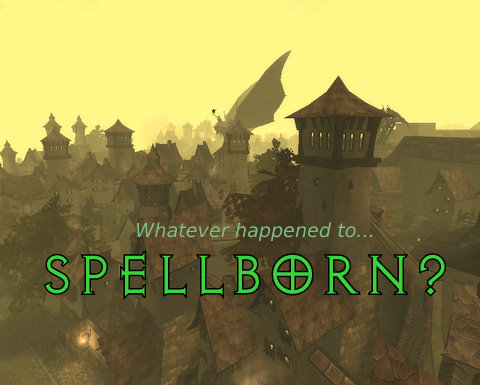
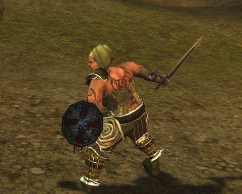

Back to: [West Karana](/posts/westkarana.md) > [2008](/posts/2008/westkarana.md) > [December](./westkarana.md)
# Did you ever get around to installing Spellborn?

*Posted by Tipa on 2008-12-30 02:36:23*

Kinda ragged... spent all night backing up my blog, then I decided to make the new blog really snazzy, then I REALLY fouled things up so that I couldn't get email any more, and don't even ASK me how that happened, because I SWEAR I don't know...

I was thinking of sleep, when I thought, hey, company is gone, I have the use of my computer back, maybe I could install Spellborn and, you know, PLAY IT?

I could and did indeed. After about an hour and a half of patching, anyway.

When I mentioned in an article I wrote for Massively awhile back that you could make overweight characters in Spellborn, a commenter said, 'Gee, great, a game for lesbians.'

That was kinda mean! And anyway, chubby can be cute!

So here is my human rogue, with a few extra pounds, but she can work them off adventuring! She sure can!

Way too tired to write more about the game. I will note that the game world may be gorgeous, but all you are seeing is that tiny little reticule. It knows all, sees all, guides all.

My character's name is Tipa, and she is on the International PvE server.

## Comments!

**[Sente](http://adingworld.wordpress.com)** writes: Welcome to Dravhave :) The character I have settled for is named Wolf, a trickster. The reticule certainly is something you focus on - it tells a lot of important info in combat and it helps find the items to interact with out of combat.

Watch out for Tiny Tyke if you get to Aldenvault.

---

**[Openedge1](http://simple-n-complex.blogspot.com/)** writes: Actually a study of EQ and EQ2 female players came up with the fact that a majority of females are bisexual, or maybe that is what the male population wished for...who knows..

Weird study...but, my wife did agree with it..

Anyways, this must have been that big download you could not tell us about? Or did you buy this in a box?
I am interested in overall performance...oh and population has to be horrible.. everyone is already stating the servers are empty (thanks to the stupid split of the subscriber base)

Good luck on getting the blog switched around.

---

**[Cow Nose the 50 Pound Cat](http://cownosethe50poundcat.blogspot.com)** writes: Hehe, no way I could keep from playing a new MMO if I had one waiting for me! Grats on getting all the hard work finished, I know that can't be easy. I can't imagine how much work it would take to backup my blog (even tho it kind of already is) I hope it was somewhat easier for you.

Hehe, and I totally agree chubby can be ultra cute. ^\_^

---

**[Tipa](https://chasingdings.com)** writes: I had family over that was collectively using every computer in the house. I watched a lot of movies and played games on the PS3 :)

@Edge -- I bought the German edition of Spellborn in a box, the collector's edition, and it finally got here a week or so ago. You will know the mystery game when the NDA drops, but I think you'll agree that in the MMO world, the mystery is nearly always better than the reality.

---

**Aliesthan** writes: Hmmm
A tip about the Mistery Game being in Beta state...

I bet it's Darkfall :p

---

**[Tipa](https://chasingdings.com)** writes: Yeah? How much?

---

**[Lars](http://www.mmomentofzen.blogspot.com/)** writes: So, what games do we know are in beta right now?

---

**[Openedge1](http://simple-n-complex.blogspot.com)** writes: @Lars

Aion
Stargate Worlds
Earthrise
Darkfall (I will count this out, due to the fact it is PURE PVP, and we know the Tipa loves her some PvP...NOT!!!)
The Agency
Champions Online

Of course, some of these have not had "true" announcements yet of beta's, so if we whittle down that list to "noted" beta's and ones Tipa would be interested in testing, we come up with

Aion
The Agency

Also of note, Earthrise did send out a newsletter stating they would be testing by the end of the year, but no "official" announcement.

So, there we have it. Tipa noted the game would be LARGE (noted a big download), so my biggest bet is for Aion.

Cmon folks, lets speculate some more...woot!

---

**[Openedge1](http://simple-n-complex.blogspot.com)** writes: ARGH!!

OOPS....My vote is wrong...I almost forgot...

**Aion has no NDA.**

So, now it has GOT to be the Agency!

---

**[Danshir](http://themmoexperience.blogspot.com)** writes: Your all wrong. Tipa told me..and I'll tell you..if you send 4 easy payments of $99.99 to...

I think either 

A). It's The Agency
 or
B)She's pulling our leg to make us all go insane.

---

