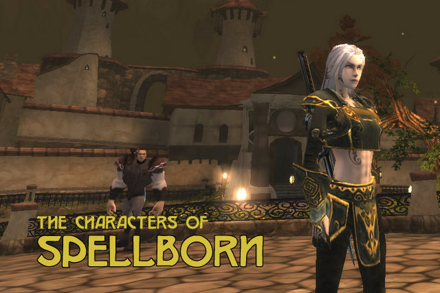

Back to: [West Karana](/posts/westkarana.md) > [2008](/posts/2008/westkarana.md) > [December](./westkarana.md)
# Character design in Spellborn

*Posted by Tipa on 2008-12-30 22:58:09*

  
*Erisa, a spellcaster. Her name is an inside joke :)*

I said this morning that you almost need to be an artist to make a character in Spellborn. I've played with the character creator for an hour or so and a little longer in the game itself, and I believe that is true -- but with a catch. You almost need to be an artist to make a character in Spellborn... that looks good in the character selection screen.

In the game itself, the characters are so small and the action so intent on keeping the Reticule aligned and the Skill Deck and the whole game world so dim and desaturated that really... the characters tend to blend together.

Many character creators these days are pages of sliders for every physical dimension. Spellborn's gives you selections. You paint your character first in broad strokes; limited selection of bodies -- six human and two non-human -- then add tattoos and age lines, then the under clothing, then the armor, then the weapons, most of which can be colored. By the end, you have a character mostly unique, but still, somewhat the same as all the others. After all, every character draws their look from the same pool of gear you got yours.

Still, you can make some cool characters :)

|
 Stout Henry. Heavy human male model. Little armor, blunt weapons. |
 Tipa. Heavy human female. She looks as if she's been swinging a sword her whole life. |
 Willowy human female. |

|
 Holyoke. Non-human female. |
 The Incredible Holk. Yeah, I wanted to see if I could make a comic book character. Huge human male. |
 Thin human male. If you work at it, you can make some cool looking characters. THIS guy could tell some stories. |

I played Tipa a bit last night, but I wasn't really catching on to how to play a rogue. I feel I should be strafing or jumping around more, but my fingers aren't that nimble. Or I am TOTALLY missing the easy way of dodging incoming attacks and keeping the reticule centered on the target and watching the skill deck roll and ... because, omg, isn't that enough?

Oh yeah, and the rapidly shrinking red bar that represents my health.

So, tonight I played Erisa, the spell caster. She's an albino with glowing red eyes, and she wields a sword which was forged a hundred million years ago by the... She's no relation to you-know-who. Really.

When I finally dinged 2 (finally!), I didn't want to just toss all my new, shiny skill points straight into Mind because, could that be bad? I know that the subclasses you get depend upon putting some points in another attribute, so would that really be the best for me?

That's when I opened up the Skill Deck and the Skill Library and started going through the icons and noticed something... Hey, these things go together like pieces of a very small puzzle.

So, follow along on that diagram up above. If I start with that Life Tap -- that's a Mind spell. It boosts the power of Mind damage spells for 12 seconds and gives you a little heal whenever you damage a monster with a spell. The skill deck rolls to the first rank, I hit the Mind spell there does severe damage -- boosted by the Tap -- AND boosts Mind! Skill deck rolls back to the second row, Slash there is a Mind based melee attack, which has just had its power boosted! It rolls back to the first row, where if the Mind spell is ready, can cast that again, or hit Hack to roll the skill deck back to the second row so I can recast Tap and keep the heals coming...

So that's really cool. It all fits together.

Is Spellborn going to win the coveted New Shiny award? Well, not until it becomes available in the US. I don't really want to get TOO invested in a game when it's only a matter of time before the people at Frogster decide to cut off all us people outside of, basically, Nederland, Germany, France, and possibly Belgium.
## Comments!

**Beau** writes: I just got into skill sigils and stuff..one of the most customizable games of recent time. :)

I haven't even started with the making of sigils and stuff..so who knows bout that. I can't wait to see it released in the US to make the crowd bigger.

 Beau

---

**TheRemedy** writes: I know it's your blog and I'm just a lowly peon reader but would it be cool if I made a request? Could you take some more screenshots of the buildings and other interesting architecture you see?

---

**[Pete S](http://dragonchasers.com)** writes: Hmm, Google says Employee Retirement Income Security Act?? Erisa?

Interestingly I was just struggling with the Vanguard character creator last night. Just all the sliders for body shape..it's so easy to make a really weird looking character but hard to make a 'normal' looking one.

Can't wait to try Spellborn!

---

**[Sente](http://adingworld.wordpress.com)** writes: The combat system really fits together nicely. From level 10+ you will also have access to different combo skills to also add into the puzzle game of setting up a skill deck which add bonuses. All skills before that can act as the steps in the middle of a combo.

Strafe, jump and move out of range are basically the mechanics to dodge. I.e. get out of the mob's "reticule" just before they attack and get back in and attack before they can do their next attack. And do not back into other mobs that aggros... Casting spells requires you to stand still though, so plays out a bit different.
Some skills will add a point to your physique/mind/concentration if you hit but loose one if you miss, so it can be harmful if you do not hit the mob properly.
If all physique is lost you will move quite slow and sluggish, if you lost all concentration the skill deck will revolve very slow. Some human NPC groups tend to be good at reducing some of those when they all attack. And if you boost these it will be the other way around of course.

If you are inside the mob's "personal space" they will get an auto-hit. Boars are probably the easiest mobs to practice on, they are quite predicable and do not possess any nasty skills that will disarm you or reduce some stats or effects significantly. Or hit you quite hard. Most human mobs will come in groups, beasts can be singled out. 

I am not nimble either with the controls, but I still really like the combat even though I probably suck compared to some younger ones. Fighting in a team is better and more fun, especially when you can combine your skills to good advantage.

---

**[Tipa](https://chasingdings.com)** writes: @Beau -- I've been looking at all the things you can do with Sigils... more than a little confusing at this stage. Spellborn is definitely a game which doesn't really feel it needs to make things easy for you!

@TheRemedy -- Well, I haven't really gotten that far in the game, but I can take some pics of the Hawksmouth region. The cities are very storybook. The region outside the city, though, is quite generic, except for the whole thing being in a gigantic cavern in the center of a rock spinning through a magical storm in space...

@Pete -- I didn't really expect someone to look it up :P I work for an insurance company...

@Sente -- combat is so incredibly different in Spellborn, that I bet it will be the number one thing on people's "why I suck at Spellborn" list. It's quite a lot of fun when you're just wandering around, and see a wolf far off in the tall grass just about at the same time it sees you, take your bow out and try to hit it with an arrow as it's running straight at you at top speed, just when you notice another wolf coming at you from another side... Maybe it's time to start buying those AE abilities.

---

**[Flemick](http://)** writes: Great graphics.

Hiyyas, tipster. Happy New Year, babes.

---

**[Tipa](https://chasingdings.com)** writes: FLEM!!! Hi!!!! How are ya? What are you up to these days, which games are you playing, how's your love life, etc?

---

**[Sente](http://adingworld.wordpress.com)** writes: One certainly does not run around without keeping an eye on the surroundings, or listening for any indications of nearby beasts starting to rush towards you for a bite or two...Again, watch out for Tiny Tyke :)

I think a potential problem here is that the environment does not really allow you to suck if you are going from A to B in some cases if you are solo - too many mobs in the way and/or too fast respawns. There are a number of quests in Aldenvault and Hoggsharrow that you really should team up for. But quests generally do not say whether they are soloable or not (one exception in Hawksmouth which states that a team is required). 

And mobs can be quite different in difficulty in my experience, level is not always a good indicator. The skills they use and how they use them is also a significant factor. Which also emphasizes the fact that it is not a die-roll combat and what you do and how well you do it matters more.

Also, the fame received for quests are relatively small in the beginning, up to maybe level 8-9. From then on when one do the house/citizen quests and then lvl 10+ quests the amount of fame is significantly more. But the fame required to get to a new level also goes up.

---

**Flemick** writes: Lol. I'm jonesing to build a bling rig and jump back into (cough) casual gaming, but the ghoulfriend gets mildly jealous when i play gladiatus. she's worth it.

love to you and your son. call anytime; my cell hasn't changed.

---

**[Capn John](http://capnjohnsblog.blogspot.com/)** writes: **"I played Tipa a bit last night, but I wasn’t really catching on to how to play a rogue."**

Tipa is a Rogue-class character? Not saying that as muscular as she is she cannot be a Rogue (just look at Conan) but she appears to be wielding both sword & shield in one of her appearances here. A sword & shield combo is (IMO) very un-Rogue like, but maybe that's just me.

---

**[Danshir](http://themmoexperience.blogspot.com)** writes: This game looks pretty interesting. The combat itself attracts my attention *Anything to avoid the hotkey mash* but also how the abilities mesh together and benefit each other is neat. Hopefully there will be a release here in the states so I can try it out and make a chubby character. Until then I'm left with MegaTen.

---

**[Capn John](http://capnjohnsblog.blogspot.com/)** writes: For any Americans wanting to give Spellborn a try, if you're quick you can click the Download link before you get redirected to Acclaim's site, or you can just go here: <https://eu-players.tcos.com/game/downloads.phtml> ;)

---

**[Sente](http://adingworld.wordpress.com)** writes: A sword & shield combo is (IMO) very un-Rogue like

Everyone can use any weapon choice they want; by default if you choose a one-handed weapon you alo get to choose a shield. The shield can be skipped or removed, it has no effect whatsoever and cannot contain any sigils - it is a pure visual choice.

I picked a shield also initialy for my rogue together with a sword/big knife. It was not until later that I realized that a lot of the equipment do not have sigil slots and thus are irrelevant for any character build. And I agree, rogues are more suitable without shields :)

---

**[Tipa](https://chasingdings.com)** writes: But some armor pieces DO have sigil slots, like the armor bp. My "Holk" character is missing out on some sigil slots. Luckily, you can get an invisible piece of armor for that slot from the tailor. Nice to see they thought of that problem :)

Huge article coming tonight about leveling through level 10, becoming a Runemage for House Rune, and the trip to The Giant Space Molar, aka Quarterstone, most of which you, Sente, have already talked about on your blog :P

I might try a Skinshifter next! I don't want to get *too* deep into the game until we all find out if Acclaim plans to release it and what sort of promotion it will get. Hawksmouth was pretty busy, but Aldenvault and Quarterstone are very quiet on the International PvE server. Seems the International PvP and German PvE servers are where the action is.

---

**[Sente](http://adingworld.wordpress.com)** writes: I still hope than whenever Acclaim decides to go live that they will at least come to their senses about Europe and share servers with Frogster/Mindscape. Or let Acclaim handle all English-speaking servers.

---

