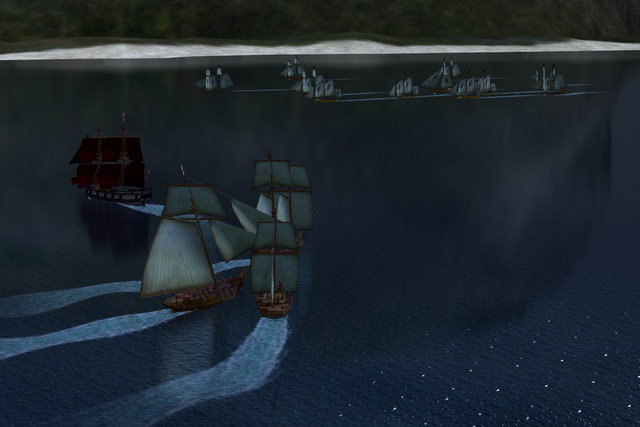
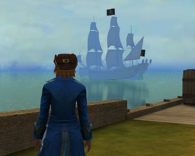

Back to: [West Karana](/posts/westkarana.md) > [2008](/posts/2008/westkarana.md) > [February](./westkarana.md)
# PotBS: The Legends of Guadaloupe

*Posted by Tipa on 2008-02-01 13:02:10*

*The good guys (bottom) prepare to liberate a fort, sink a fleet and quell a rebellion in Red Tide*

Goodbye, Blanche DuBois. You always knew the asylum awaited you at the close of your mad, drunker life.

Pirates of the Burning Sea has become a place to go for many of us in Clan of Shadows when the raid is full. While it would have been nice if people had randomly decided to join the French on Bonny so I wouldn't have to reroll, in the end most of the people gathered on the side of the British on the Guadaloupe server.

*Liz Strickland at character select* 

It's all somewhat funny, as this is exactly how I ended up restarting on the Faydark server in EQ2 and abandoned my original characters on Antonia Bayle. My EQ1 guild at the time, Viking Alliance, chose Faydark because they heard it was the de facto European server (and they were a European guild. Being unemployed at the time gave me the 'freedom' to group and raid in the mornings and leave my afternoons and evenings free).

And so was born Liz Strickland, Freetrader for the British Empire. I changed all her look from how Blanche had been dressed aside from the hat and boots that I loved. Perhaps... Liz sunk Blanche's ship and fished these from the wreckage?

*The Lady of Guadaloupe and her crew*

Aside from some stuttering immediately after zoning, there were no problems with lag and no disconnections at all. About midway through the tutorials, I decided to see how the game performed at max settings -- 1680x1050 instead of the default 1024x768, with all the graphics bumped up and it was smooth as Havana rum.

I completed the tutorial and the first few missions and made it to level 5 in about half the time it took to reach level 3 on Bonny. Once you get used to the controls and learn some basic strategies on fighting -- separate the enemy, close and board as soon as the enemy has been weakened enough, never turn through the wind in battle, let your NPC allies (if you have any) engage the enemy first -- the early missions, at least, aren't hard.

By the time I'd finished, the raiding was over on EQ2 and we nearly had a full group with which to take on the Red Tide.

This is the first group mission, and the quest giver even helpfully suggests doing it multiple times until everyone has gotten the various nice loot items that drop there. So, we did it twice. Not for loot, but because we failed one of the mission objectives.

There's a whole list of them.

*Looking seaward from Port Jenny*

It's a night mission, which means your accuracy is down and your shots don't travel as far. I was reminded to order my crew to focus on Gunnery -- speed and accuracy in weapons -- to help make up the difference.

Thirteen ships patrol the waters outside a fort held by a villain who is brutalizing those who live there. There are twin missions -- one to retake the fort by rousing the inhabitants against their master, and keep the master from blowing the fort up. The sea mission it to destroy every enemy ship and allow not even one to escape; then when the fort's master makes his own run for it, sink him and his allies.

The tide here is red, but the blood isn't ours.

Afterward, I worked on a couple smaller solo missions and began the Freetrader quest line, which brings me from far Port Jenny to Port Royal in Jamaica, a very, very long trip that I began this morning.

The wind was against me so I am having to tack through the Caribbean; I've been attacked by pirates twice (and ran from them both, I'm no idiot). After about twenty minutes, I had to unfortunately leave for work and docked at a Spanish port (Santo Domingo? Maybe...)

Tonight, I'll finish my trip to Port Royal and see what kind of price I can get for the 20 units of wood I have in my ship's hold. I'm not entirely sure selling my incredibly valuable wood at Port Royal is a great idea, considering it is due to be [sunk by an earthquake](http://en.wikipedia.org/wiki/Port_Royal), but the trip will at least give me a substantial amount of goods and experience, and a new ship besides.

Which... I will have to sail all through the Caribbean once again because my warehouse, gravel pit and wood lot are at the other side of the sea. I'll have to finish up my missions there and move my operation to someplace a little more central, I think.

My second day playing was far more successful than my first. The game still reminds me strongly of EvE Online, but in a good way. Unfortunately, since I am playing on my son's account, this won't be included in my Station Pass. I'll probably have to restart once more unless Flying Labs is allowing character transfers already.

The game ran almost flawlessly, aside from the stuttering after zoning I mentioned. There is a whole lot of zoning. The sea battles, while beautiful and looking fairly realistic, don't stand out from one another. You circle your enemy looking for advantage while chipping away at their hull and sails, then close in with the anti-personnel shot and finally grapple and board and end with a crew vs crew fight that is just exactly like all the other ones. Every fight, from the lowest to the bosses that I've encountered thus far, plays the same way.

But the game lives at the nation vs nation warfare, the massive fleet battles, and the economy, and all this stuff is just to get you ready for the battles to come. At this time, though, no ports on the Guadaloupe server are in contention (some are threatened), so it's hard to see how the game will change when the server begins to go to war.

So many games I played once and then never again (Vanguard, Tabula Rasa) -- this one makes me want to log in again and see more. This could be the casual game I've been looking for -- quick missions, fast leveling, graphically gorgeous, deep economy and massive fleet battles.

More on my adventures in Port Royal once I finally get there :P

## Comments!

**[JoBildo](http://bildos.blogspot.com)** writes: It really is a gem that a lot of people will dismiss without trying due to its setting, more methodically based combat, and/or the idea that there's no "end-game" raiding to be done.

I'm glad you enjoy it, Tipa. I remember reading an EQ2 post (I think) a while back and thinking, "She needs to play PotBS". 

Cheers!

---

**[Genjer Leigh](http://www.michaelstuartsalsero.com)** writes: The female pirate looks like Allyson.

yo-ho-ho and a bottle of rum maties!!

---

**[Tipa](https://chasingdings.com)** writes: Hmmm didn't notice that. Maybe it was unconscious. But now that you point it out, I guess maybe I'll make it even more like her :)

---

**Rusty** writes: "Stuttering after zoning" is...urm...our fault. We're working on it. Essentially, we're loading you into the zone a little too aggressively before the NPCs are loaded up, so your hard drive is chugging pulling all of them in.

---

**Crookshankz** writes: O jeez, sounds like yet another mmo I'm gonna have to give this game a try *hangs head in shame* :-P

---

**[almagill](http://gudeman.co.uk)** writes: I have PotBS on my Station Pass account and, yeah, it's got that "draws you back in" quality.

The PvE ship to ship combat does get a bit repetitive, though quests like Red Tide where you need to group up help to add a bit of variety there. The raids ashore, so far, have had a nice bit of variety in layout, objectives, strength and disposition of the enemy, presence of NPC sidekicks, etc.

But I still get a bit freaked out by the female Royal Marines.... *boggle*

Still, time to log in I think, I feel the call of the sea...

@Rusty: nice to hear there's a known cause for stuttering and you chaps are on it :)

---

