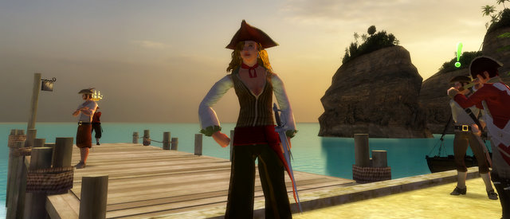
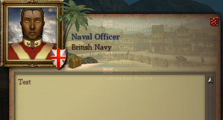
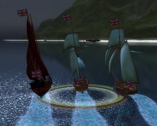
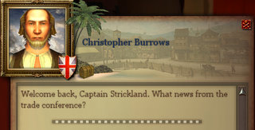

Back to: [West Karana](/posts/westkarana.md) > [2008](/posts/2008/westkarana.md) > [February](./westkarana.md)
# PotBS: Conversations and Free Trade agreements

*Posted by Tipa on 2008-02-22 13:46:38*

Nothing like the warm trade winds blowing off the water to get you excited about spending a lot of time in a stuffy house with people who hate you trying to find out who hates your employer the most.

Ah, the life of the free trader.

The man who is not what he seems... the person all too willing to believe he is being betrayed; and the one who is not so quickly convinced. Will I ever see these people again?

It's a dangerous place. Perhaps you would be safer if you returned to England. But no, the money is too good, yes?

I do like the free trader quests. The next one in the line had me salvaging a deal gone horribly wrong. It was okay, though. A little withdrawal from petty cash along with a few stern words set that right.

If only more of the quests were like that. If only they all were!

Not all quests go so well. These Mayans, for instance, were entirely unreasonable. I thought we could do some trading, maybe build a small resort there, lead some hunting parties into the jungle, and give these natives good jobs, like dishwashers or room cleaners -- they could even staff the shops!

They would not deal with me! Are not my doubloons as good as anyone else's? Because I came alone, without my first mate by my side, I forgave them their insult and let them live.

Those masks they wear would fetch a good price in London. I really must see to obtaining some.

Test? Failed. Sorry.

What I want to know is, did you fire first?

This is a quick fort defense a couple of society mates and I did. How do you color your sails? That's probably in a book somewhere.

To be honest, I haven't touched Pirates since I got accepted into Delusions of Grandeur. Raiding and working on my epic takes all my Pirates time, and my non-MMO time is spent playing Rock Band and Audiosurf and Phun and other littler games. I do want to get back into it; it's a great game, just... not as good as EQ2.

Nothing alike, really nothing alike at all, they can't be compared, I just have so much to do in EQ2 and nothing in particular I need to do in Pirates.

They all think you're a jerk, Mr. Burrows. But not me, I like you lots. About 350 doubloons worth of like, please, and mind, I don't take credit.

I have ships throughout the Caribbean. One down in Georgetown, one in Port Royal, one in Bluefields and one in Sisal. I gathered 120 small pennants and turned them in for a Dolphyn ketch, that I turned around and sold for 6000 doubloons using my mysterious auction house powers to find out where they sold best.

I wish I had something else worth selling...

## Comments!

**[Caliga](http://www.mmogamers.freeblogit.com)** writes: While in open sea or ship combat mode, bring up the window which has your persona and ship tabs (actually you may be able to do this anytime but I've always done it in either of these two modes, that way I can see the changes). Click on the ship tab and there is an option to "customize ship". You can change sail colour among other things here.

---

**[Tipa](https://chasingdings.com)** writes: I knew it was something simple! I checked the forums and all I could find was info about custom sail designs :P

Thanks!

---

**[Captain Angry](http://www.captain-angry.com)** writes: If you aren't playing it let me borrow your account :) I want to try it but not in that $50-to-taste kinda way

---

**[Tipa](https://chasingdings.com)** writes: Well, it's my son's account. I have to decide whether I like it enough to start over on my account, since I am unsubscribing him while he is in basic training.

I think there might be a buddy code available.

---

**Einhorn** writes: "They all think you’re a jerk, Mr. Burrows. But not me, I like you lots. About 350 doubloons worth of like, please, and mind, I don’t take credit."

This is one of those comments I read and got funny stares from people at work because I laughed so hard. You know, like that weird singular "BLAP!" kind of laugh taught to children in Marry Poppins. Can't scroll back through old articles without skimming this one over again for this comment.

---

**[Tipa](https://chasingdings.com)** writes: lol :) Thanks. I hate laughing at work. So embarrassing. I usually try to make it into a cough but nobody is fooled.

---

