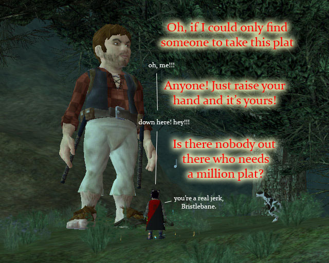
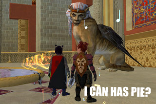

Back to: [West Karana](/posts/westkarana.md) > [2008](/posts/2008/westkarana.md) > [February](./westkarana.md)
# EQ2: Epic Bits

*Posted by Tipa on 2008-02-08 12:59:40*

Funny thing about the Avatars. They aren't the real gods themselves, you know. They got over that whole "oh, let's just stand here and be raidkilled" thing 500 years ago when Druzzil Ro decided letting mortals in to the Plane of Time and perhaps follow Zebuxurok's path to semi-godhood was just going to ruin the cosmos for everyone and so she rolled back time itself.

Anyway, up until a couple of years ago, the gods were on strike (begging the question of what powered the spells of their priests if not the gods...) (and don't we all miss the old days when priests had to nightly beseech their deities for the next day's spells?). Then the gods came back to the world, a couple at a time. But they weren't going to allow themselves to be killed THIS time. Oh, no.

Instead, what they'd do is find some hapless worshiper, polymorph them so they looked like the god, give them a tiny bit of that god's power, and then say, "okay, now just stand... here..."

> "Sure! Yay, I look like Solusek Ro now! Whoopee! What should I do if people come by? Give presents?"

"Well... here's some clothes and a few spells you can keep in your pocket, but I'd say to just ignore them. You're supposed to be a god, so just stand there and look... godly... or something."

"Oh dear. What if they try to kill me?"

"Oh, I dunno. I'm sure you'll think of something. Look, gotta go, big party, take care and drop me a letter now and then."

I don't really care. I just wish the Avatar of the god Dina worships would just make free with teh platz.

Finding the start of the troubador epic was easy. Just listen for the caterwauling (literally: *the wailing of cats*) of bards with rusty voices screeching out their Chaos song. The centaurs over in Thundering Steppes were grumbling about having to move their camp if that damn bard didn't shut up.

Heck, I'm always ready to hear a good tune, even if it does make my ears bleed a little.

Well, that bard kinda elliptically remarked that other bards had been sent to send the residents of Freeport and Qeynos running, so I tracked them down, heard their tunes, lied through my teeth about how much I liked it, and asked where I could get a copy?

Turns out the mages of Freeport and Qeynos were trying to decipher some copies, probably at the behest of the poor residents of those cities who were begging the mages to find a way to make it STOP.

I borrowed the book from the Qeynos mages and read a chilling tale of an instrument that had once belonged to the goddess of music, Ayonae Ro. Everyone remembers her from EQ1, where she agonized raids in gigantic ampitheaters, sort of a Norrathian Celine Dion. Well, she's back. And she has a weapon of musical terror to unleash upon the world.

It is up to me, Dina Tanglewood, a lone halfling without a friend in the world, to take on the terrible task of acquiring the six-stringed Axe of Ayonae and strike the chord that saves eternity.

Well, of course I had to talk to my good friend Vhalen Nostrolo about this. He's dead, of course. And I should know, since I killed him. Yup, back in EQ1, when he would just be standing around in South Karana without a care in the world. I killed him and killed him and killed him. I couldn't walk anywhere near a bard hall after that. Took days to repair that faction by running mail for them.

Anyway, he's dead and I'm sure he wouldn't recognize me now. But he WAS a little reluctant to help me with the Sword of Destiny earlier (net result: I do not have a Soulfire weapon, so I guess he still bears a grudge.) (Note to self: find guild that helps with quests.). Anyway, I clonked him on the noggin and he showed up to play a tune and tell me that he had to meet me at the gnoll shrine in Thundering Steppes.

Where... I STARTED all this. Why couldn't I just have walked from the bard at the centaur camp to meet him where he stood a hundred yards away. Grrr. Anyway, running all the way BACK to Thundering Steppes (but no! let's use my Splitpaw port stone! YAY!)

Well, once I get there, he's managed to remember something about a witch whose soul was bound to a demonic... xylophone... yes. Those can be pretty witchy. Why, I once knew someone with a possessed harmonica. Poor guy. But I wander. Anyway, he thought there was someone over in Rivervale who might know more, since they are into music and drinking and demons and drinking and pie and stuff like that.

Hey, I never turn down a chance to explore Old Rivervale. Off I went racing back to Nektulos Forest, and the Enchanted Lands, and then to Rivervale (huff huff huff). There was a halfling there who thought he knew about a poltergeist in a piano, but it took the quick application of some muffins I had in my backpack to get him to tell me about the Xylophone of Doom, or whatever it was called.

It was made from the witch's bones, and her soul was bound into it. That... that's HORRIFIC. Reminds me of the bone chair from Iain M. Banks' "Use of Weapons". Which was even worse, by the way.

If I played it with those bone mallets, it appeared to talk... I was told to look for something bound in a lamp in a fortress that hovered high above the burning sands.

Of course. That place with the Mute Bard. Poet's Palace, that sits within the Shimmering Citadel that floats high above the Deserts of Ro. It would make sense Ayonae Ro would have something to do with the place.

Problem: I didn't have access to Poet's Palace. I'd... um... never been. I'd been to Poet's Palace: Return, but only my inquisitor, Dera, had been to the original and done all the access quests because... clerics just get groups more easily. They get to go EVERYWHERE. Bards, not so much.

Anyway, it took a night and a half to do the Poet's Palace access quests, and then once I got in, the rest of the night to do the stupid floor access quests inside. And then -- FINALLY -- face to face with the Djinn Master....

And I could not understand a word he spoke. Not one. So I cleared Poet's Palace of djinn in anger, but they dropped none of the things that teach you the language. I went back out to the Shimmering Citadel and killed Djinn until I could understand how they cursed me when they died.

What an awful way to learn a language. "Hi, I can't understand what you're saying! Let me kill you and all your friends and family and maybe I'll pick it up along the way!"

Naturally, I was locked out of Poet's Palace after I left to learn the language, so I ended my epic quest there for the night. Tonight: back into the Palace, and then? Who knows?

## Comments!

**[stargrace](http://mmoquests.com)** writes: Oh my gawd I love reading your adventures, hah. 

Since my little 'break' from EQII (which have become more frequent, sadly.. sighs.. nothing to keep me in game any more) I've not started any of the adventure epics. I've been having a blast hearing about everyone else' story concerning them though. 

It was sad to see 6 of them linked on the second day of release. The coercer one on the first day.

---

**[Cyanbane](http://www.cyanbane.com)** writes: *"I borrowed the book from the Qeynos mages and read a chilling tale of an instrument that had once belonged to the goddess of music, Ayonae Ro. Everyone remembers her from EQ1, where she agonized raids in gigantic ampitheaters, sort of a Norrathian Celine Dion. Well, she’s back. And she has a weapon of musical terror to unleash upon the world."*

ROFL.

---

**Egat** writes: I know you've mentioned it may times here... but I can't seem to find it.

What server are you on?

I can make no comment, and I will deny everything if confronted, but there is rumor I may have purchased and installed EQ2: RoK on a certain computer that may (or may not) be in my possession.

---

**[Tipa](https://chasingdings.com)** writes: Heh... Befallen for now. But I am looking to change servers to find a guild as good as CoS but with room for a troub.

---

**QuimbiusStormfyre** writes: I too killed the bard in sk and the treants now Im kos in all human cities. It was probaly Tipa who got me started on my road to ruin :P, but on the plus side i was max ally to gornaire because of ring of scale faction. I'd go to KC in DLand Gor would come up to me and wag her tail and start licking me silly dragon.

---

**[Tipa](https://chasingdings.com)** writes: Did I do that to you? Agh, sorry if so. It was Etha who did the dirty bard deed, by the way -- I never did it with any other character after that.

Hey, Quimb, what are you playing these days? I haven't been frightened nearly to death by a pasty-skinned elf for a long time.

---

**Allegro** writes: What's this? "It is up to me, Dina Tanglewood, a lone halfling without a friend in the world ...." So send me a tell, already. My epic's not done either - nor do I have my master provisioner cloak, but I'd be happy to help a sister musician.

---

**[Tipa](https://chasingdings.com)** writes: lol... I was just being dramatic. It IS tough to get pickup groups that happen to be interested in doing all the steps, but now's the best time, since everyone is working on epics.

I was kinda hoping I could sneak through Chardok and just get those bits myself. Curse those see-stealth mobs.

It's kinda awkward asking CoS peeps for help, since, you know, I was rejected :( but since you offer, expect a tell someday :)

And of course, if you ever need a troub or an inq for anything, let me know! Or a jeweler for your epic (I have to get to that step too first).

---

