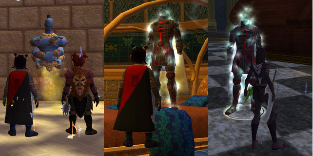

Back to: [West Karana](/posts/westkarana.md) > [2008](/posts/2008/westkarana.md) > [February](./westkarana.md)
# EQ2: Guild search, AA mirror, more epic progress

*Posted by Tipa on 2008-02-11 09:03:54*

Prices for the reflective smoldering shard have really tanked on Befallen, so even though they've eluded me in groups, I got one for cheap from the broker. Loves the broker. I had Dorah make me a mirror of my own, and I hung it here in my little Shrine to the Mirror and stored my DPS spec there. (By the by: Dorah is an 80 jeweler now, and she made the remaining six adept 3s I needed, though some weren't any improvement at all over my master spells from T7.)

One of the guilds I'm talking with asked me what my DPS was. Now I know the raiding troub is supposed to put the hurt on as much or more than dirges, and dirges parse about 2K DPS. Our DPS is so very dependent on the buffs we have; mages can give us proc buffs that feed our proc songs and mesh with Maestro, but that sets up a bit of a quandary for me on a raid, since usually I'm trying to spread the Jester's. But in my raid buff spec, I can do about 1200 DPS if all I am worried about is pushing my own DPS.

With my new DPS spec, I parse from about 1400-1600 in my own tests, but that's not with raid buffs...

Anyway, when last we left the epic quest, I had just learned to speak with the Djinn by virtue of slaughtering enough of them that I learned their language, but was locked out of Poet's Palace. I went back after my lockout and -- having to do the scarab ring event again to get to the top floor -- talked to the Djinn Master, who sent me down to talk to Vhalen's ghost again.

I still feel we could just shortcut the whole process if he just had told me from the start whatever he wanted to tell me.

But no, he wanted me to go to Mistmoore Castle.

Argh. I HATE that place. I've been trying to get a group there to finish the pages for the Sword of Destiny quest for like six months, so I thought this might be the end of my epic quest, right there.

I log in Sunday, and there's a Mistmoore group and they are looking for DPS. Oh. My. God. I'm there so fast, Selo's himself only saw a blur. 

It was a great group. We went right to the only page I was missing, page 7, which just happened to be IN THE SAME ROOM as the piano key I was suppose to find.

SAME ROOM. What are the odds!?

We gather the other pages people needed, start on the nameds, and along the way, find time to place the 89th key on the piano, and hit it to summon Vhalen for the last time, where he thanks me for my efforts and hands me my epic.

No, no. Of course not. Instead, he sends me back to the DEMON XYLOPHONE, which must be played to summon its ghost. Basically making the whole Vhalen-ghost-thing pointless. Some friends from Revolution came and helped me kill the ghost (thanks Tenadore and Nurm!), and that was that -- I'm sent off to Kunark.

A faithful ice elemental has been sitting around, waiting for centuries, to divulge the location of the wards that will protect me from the curse that strikes any bard who dares play the Ayonian Axe. Turns out a Sarnak right down the road has it. Sweet!

Unfortunately, said Sarnak wants me to traipse through the entirety of Chardok and the Court of Korocust bringing him back Di'Zok artifacts, since his faction and the Di'Zok aren't on speaking terms at the moment, and he wants the artifacts kept safe in case civil war breaks out. Well, I get the first easy enough, but I couldn't find a way to get past the named that guards the second one, so I'll have to find a group for those.

---

The guild search is going fairly well. I posted up on EQ2Flames looking for a cross server transfer. I got a nice letter from a Euro guild in Runnyeye who would take either troub or inquisitor, but I can't raid on their times. One guild on Befallen wanted my inquisitor -- while I love playing Dera, I did the cleric thing in EQ1 and besides, she isn't flagged for anything. I honestly think she's better off just being my alt. There's a couple of guilds on other servers that expressed an interest in the troub, but I was in a Maiden's group with someone from a Befallen raid guild the other day and he thought they might need a troub. My preference is to stay on Befallen if possible, so I applied and we'll see what happens. I don't want to say which guild or anything in case it doesn't work out -- but if everything goes well, I might be raiding again soon!

TON of stuff about Pirates of the Burning Sea in the works... just have to get it all collected together. Level 18 there now.

## Comments!

**[The value of the blogging community. &laquo; Hardcore Casual](http://syncaine.wordpress.com/2008/02/11/the-value-of-the-blogging-community/)** writes: [...] a corner’ and was actually fun, it put the game on my list. Based almost exclusively on Tipa’s writing, I went out and bought two copies of EQ2 to give it a try. Sure it did not work out, but it [...]

---

**[Lishian](http://lishian.wordpress.com)** writes: I think you need to set the mirror or little lower or put a stool in front of it.

---

**[Tipa](https://chasingdings.com)** writes: If I put everything in my house at hobbit-height, it would be a very boring house. I guess it would look like gravity got unexpectedly stronger for awhile.

---

