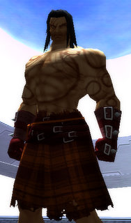

Back to: [West Karana](/posts/westkarana.md) > [2008](/posts/2008/westkarana.md) > [February](./westkarana.md)
# AoC: Conan Speaks

*Posted by Tipa on 2008-02-16 14:11:24*

*He is more a creature of sun and plains than a man whose shadow would ever darken a marble palace floor, unless he carried also a sack for the plunder. Bronzed skin and scars run the length of his body; badges they are, of skin and blood, of battles in places far and near. He is Conan, the Cimmerian, though the people of these more civilized lands think his people myth, and yet he stands, clad simply despite his great station, his dark hair held back with a thin band of silver cloth, his well-burnished, phoenix-etched great sword strapped to his back with leather made of some dark-skinned beast that once prowled the eldritch halls of Set's great obsidian temple.*

"Mention my thews," offered Conan. "Steely. Bob was always obsessed with muscles. He was always obsessed about something."

*His steely thews rippled as he strode from the scant light of the torch. The night was dark, and the spaces between the glittering diamonds of the stars seemed to ebb and slow hungrily, like the dark rivers that flowed from Stygia's fetid jungles.*

"Oh, I *like* that. I do. The arts of the scribe have never been mine, unless it be the poems and oaths scribed by my blade as it confounds my foes. I have always appreciated the poems of minstrels, sung full-throated in words drenched with ale. Even when they were used against me. Poor, maddened Rinaldo..."

"Pardon me, King Conan," I said.

"Please," said Conan. "You are not an Aquilonian; I am not your king. If you must assign a title to me, let it be Conan, the Cimmerian."

"In this age, Conan, you are often called a barbarian..."

"Pfft. Only southerners call me thus. They have never tasted the cold air that blows from the Asgardian mountains, never been to the temples of my gods, accursed though they may be, never known the deep knowledge shared by my people. I am Cimmerian, and only one who does not know me would bring me that low."

"Ah," said I. "I wonder if we could talk about the game set in your age, the Hyborian age; or the Age of Conan, as it is called. You have been long remembered when all else has been forgotten, until Hyboria and you are inextricably linked..." I winced. I was even beginning to speak in that same purple prose I had long mocked. Agh. Still doing it.

"A game, a game like we played after we fought and plundered, then, with the roar of campfires belching flames into the night, as we gambled our prizes and the wealth of kings might change hands a dozen times before the Sun looked in on the carnage..."

"No, no... this is a different sort of game. People pretend to be people who lived in your age, and they pretend to fight, and kill, and level up..." I stopped myself, hoping he hadn't heard that. The sudden darting of his eyes was proof he had heard, but perhaps not understood.

"Ah. This is a dalliance, a daydream concocted by you scribes," he motioned toward my laptop. "A game for women, I see, to idle away the time while their men are away."

I sighed. "No... it is the men who will play this game. If Funcom, the creators of this game, have their way, men everywhere will devote their lives to this game."

"WHAT?" he said, his dark eyes smoldering as he bellowed. "What trickery is this? Men should be out, tasting the air, letting their blood roar as they do the great deeds only men may accomplish. Fighting the good battles, routing the enemy, taking their women, scattering their slaves, not bent before a flickering window of false light, and by pretending, never become what they desire so much. Scholars," he continued, "Skins pale, like beaten papyrus. Put them on the battlefield and they are as useless as women."

"There will be women playing this as well."

"Will you be playing?"

"... I might try it."

"Instead of caring for the wounded, or your children, instead of fighting to keep your cities safe so that your men have a home to which to drag the spoils of war, to rest and drink and rut until war comes once more upon them?"

"...hmmm. Well, perhaps not."

"War is real. Battle is real. A real man would not pretend to be something he is not. He would become it in truth. Robert Howard knew that. It was his passion that pulled me from distant Hyboria to this time, and that passion that inflames all who read of my adventures. To pretend to feel the thrill of battle or the touch of a woman when you could know it true... what a pale life that must be."

"You started a revolution, Lord Conan," I said, to cool his hot agitation. "Your tales have inspired seventy years of writers to call forth other heroes from the past. Corum Mac Art. Thongor. Grignr."

"Grignr? The Accordion?"

"The same."

He stopped his restless pacing. Looked at me for awhile, and at the keys on which I copied his words, the ones I am using now. "These idylls of scribes do not concern me, but consider this warning: When battle comes to your cities, hide well behind the scarred bodies of your men, and regret the time you spent in these dreams."

With that, he turned, and slipped back into that place from whence dreams come.

