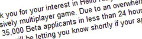

Back to: [West Karana](/posts/westkarana.md) > [2008](/posts/2008/westkarana.md) > [February](./westkarana.md)
# Sorry, Age of Conan. Hello Kitty Online is going to kick your butt.

*Posted by Tipa on 2008-02-16 11:54:41*

Decapitated naked women (now with NIPPLES!!!), or the sheer awesome goodness of Hello Kitty Online?

The screams of the damned or catchy synth bubblegum music that leaves you smiling and dancing in your seat?

Carving chunks of flesh from your thick-thewed foes on the battlefield, or fun games with your friends in a wonderland of sweetness?

In the twenty four hours since the Hello Kitty closed beta signups have been live, they have been completely crushed by interest. I just got an email apologizing for their delay but they have had WAY more interest than they ever expected. They had to close their forums because of TOO MUCH INTEREST.

If the chat we were having when we recorded Witty Ranter #3 last night is any clue, you guys are gonna get mighty lonesome shagging your skanky hos in AoC.

Come join the cute side.

It'll be fun :)

(Sign up [here](http://www.hellokittyonline.com/)!)

*Looks free to play, financed with an item store -- usual for these types of games from the East. You get your own home, your own farm, wide variety of gameplay including mini-games...*

## Comments!

**[almagill](http://gudeman.co.uk)** writes: SO waiting to hear the more 'macho' gamers take on this one.

While they secretly give themselves over to the cute side. Meowf.

---

**[Rob](http://www.lostaneighth.com)** writes: Is .... is that a fish hat? I'm in.

---

**[Lishian](http://lishian.wordpress.com)** writes: Can you pvp people? Can you ganks them?

---

**[Tipa](https://chasingdings.com)** writes: At night, Hello Kitty grows fangs, and then flies into the darkness to feed.

---

**[Openedge1](http://simple-n-complex.blogspot.com)** writes: OMGZ
NOOBS...Hello Kitty's the roxorsz
LOL!!11

AoC sucx!

(The above comments do not reflect the actual viewpoints of the poster, and are not to be taken out of the context of the realms of humor....thank you...(But he does WUV KITTAHS!))

---

