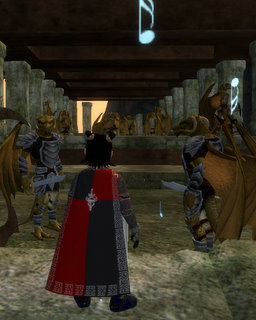

Back to: [West Karana](/posts/westkarana.md) > [2008](/posts/2008/westkarana.md) > [February](./westkarana.md)
# EQ2: Epic Harvesting! Woohoo!

*Posted by Tipa on 2008-02-18 08:45:41*

In the Temple of the White Lady, deep within the burning spires of Skyfire Mountains, dodging psychopathic cannibalistic yeti giants. seeking the mythical Flame of Yore.

"I DEMAND XEGONITE!" it thundered. I BROUGHT Xegonite. It didn't WANT my Xegonite. Because I'd bought it from the broker and not harvested it myself.

I guess Dina-harvested Xegonite is better than someone-else-harvested Xegonite. So I sold my xegonites to a guildy for less than I had paid, and headed to Tenebrous Tangle to get with the harvesting.

So the FIRST night, I ran in circles around the stonesetter house on the temple island. Half the time spent harvesting, the other half spent watching other people STEAL MY HARVESTS!!!

I wasn't going to go to bed until I had harvested at least three of the ten I needed. I got two after a few hours, and then I woke up from where I'd dozed off at the keyboard to see Dina plummeting three gadzillion miles down to death from running off the island. When I came to, I camped. That was enough.

Two xegonites in one night would mean hmmm five nights to harvest enough xegonites for my epic. This just wasn't going to work. I vented a little in 70s chat, and, because this isn't WoW, people were helpful and I got SEVERAL people who pointed me at better places to harvest, including one lady who checked back on me after a couple of hours to see how I was doing.

Community. I LOVE THE EQ2 COMMUNITY!!!!

But I HATE this stupid quest. Since I guess this place is kind of an open secret, I'm not gonna say right out where I spent six hours Sunday. But I will show you this video, and maybe you can figure it out.

When you run around a place for several hours, it becomes a game by itself. So I had to hit all the ledges, and never touch the low parts of the buildings -- I had to jump over those in one hop. And there were a couple of other rules you'll probably be able to figure out from the video. Fraps slowed my frame rate so the circuit isn't as smooth as it was when I wasn't recording, but the last circuit in the video is the best.

After last night's raid, I went back to my spot and within an hour, got my last Xegonite, and headed back to the Temple of the White Lady to feed the flame ***MY*** Xegonite.

The spirit wanted to know my business with it. I chose "I do not need anything. I just like wasting xegonite. Bye."

AGH WHY IS THAT EVEN A **CHOICE**? The first selection should be, YES, GIMME SOUL KEY NOW and the second selection should be, DIDN'T YOU HEAR ME? SOUL KEY!!! What if I had PRESSED the second button!?

/cry /cry /cry

I didn't press that one. I got the soul key, and have been sent to kill two nameds in Sebilis and the boss in CoA. And though it isn't telling me yet, after that is one more kill for my fabled epic.

Virulence and Fallen were spamming the world with their mythical weapon updates (err, excuse me, "mytical") as they cleared Veeshan's Peak. Every time someone completes their raid epic, it's broadcast server-wide, and I hope by the time it's my turn that they still do that.

In the end, I harvested over 5000 adamantine clusters and porous loam. I gave about 1200 adamantine to a friend who came by so that she wouldn't have to harvest my nodes. The rest I'll probably put on the broker. I destroyed the loam. I got a stack and a half of the blue silver metal sheets for the bone-clasped girdle quest, and about a stack of the purple geodes for the same quest. Those will get destroyed. I got 15 spongy loams which I sent to a friend as a gift. And 10 xegonites. Those are the wages for running in circles for two nights. So now you know exactly how much that is worth.

## Comments!

**[Ogrebears](http://www.ogrebear.com)** writes: so far my epic hasn't required me to harvest anything. Just kill thing for rare drops (which i guess is similar)

---

**Kirena** writes: Thank You, Thank You and did I say Thank You for those adamantine. My crafter jumped for joy. Good luck and let me know if you need any help...have heals will travel.

---

**Doom** writes: Gazer isle for the win!

---

**Aneova** writes: 15+ hours for 4 mantrap roots, and 5 Smoldering materials. On the plus side i got to keep all of it.

---

**[Tipa](https://chasingdings.com)** writes: 15 hours is too much for so little :( At least I was able to sell all my T7 harvests -- even the loams. But harvests at the level cap are nearly always over-abundant. I was getting 21s for each adamantine cluster and 7g for each shimmering material... I made several plat from the harvesting -- and I'd given most of what I harvested away!

---

**Bubb** writes: You do know that if you harvest the roots the ore will have a chance to pop?

---

**[Tipa](https://chasingdings.com)** writes: @Bubb -- in this particular spot, only ores pop. That's why it is the best spot in the game to harvest T7 ores. But just because I was bored, I also harvested the roots in the area as well, because I could sell whatever I harvested.

---

