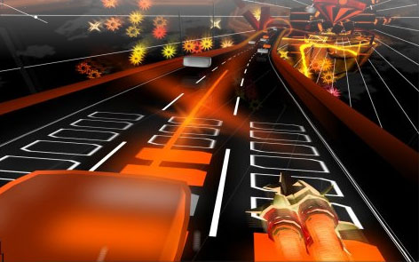

Back to: [West Karana](/posts/westkarana.md) > [2008](/posts/2008/westkarana.md) > [February](./westkarana.md)
# Audiosurf: When we say play your music, we mean it.

*Posted by Tipa on 2008-02-20 03:15:40*

When I listen to music, and close my eyes, I see blocks whizzing at me at the speed of sound.

It didn't used to be that way. Audiosurf did that.

I have over three thousand eight hundred and eight songs ripped and on my computer. That's nearly four thousand ways Audiosurf can rip my mind apart. Each game is generated from the music. Quiet bits have few blocks. Turn up the energy a little, and low scoring blue blocks flood down. Turn it up a notch more, and it's a blizzard of blue, with occasional streaks of yellow and red and MAN.... You are FEELING the music.

Here, watch the Oyster Boys prophesy doom in "The Old Gods Return" while I try to save the day by collecting blocks:

The game is basically all about matching colored bricks by hitting them with your space ship. You can race with lots of different drivers, and each has a different style of game play. I'm running on one of the easy modes here, not doing so hot, but that's fine because my mind is as wide-eyed as if I'd just chugged a six pack of Mountain Dew.

I wish the tracks tracked the songs more closely. I tried a bunch. The best was Love Spiral Downwards' "By Your Side", a nice down tempo song. Tracks like BOC's "[Stairway to the Stars](http://youtube.com/watch?v=sA1K5NGAKEs)" -- not so much. "O Fortuna", that chorale piece you see a lot in horror movies -- I expected great things, but no. Ozric Tentacles' "Dissolution", a song I was listening to at work and thought -- "This song would be AMAZING on Audiosurf" -- but it really wasn't. Synergy's "Revolt at L-5"... did not do it for me.

So little Audiosurf secret here -- dense walls of music will not make an exciting track. I clean song with a distinct beat and melody -- that's gonna give you the race of your lifetime.

Well, I guess I've got about 3,780 more songs to go so I better get to it.

## Comments!

**[Mythokia](http://blog.thermonuclearexchange.com)** writes: I've been playing that too and I must say it is addictive. Many of my songs unfortunately, also suffer from the 'wall of noise' problem as a result of modern day CD mastering and therefore lack any dynamic range whatsoever.

---

**[Tipa](https://chasingdings.com)** writes: Ironically, one of the songs that comes with it, "Still Alive" from Portal, works amazingly well. Dead Can Dance's "Yolunga" was incredible, it's the kind of song Audiosurf can track very well.

As I wrote this piece last night and a companion piece that I will fold into this one for posting on GAX, it occurred to me that I could say "this song works well" but it's unlikely anyone else would have those songs on hand, or even have ever heard them. Or their bands!

It's not that I'm some musical renegade searching out obscure bands; most all the stuff I listen to was recommended by friends, or I heard in someplace like Tower Records, when there were such things as Tower Records. And so what I want to do is put all those tracks online -- but as Audiosurf plays! Using an Audiosurf run as a visualization for the music. For instance, I put a couple of BOC songs on Youtube as Audiosurf runs not only to show off the game, but to spread the word that BOC was a lot heavier band than their easy listening "classic" rock tracks like "Burnin' For You" would imply. Because I want to spread the gospel of Blue Oyster Cult and think people would like their music if they heard more of it.

Or Love Spirals Downward's "By Your Side". LSD, Portishead, Sneaker Pimps, Massive Attack etc are bands I absolutely adore, but many find their genre depressing. I disagree. I want to grab people, put some headphones on them and plead them to just listen and not make snap judgments because some music journalist grouped them all into a stupid category which I won't even name. Maybe if I put it up on Youtube and call it a decent Audiosurf run, people will listen to the music :)

That's Audiosurf's strength. Not to score high points in what is a fairly simple game, but to give a new way to seek out new music. Looking at the in-game list of most-played Audiosurf tracks and subtracting all the Orange Box songs (...and Guitar Hero songs... come ON, people), there's some stuff there I might want to try.

If only to see how it plays on Audiosurf.

---

**[Relmstein](http://relmstein.blogspot.com)** writes: Try Wizard's in Winter by the Trans-siberian orchestra. Ever since I started playing Guitar Hero I can't help but wonder what playing a rhythm game set to that song would be like.

---

**[Tipa](https://chasingdings.com)** writes: lol... that song that guy with the automated Christmas lights used? I guess you can kind of look upon his display as how it might look in a rhythm game....

(Totally pleased at myself for remembering that without having to Google it).

---

