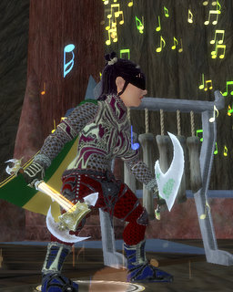
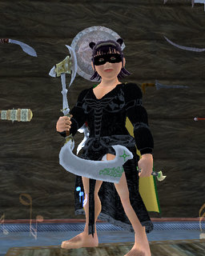

Back to: [West Karana](/posts/westkarana.md) > [2008](/posts/2008/westkarana.md) > [February](./westkarana.md)
# EQ2: A Bard's Dream, an Epic Done

*Posted by Tipa on 2008-02-26 08:41:51*

I had only an hour left on my Maidens instance. If I couldn't get it done in that hour, I'd have to start Maidens from scratch, and it would have to wait another day.

Sunday, I was incredibly excited about getting my epic, the Ayonian Axe. I had the absolutely most perfect Maiden's group imaginable -- a guardian, a coercer (Wrapye, who has always been there to help for YEARS now...), me, a ranger for dps, two healers... and we owned the zone. But a couple of deaths on the Sisters and the tank and one of the healers, who belonged to the same guild... ported out. The others soon followed. I was standing alone in Maiden's, and I wasn't going to get my epic that day.

Yesterday... ah, now that was a day to remember. We plowed through Thuuga to start, then headed to the Throne Room of Kor-Sha to take on the Overking -- and we got him. It was sweet and easy and you could just FEEL the electricity in the guild. What I consider the hardest fight on the path to Veeshan's Peak was done. We zoned out, killed the instance, zoned back in and cleared up to the twins before we called it a night.

I asked in guild if anyone would want to finish up my Maiden's instance, and just like that, I had a full group, all guildies save for the enchanter, who was a friend of the conjurer's. Once we compensated for the berserker's unavoidable AE attacks in the sisters fight, we took them down easily, moved on to Drusella and SHE went down without a problem. Well, okay, there were a couple of problems dealing with damage shields (not mine) and aria (oops, mine), but nobody died except Drusella and she was dead and my soul key dinged and we had about ten minutes left before the zone expired.

I was supposed to look through some instruments scattered around the room; one of them would be my epic. Problem was: that room was EMPTY. There was nothing left in it. Minutes were ticking by and I could NOT find the damn things. In desperation, I portaled back up to the entryway and then back -- and there they were, all four of them. I clicked them all and my epic was the fourth one.

A Rhinemaiden appeared and attacked us, and I tried that axe out on her.

Mmmm.... felt good!

SO many people helped with the epic; it's not something you can do by yourself. I can think of ten people right off the bat, going deep into places like Chardok and Sebilis -- multiple times -- for me, or helping with various fights here and there. But that would only be the start of a long list (and maybe I'll go through my logs and make that list). But what I want to say is, thanks to my friends, and to the wonderful folk of Delusions of Grandeur. I've only been a member two weeks, but at no time have they ever treated me like anything less than a good friend.

Now I've got to head to Barren Sky and talk to someone there about an even greater plot, that will lead to the door of Venril Sathir himself... who, coincidentally, is on the kill list for tonight :)

 

Funny thing about that black dress (which you might recognize from my RoK beta tailoring page). I'd been scouting out Teren's Grasp for epic crafters with Dina while Dorah was getting updates in the Nettleville crafting group, and happened to stop outside the tailoring station. When I logged in last night, I was still there, and there was someone there, and what do you think they did? They asked me if I needed the tailoring update. Right out of the blue! I thanked them, but said I didn't. They turned back to their crafting, and I remembered this black dress from beta -- Lady's Dark Heart -- and asked if they could make it.

They could, and did, I gave them 10g and two bristled pelts for their time and had a new dress. 

Everyone is too damned kind in EQ2. I really need to resubscribe to WoW so I can appreciate EQ2 even more.

## Comments!

**[stargrace](http://mmoquests.com)** writes: Congratulations on the epic. :)

---

**Kirena** writes: Wooohooo, good job and heartfelt congratulations!

---

**Zygwen** writes: Grats on your epic.

---

**[Jason](http://www.channelmassive.com)** writes: That's sexy. Grats!

---

**[Lucifrank](http://tenfoldhate.com)** writes: Gratz Tipa! Them's some nasty lookin' blades ya gotcher self thar. Halflings FTW! I always enjoy your snapshots from your EQ2 adventures.

---

**[Tipa](https://chasingdings.com)** writes: Thanks all!!!

---

**Einhorn** writes: Honestly - reading your blog, your funny commentary, and your amazing journey towards getting your epic is what inspired me to quit WoW, and try EQ 2.

I am an EQ 1 vet, played for 5 years. Went to WoW for 2 years around time Omens of War came out. Never really raided in Everquest 1 due to my permanent wanderlust. I loved exploring zones, even ones I had already seen hundreds of times. Kunark was an amazing place to explore, and Grachnist the Destroyer learned how to sense when I was in the zone with him. I swear one night he yelled obscenities at me. Thurgadin was my all-time favorite place to mill about. Love those little Coldain!

I was not without a guild, my guild helped me with a few different "big" things including getting my 10th Coldain Ring. Oh so many great memories. It was those memories (and forging new ones) that kept me so in love with Everquest despite it's many cruel flaws at that time.

Your sparks on this wonderful blog rekindled my fires of exploration and before I knew it I was downloading a trial. Having given it a fair chance (as you always have preached doing so) I signed myself up last night. Given you were my inspiration to start again, would you be at all surprised if I told you I started a Bard? Mmm, I didn't think so.

I guess the point of this little rant is ultimately to thank you for waking that spirit of adventure within me to start again with your many wonderful tales and exquisite writing technique. Thank you so very much, and a supreme congratulations on your epic! 

Now only one question remains: Did the guild you mentioned in a past entry shout your triumph from the mountaintops like you'd hoped?

Numerous thanks,

Einhorn

---

**[Tipa](https://chasingdings.com)** writes: Ah, the 10th ring. Getting that was like getting an "I Love You" letter from your guild. All the various things you had to do for that, and for an absolutely amazing reward.

A bard! How wonderful :) Like most support classes, bards have surprisingly deep gameplay and bring a smile to any group.

I didn't get the serverwide message for my epic. I just got the first epic, that you get through normal grouping. The super powered "mythical" one requires raids and end in Veeshan's Peak. You can imagine they're going to be pretty tough! When you get that one, the all of Norrath pauses in silence as you take possession of a weapon of great power. Mine takes one of my signature spells, Perfection of the Maestro, which adds a proc to any spell or combat art (and can proc off procs), and makes it raid-wide. Two troubadors in a raid can keep this up almost all the time, turning an entire raid force super-deadly. Most of the raid epics boost raid power in this way, and it is said the boss of Veeshan's Peak, the terrible poison dragon Trakanon himself, may only be defeated with these weapons.

Thanks for reading my blog! I've had my ups and downs with EQ2, but having tried the others, I still consider it the best game currently going.

---

