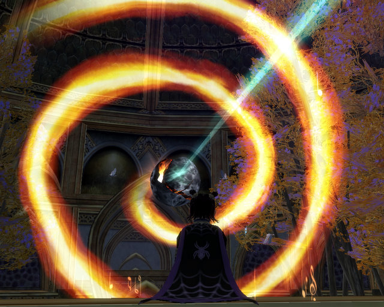

Back to: [West Karana](/posts/westkarana.md) > [2008](/posts/2008/westkarana.md) > [January](./westkarana.md)
# EQ2: There is celebrating in New Tunaria tonight.

*Posted by Tipa on 2008-01-03 07:24:05*

There is celebrating in New Tunaria tonight; the evil stain on the heart of the capital of the High Elves is cleansed; Mayong Mistmoore has been unmasked and killed. Rejoice, O New Tunarians! Of course, we *did* have to kill your Queen to get to him. And, um, he'll probably be back in a couple of days (yeah sorry about that. vampires, you know.)

Overking was scheduled, and good thing since I'd just spent all afternoon there earning my Master Di'Zok Hunter title and exploring the more distant reaches of this immense zone. Earlier I'd been in Sebilis, *another* really huge zone that certainly doesn't appear that large from zone in.... but it is... then you fight your way to the back and come to the basement, just as huge.

Anyway, target changed. Mayong was causing trouble in New Tunaria, and Qeynosian agents had contracted with the Clan of Shadows to teach him a lesson about fooling with High Elves.

Unfortunately, CoS has just one lesson for mobs: "Kill. Them. All. (and take their stuff)."

Gosh, Queen... terribly sorry. Did you know your boyfriend is a vampire? Ya know, High Elves are always going on about how smart they are, but they let themselves get corrupted into Dark Elves by Innoruuk, they get forced out of Tunaria Antonica by perky humans, they walk around in the snow with no clothes on...

I once had a theory about height and brilliance. See, I figured there were three kinds of elves -- High Elves, tall, blonde, haughty, Aryan; Wood Elves, average sized, average intelligence; Dark Elves, average sized but nearly as stupid as their progenitor High Elves; and shrub elves, blessed with intelligence, wisdom, and stunning good looks. I called them shrub elves, but the rest of the world knows them as Halflings. They gave haffers the pointy ears in EQ1, they is elves, I say. Shrub Elves. So I figured, the taller you are, the dumber you get -- maybe the thin air, maybe just not being as close to the good earth, I dunno, I'm no scientist.

Anyway, this Queen Thex had no idea her boyfriend was a vampire. The fact that Mistmoore guards rise from their crypts to roam the land in his name each evening didn't tip her off. Troops of adventurers roaming through the place looking for bits of the Sword of Destiny -- again, she had no clue. The oh-most-high Overlord Lucan D'lere coming 'round and saying, "Madam, are you aware that you are cohabitating with a vile creature of the night?" -- taught her nothing.

"Ooooohhhh you stay away from my BOYFRIEND!" yelled the airhead Queen, and so we killed her.

Really, it was for her own good.

An intervention, you might say.

And on the chance she'd be lonely, we sent her bf down to hell with her. (Until they respawn anyway).

Afterward, we all got comfy and watched "As Luclin Turns" on the Queen's widescreen, high-definition, holographic Moon-O-Scope. I know people douse themselves in gasoline and beg passers-by to "light my fire" when they hear this, but I really do think the next EQ2 expansion will bring us to Luclin.

Pass the popcorn, please.
## Comments!

**[Wydow](http://wydow.homeip.net/)** writes: Stunning screenshots, you capture the action of the raid beautifully.

- Wydow

---

**[Tipa](https://chasingdings.com)** writes: Wish I could have captured when I accidentally evaced my group while buffing /whistles innocently. On second thought, maybe it's just as well.

I laughed when, later on that night in a CoM group, someone (not me!) evaced by accident! "Not me!" I shouted excitedly into my headset, but the group was laughing and laughing because I had forgotten to unequip my JW port hammer... and when I finished loading, I was in the Danak Shipyards. But I wasn't the only one in the group who did it, so it was marginally better.

But think of the scene to the others: You're fighting the first mob in the City of Mist, and midway through the fight, your troubador and necromancer vanish.

I wonder if my role in CoS will be comic relief sometimes...

---

**[Josgar](http://eldarsanctum.hyperverse.com)** writes: Excuse me. We were not kicked out of our glorious tunaria by measily humans. It took the diving intervention of Ro to burn down our forests and create the desert of Ro. I really have no excuse for Mrs. Thex; however, one of the lore devs hinted that she may be forced against her will into being with Maygong.

---

**[Josgar](http://eldarsanctum.hyperverse.com)** writes: Make that "divine intervention." This silly human language does not like me >.> Huzzah for elvish!

---

**[Tipa](https://chasingdings.com)** writes: Like you were there :)

---

