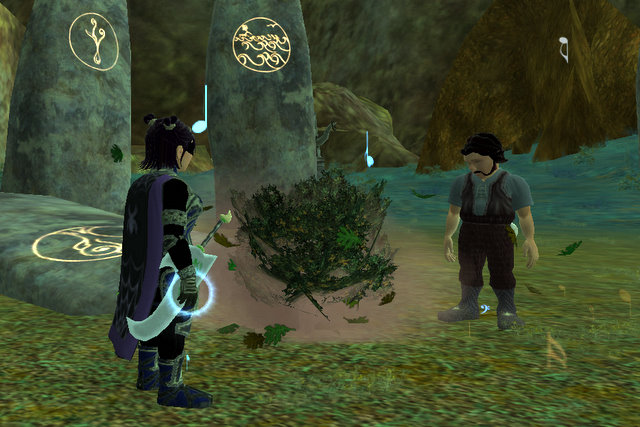
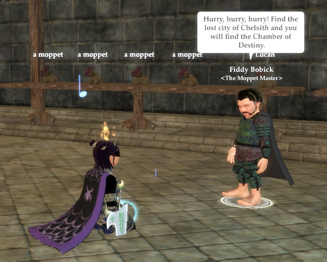

Back to: [West Karana](/posts/westkarana.md) > [2008](/posts/2008/westkarana.md) > [January](./westkarana.md)
# EQ2: Tier 2 done. Well, half done. And some other stuff.

*Posted by Tipa on 2008-01-07 08:59:52*

There's two raids in Tier 2, Venril Sathir and the Overking. So we killed Venril. He wasn't that hard; all you have to do is pay attention, and anyone can do that, right? 

Well, it wasn't that simple; it took us two nights. I've been warned by the guild leaders not to talk about the strat, but there's no need -- once we all were paying attention, it wasn't that tough. Fighting down to the instance is much harder :)

Now this Overking guy is a whole different story. There's a few events leading up to him, and then when he decides to enter the fight, well, he's the OVERKING, it isn't like he doesn't have help. LOTS of help. WAVES and WAVES of bright Sarnak youngsters all too eager to toss themselves against the raid. I guess enough moths can blot out a bonfire, so we let him live this time.

Backflagging is annoying. Of course it's all first-flagging for me, but eventually I'll get flagged, but we'll still be here. It's really not that bad... for the first year or so. Back in EQ1 we were stuck backflagging again and again -- every month we had to do it for the new people -- until SOE eventually had backflag items drop from mobs. For instance, an item dropped in the Plane of Time would backflag a person so they could enter Time on their own thereafter (I can't remember if it also flagged them for the elemental planes). One dropped in Anguish would flag a person for the twelve backflagging events.

SOE will have to do the same. A Veeshan's Peak guild isn't going to want to do all the Tier 1-3 again -- but they'll have to for now.

In other pointless endeavors, I got my jeweler, Dorah, to level 78, and she made all my adept 3s to 78 :) :) She can also make the Mirror of Reflected Achievements that can save a AA spec, if I can find a smoldering reflective shard ar a reasonable price (so rare! so EXPENSIVE!) That would allow me to have a DPS spec for just playing around, and a support spec for raids.

I got Verd (the haffer with me at the druid ring) his two ports, to Kylong Plains and Kunzar Jungle, so I wouldn't have to always be running everywhere, ESPECIALLY Kunzar Jungle. It turns out that level 70+ mobs see through invis and can one shot a level 39 Fury just by looking at him, so he had to be escorted through. A level 39 Fury, it turns out, can't heal very well when fighting T8 mobs... made it through, though, and he's probably the lowest level character ever to stand in the Abandoned Village.

Oh yeah, talked to my old friend, the Moppet King. He told me I needed to find the Chamber of Destiny in Chelsith.

Little does he know I already WENT. And I didn't see ANYTHING that looked like any Chamber of Destiny.

Or did I?

