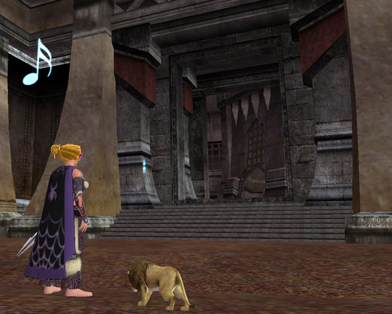

Back to: [West Karana](/posts/westkarana.md) > [2008](/posts/2008/westkarana.md) > [January](./westkarana.md)
# EQ2: The Court of Korocust

*Posted by Tipa on 2008-01-12 21:54:52*

I'd never done the Court of Korocust before. It's a simple instance at the bottom of Chardok -- collect three ground spawns and one mob drop, then summon a named, once for each member of the group. Fun part where you have to be sent to prison to collect one bit from a cell there.

Just plead nolo...

It was something to do after our Sebilis run. We opened with Protector's Realm, which gets easier for me every time I go. The most challenging part, personally, is doling out Jester's Cap. Usually on raids, I would just give it to random people I thought would appreciate the boost. Now, though, I have to hold it back, because people with long recast abilities might need it at any time. The two necros are going to lifeburn right after one another; a berserker's Peel timer is about to expire; if I just use it whenever I like, I'll miss a time when it is really needed.

We went after that to see Venril. The lizard was too much for us last night. Sometimes raids just "click" and everything goes well. Other times... VS is an easy raid to wipe. Anyone doing the wrong thing at the wrong time will wipe the raid. It's easy for people like me, there mostly as a support role. Those people who are constantly busy have a far harder time of it.

The barbie in the picture above is my mentor in Clan of Shadows. If I don't make it to full membership, she'll be the one assigned to kill me. Until then, it is her job to watch me, watch where I go, see that I don't find out things about the guild it would be unhealthy to learn.

And if I do make it in, it will be she who removes my right ring finger, the mark of the Clan.

*Sigh*. I tried, I really did, to make an EQ2 post without Dina in it.

Tried and failed :/

## Comments!

**[stargrace](http://mmoquests.com)** writes: Oooers pretty cloak! I like that one. Though it does make me want to leap across buildings with webs shooting out of my finger tips..

---

**Zygwen** writes: Here is a shot of our cloak pre-RoK.
http://i205.photobucket.com/albums/bb182/Zygwen/Eq2%20Cloaks/EQ2\_000050.jpg

---

**[Ogrebears](http://www.ogrebear.com)** writes: Last time i did the zone i my group got lucky. Every time before that i've only see the last dude drop treasure every time. This time we got him to drop 3 legendaries.

---

