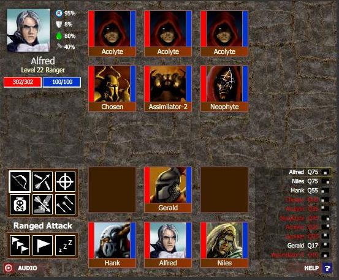

Back to: [West Karana](/posts/westkarana.md) > [2008](/posts/2008/westkarana.md) > [January](./westkarana.md)
# Monster's Den @ Kongregate

*Posted by Tipa on 2008-01-13 18:21:43*

[Monster's Den](http://www.kongregate.com/games/garin/monsters-den/) is a nice enough little Flash game -- you assemble a party, and go on to wtfpwn a randomly generated dungeon a la Rogue/Nethack/Moria and other similar games. Each room can contain nothing, treasure, a healing altar, or an encounter. One "boss" encounter per level can drop epic gear. The challenge to this game continues only until you realize that the secret to winning battles is using AEs. Since your power grows geometrically while monster power increases arithmetically, eventually you become unbeatable. Higher difficulty levels increase the monster power, but inevitably, sooner or later, you will entirely overmatch every encounter -- when everyone has 100% poison and stun resistance, 100%+ damage reflection and 20% to kill a mob outright on any attack (and remember, we're AEing) -- well, you're ready to rock.

It's a cool game, well put together, free, you can play it in your browser whenever you have a spare couple of minutes... But that's not the interesting thing about it.

The interesting part is how it is hosted. [Kongregate](http://www.kongregate.com/) lets you upload Flash games you have made just like you'd upload videos to Youtube. The highest rated games win cash. Got a game idea? Implement it in Flash, upload it, and see how people like it. 

There's a massive shift toward user-generated content of all sorts. Developers making yet another closed, unmodifiable game, take note. The world is changing.

