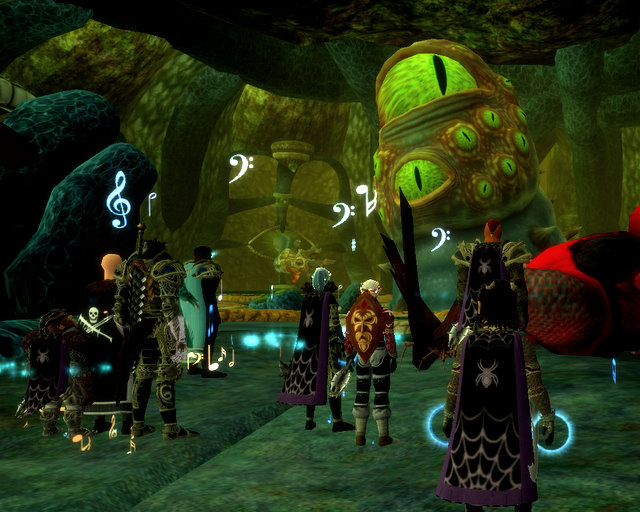

Back to: [West Karana](/posts/westkarana.md) > [2008](/posts/2008/westkarana.md) > [January](./westkarana.md)
# EQ2: Leviathon

*Posted by Tipa on 2008-01-14 08:37:07*

This was the fight I mentioned a few posts back, the one that takes an hour.

We opened with Venril Sathir, a fight we weren't supposed to finish on the first pull, since the Leviathon timer from before hadn't expired yet. Having the flag, I sat out and worked on redecorating my apartment with Dera on my other computer. I'm thinking of contracting with an interior designer to do something with my five room in Gorowyn. I had my three room in Freeport set up pretty nicely, but am hoping for a different perspective...

Anyway.

VS was a total success, so we moved on to Pawbuster. Now, my laptop had been getting really laggy; I don't often shut it down completely, I just close the lid and it hibernates. Buy now and then it needs a good reboot, and during Pawbuster, our next target, it became unendurable -- long, long zone times, severe lag. Made it through that raid somehow, completing Tier 1 for several people (as VS had completed Tier 2 for many).

We moved on to the ginormous Penisaurus Rex. It had been described to me in hushed tones. Nothing, they said, could prepare me. We joked nervously. Surely it couldn't be...

It was. IT WAS. It... it has EYES. There's this movie coming out called [Teeth](http://imdb.com/title/tt0780622/), about a girl with hmmm teeth in an unusual place. Well, if they ever make a sequel with a guy as the star...

*shudder* This is gonna come up years from now in therapy.

## Comments!

**[stargrace](http://mmoquests.com)** writes: I'd so make an alt and decorate for you!!!!!! *pleads and stalks*

---

**[Tipa](https://chasingdings.com)** writes: Would you? I'd love you to. I have the 5 room in Gorowyn, look for Dina. Befallen of course :) The room off to the left of the foyer has a bunch of junk in it and there's more in the moving crate. It's intended to be the library. I want the foyer to be both dramatic and inviting. The room to the right with the stairs is the parlor. Downstairs from that is the dungeon/shrine, and upstairs is my bedroom and trophy room.

I have some various rares that can be used for various things. Fire emeralds, alas, I have to save for Dera's spells.

---

