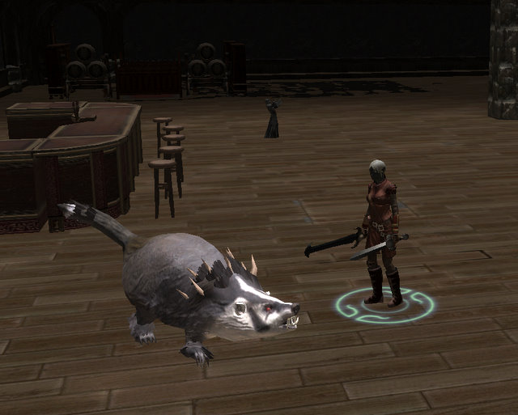

Back to: [West Karana](/posts/westkarana.md) > [2008](/posts/2008/westkarana.md) > [January](./westkarana.md)
# NWN2: I'm in my world, now.

*Posted by Tipa on 2008-01-15 09:30:17*

Over the weekend, I bought Neverwinter Nights 2. Not because I really want to *play* the game (though I will), but because I want to teach myself how to use the scenario creator to write my own adventures.

I'm not sure NWN2's editor is what I'm looking for; it doesn't have that sense of freedom while editing that I'd like. I would prefer to edit things in a sort of "god" mode -- quickly sketch the layout of the rooms in an overhead view (as this editor does allow), but then walk around inside the room, placing things so they look good from the player's perspective.

And a word on that perspective -- as an MMO player, what I really want is a camera that just follows what I do, turns with me, and basically disappears -- I never want to have to fight the camera to make it see something my character would be able to see. Fights are so frustrating.

I did with the editor what everyone probably does with it first -- make a room, then place nice stuff in it. My first room was also filled with monsters, that attacked each other and the Dungeon Master character I'd placed in it. That didn't really work. My second room (above) just had one monster that I could experiment with -- Badger Jones is his name.

It's going to take a fair amount of practice before I can even START with the real things I want to explore in an MMO setting. I'm still not even sure I shouldn't be using the Unreal 2 scenario creator, as it looks to be more in sync with the tools used by actual MMO developers.

## Comments!

**[Openedge1](http://Nonerightnow)** writes: I hated that camera also...but, you may try this..it makes the controls WoW like, and works quite well.

http://www.bluechipps.com/nwn2/

If you go there you will see two versions. One has the menus with the thumb button (if you have say a Logitech model laser) and the other lets you bring up the menu with left shift, which is really nice if you don't have a thumb button on your mouse.

These are safe and tested, but make sure to always run a virus check.
Good luck in your endeavors, and build us a cool mod!

---

**[Tipa](https://chasingdings.com)** writes: Woot, you may have saved my life here. I'll have to check it out when I get home :)

The camera disappears in WoW, I never ever think of it. EQ2 as well. Not quite in EQ1, where you pretty much have to go first person most of the time. I'd be content with a first person view in NWN2, especially if the field of vision was wide enough.

Thanks for the good thoughts :) My initial plan is to try and make a level in NWN2 and then try and duplicate it on the Unreal 2 engine, which looks pretty interesting as well.

---

