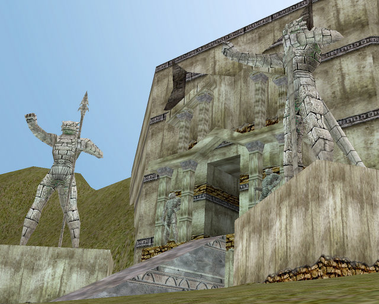
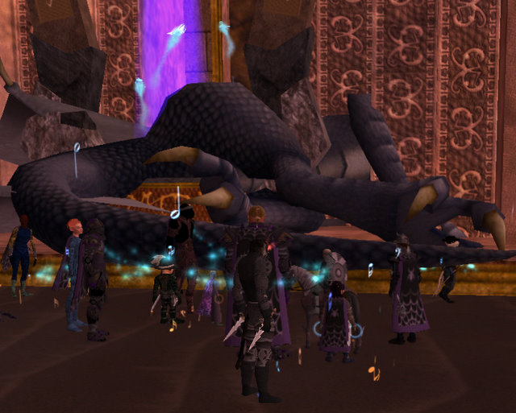
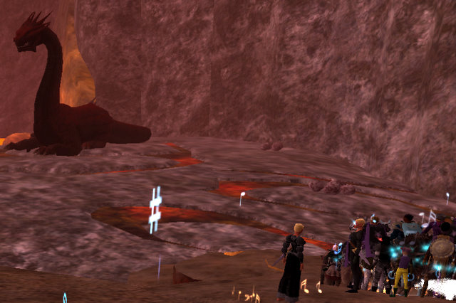

Back to: [West Karana](/posts/westkarana.md) > [2008](/posts/2008/westkarana.md) > [January](./westkarana.md)
# EQ2: Looking for Veeshan.

*Posted by Tipa on 2008-01-18 12:08:33*

The barrier that separates the calm veldt of the Jarsath Wastes from the hellish environs of Skyfire. We approached it last night with trepidation -- this night, we were going to meet the Ring of Scale on their home ground. Once they spurned and imprisoned Trakanon. But now he's back to rule over them all.

The dragons of the Ring of Scale built this as their city and temple; outside prowl the creatures of the dragon's home world and many of their young. They must conquer the outside before they are let inside. Inside, the dragons plot and scheme and guard the hidden portal to the Plane of Sky.

Oh, wait. That was EQ1.

Y'know, I was a big fan of the whole nostalgia thing with the Echoes of Faydwer, and I guess I appreciated why they did it again with the Rise of Kunark, but come on. We EQ2 players don't want to be locked into what was done in EQ1. Lots of the dragons are the same... if you're going to make everything the same as in EQ1, then just copy all the EQ1 characters to EQ2 and close the original one down.

I promise in advance that if you copy the Prophecy of Ro expansion, I'm quitting. Just saying. I'm not doing that pointless factioning in Devastation again. What a terribly ugly zone.

Well, VP has changed considerably from its old architecture. First: Note the Veeshan symbol on the door. Instead of Veeshan surveying Norrath (it was her discovery of the world that drew interest from the gods and led to the creation of the mortal races), we see Kerafrym, the Sleeper, the illicit union of red and white dragons (though not, apparently, Nagafen and Vox, but I bet it was them anyway, since when the Sleeper awoke, he stopped by their lairs) -- we see Kerafrym looking over the shattered moon, Luclin.

Anyone still think Luclin is not the next expansion? We see it in the Tunarian Throne Room, now Veeshan's Peak...

The old Veeshan's Peak was a place of marble walls and broad avenues, leading off with a alabaster bridge spanning a moat of lava. Disaster has struck the place in the centuries since, and now the moat is spanned with haphazardly-stacked stones and the ruins of bridges and guard houses, patrolled by raptors and drakes. That one down there is just about to kill me... they have a huge aggro range.

In EQ2, death is just a learning experience. I wish real life was like that.

Revenge is sweet. Stings, don't it?

The first couple of nameds had been cleared by the guild a couple of nights ago, as well as a lot of the trash, so aside from a couple of respawned roamers, we soon arrived at Nexona's Lair. Her lair in EQ1 (why so many comparisons to EQ1? Hey, the devs copied the zone, isn't it reasonable to talk about what they changed?), anyway, her lair in EQ1 was shared with two of her kin (separate bedrooms, common living area), and they overlooked one of the central shrines. Here she has a place to herself. Things get better with Trak in the top office, eh?

Here she is taking a nap. A DIRT nap. Get it? HAHA!

She's picked up some friends who help her a little bit as she dies. Way back when, she mostly just feared and knocked back -- she wasn't much of a fight. I have to admit that she hasn't really learned much since then.

I have forgotten this wurm's name. Edgar the Old or something like that. Probably an ancient guardian wurm from outside who got all uppity, decided to take and make a name for himself on the inside. And what do they have him doing? Guarding the hatchery.

He had some devastating attacks -- from the hard candy he keeps on the coffee table to the endless pictures of his grandkids. Well, we dealt with him AND his grandkids after everyone got back from crashing.

Because by this time in our night's journey, EQ2 had decided that it was done rendering this game and wanted a rest. During one pull, I was so lagged the fight was still going on, on my screen, after we had wiped and people had made it back down. Raid was in the green, and only by the people on Vent did I know it would go badly in the future. I cast Jester's Cap and a few minutes later, saw it go off. Then the past came rushing up to the present and I saw the raid wipe, revive, and run down in a couple of seconds.

This was as bad as some of those old Kael and Velketor raids back in EQ1 when I had joined my first raiding guild with a dial-up modem and a slow computer. Not Good.

Then EQ2 crashed -- out of memory. Lots of people had to reboot. When I came back, everything was fine once more, and we killed Edgar and his baby friends without any trouble after that.

We cleared up to the end of the first Wing (hehe... get it?), to the Librarian (Skyshrine had a lot of book-obsessed dragons, but they were of the slightly more-intelligent Claws of Veeshan faction... Ring of Scale must be trying to edify themselves...). The Librarian is protected by a color matching puzzle anyone who has recently betrayed from Qeynos should recognize. It was late, so we left off there.

Once we finish backflagging, we, like every other raid guild on Befallen, will be living in Veeshan's Peak. Back in EQ1 (sigh, I sound like an old codger every time I say that), VP was a horribly deadly place that took an extremely long and tedious quest to enter. You couldn't leave the place. And it was a contested zone -- so you had to fight other guilds for spawns (or let lesser guilds clear up to the good nameds and then race past them in typical EQ1 uberguild fashion -- best to twist the knife a little and suggest they should be thankful you let them have the lesser nameds at all... yes, Magister, I remember bowing and scraping to you...) And you *also* had Venril and Trakanon and the Planes for off nights.

Here we are three months in to RoK, and a lot of guilds are in VP, more coming all the time, and pickup raids for the Tier 1 encounters. Kinda funny. Way back when, these same dragons would come out, wipe the raid in ten seconds, and then after an hour or two of CR and rebuffing, we'd try again. Not saying I liked the long CRs, but it definitely focused the mind on raids -- if you screwed up, that's two hours gone. So like for the second dragon in old VP, the one that required 500 DR and Cure Disease potions -- we had to prepare for weeks for that fight, getting gear and stuff, getting more people flagged, so the NEXT time we went.... we would rule.

Wish EQ2 would go back to bringing new places and mobs. This involuntary nostalgia for a game I quit long ago is getting a little tiring. Yes the men were more handsome and the women more beautiful in EQ1, and everyone was above average...

## Comments!

**[stargrace](http://mmoquests.com)** writes: I actually mentioned one night in 70-79 that I'd love to see NEW content. Not EQ1 content revamped for EQ2, and I was flamed, bad. REALLY bad in fact. 90% of the players ranted on about how "this is EQ2, and it should be molded exactly like EQ1" etc etc. It's all I heard for the rest of the night. Damn didn't I feel like crap by the end of it. 

A few people spoke up about how they didn't play EQ1. So all they hear now in EQ2 is EQ1 this and EQ1 that. Makes for pretty boring conversations to those who never played the original. 

Personally. I'd LOVE to see NEW content. Brand new. Something no one has seen in EQ1 or EQ2 yet. I enjoy the nostalgia just as much as the next person, but it's been three years of EQ1 revamps now. I'm ready for something else.

---

**Zygwen** writes: I believe you are referring to Elder Ekron and not the Fairy Dragon that flies around Skyfire, which should also not be confused with that poet named Edgar something or other.

You make EQ1 sound like Minnesota :P

---

**[Tipa](https://chasingdings.com)** writes: Yeah, that's the one. And, I figured you'd get the PHC reference :)

---

**[Genda](http://www.thegrouchygamer.com)** writes: "just copy all the EQ1 characters to EQ2 and close the original one down."

OOH! Great idea. That would probably get me playing Genda again. I bet Branyanu would get her enchanter going again too. 

I agree though, that is taking the easy way out. "Design new content and storyline or make a derivative? Hmm we can go a lot faster if we don't have to do all this from scratch." It's nice if there are some of the same PLACES. Geography isn't going to change THAT much. I want different storylines and characters, especially if they are bosses. It's OK to have the odd boss from EQ1 in EQ2 just for continuity (if there was no way he would have been gone for some reason" but if they are making carbon-copy stories and characters, it doesn't matter how different the encounter is, it deprives the users of that certain "OH! Cool!" moment. "Oh, look. It's Zlandicar again. Yawn"

---

**[Tipa](https://chasingdings.com)** writes: Well, if the next expansion is Velious 2.0, I guess we'll get Klandi and Zlandi. It's ridiculous. Aside from the fact that all these dragons were killed repeatedly by thousands of people in EQ1, which, even given resurrection as a reality in the world (as opposed to simply being a game mechanic -- some NPCs have rez), should at least have been a clear signal to the Ring hierarchy that those lizards just weren't up to snuff.

EQ1 is \_\_still there\_\_. If anyone wants to raid Trak again, they can go do exactly that. In a few months, they'll be spawning Fabled Trakanon again, so he'll even be a challenge for a month or so.

There's probably a need for an updated EQ1 -- with modern technology wrapped around the old game -- but that game should not be EQ2. EQ1 had some tragic missteps that should not be repeated.

I would have liked to have seen VP be a broken, disused place, guarded by the undead shells of the old dragons... and then at the end, a new portal to Veeshan's plane -- hell, why not to Veeshan herself, she's bigger than the world. Her body must be home to all sorts of weird things.

EQ2 needs to tell a new story. We already played the old one.

---

