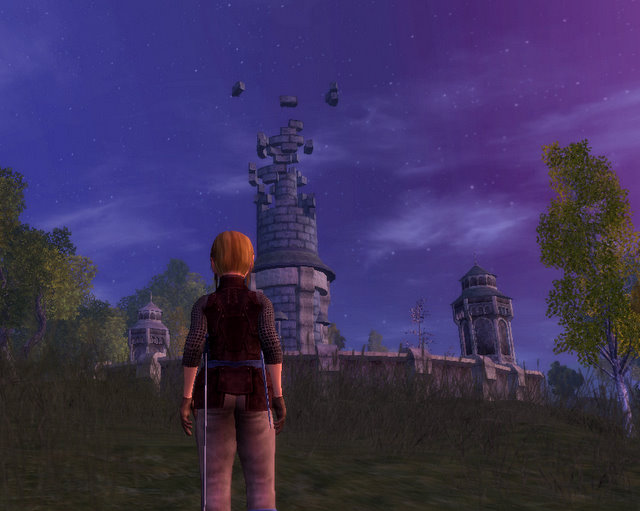

Back to: [West Karana](/posts/westkarana.md) > [2008](/posts/2008/westkarana.md) > [January](./westkarana.md)
# Vanguard: The Newbie Fields

*Posted by Tipa on 2008-01-21 08:23:33*

Vanguard has its problems; [Stargrace](http://mmoquests.com/) mentioned last night while we were chatting that you really should think of it as still being in beta and that's right on. And we now know from former Sigil employees that the artwork was in place, but most of the quests were written by new hires in the last year of development so in short, the game is absolutely beautiful, but the quests are rote and the game isn't all that stable.

 My first few hours were plagued by bugs and disappointments, such as having to ramp back the resolution I play at in order to get acceptable performance. But I moved past that. Since I have Station Pass on my main account, Vanguard is free for me as long as I keep up the subscription; so I will be able to check in now and then.

Vanguard players are passionate about their game. They know about WoW and EQ2 and consider both games for kids. In the Thestra general chat, aside from chatting about Cloverfield and the Packers game, were fears that SOE would be bastardizing the game to make it more palatable for players of other games.

These people like being the underdogs. They'll tear off your face if you suggest it's like any other game.

Really, though -- it is. And that might be Vanguard's real problem.

They promised the EQ1 experience, but in EQ1, you soloed up to level 6 (or level 10 if you were tenacious), and after that, you generally grouped for the rest of your gaming life. In Vanguard, you don't seem to have to group that much. Which is lucky, since I'd be hard pressed to find someone to group with. The nearest city, Thrush(?), was entirely empty. That monastery where you end up when you, say, fall through the world and contains all sorts of trainers and stuff -- entirely empty. Aside from the rare rider galloping through and one person running through doing diplomacy quests.

Diplomacy, that's a fun one. The first real diplomacy quest I got is impossible to win. I don't have the right cards. The lady hammers me with red cards while I power up her yellow ones, since yellow is all I have. I spent hours analyzing all her cards and all mine, and I can come close, but it's clear that unless I can meet her in both red and yellow, or work around her with some greens, that I am not going to win this one. 

So after a few hours spent writing a program to analyze diplomacy, I moved back to adventuring. Diplomacy will have to wait until I can play more effectively. 

I really enjoy Vanguard's combat animations. They did a lot of work on this, and they are equal (or better) than those in EverQuest 2. Here's a video (with some snarky subtitles) of my low level bard, dual-wielding long sword and dagger, attacking some walking pumpkins. Check out the overhead two-hit action.

I am listening to "Shut Up, We're Talking #18" while I write this, and they are wondering if people are being too nice when talking about bad games, and they mention Vanguard ... twice .... three times.... clearly they think of Vanguard as the example of a bad game.

It's not a *bad* game. Even as far back as in beta, I didn't think it was a *bad* game. Just a *typical* game. A game these days has to bring out the big guns right from the start. Instead of getting newbie quests to kill ants and frogs, why not give me a story to work through? Put me right in the thick of things. Use that diplomacy right from the start, first quest maybe, and for more than getting a slice of pie. Crafting and diplomacy are side activities that you encounter eventually but are never presented as something vital to know. Put those first; like you have to use diplomacy to convince someone to let you fight, and the first thing they have you doing is repairing weapons for the fight, before you are given one of those and sent to, finally, fight.

People coming new to VG only see what they've done before. In my first six levels, all I have done is what I have done in every single game since Dark Age of Camelot, my first game after EQ1 and first with a seamless world. I know there's unique stuff out there, I saw it at the Fanguard I went to, but I don't see any of it here. It needs to be front and center, hour #1.

They could do something about the character models as well. There's sliders so you can infinitely adjust your nose size or forehead size, but only four hair styles?

(lol... SUWT just mentioned Vanguard again... in the context of EQ1 nostalgia wanting VG to be EQ again... and being disappointed...)

Vanguard is a game that needs a redoing of the newbie experience -- at least the halfling one. Do what EQ1 did and concentrate all new players in some hubs, like, one for each continent perhaps. Get the innovative game mechanics right out there, first thing. And somehow, STOP people from expecting to see EQ1 again. I tell people again and again -- if you want a sparsely populated game with a bunch of high level players similar to EQ1, well, go play EQ1. It even now has more people than Vanguard...

Vanguard has to figure out what's different, and emphasize that. Perhaps the amazing artwork and vistas. Give us some lore. Make some quests that are a little more interesting to pull people through the content. Then you might find new people playing.

As for me -- well, I'm not paying extra for it, so I'll keep it around. It's tough to figure out when I should play Vanguard when I have EQ2 available...

## Comments!

**[Tipa](https://chasingdings.com)** writes: Watch out for a "Vanguard Bloopers" post... where I run from a walking pumpkin until I find a place where it is NOT out of line of sight, or pictures of me falling and falling and falling through the world.

---

**[Lucifrank](http://tenfoldhate.com)** writes: Yeah, by no means is Vanguard the turd it was upon release. However, when I briefly reactivated my account the game failed to answer the question for me, "Why Vanguard and why NOT WoW or EQ2 or LOTRO?" I couldn't find anything done drastically different than--or any better than--the holy trinity of the current fantasy MMO market. And it does still play as if its in BETA, something IMHO inexcusable in 2008 over almost a year after launch.

---

**[Openedge1](http://Nonerightnow)** writes: Wow...
 I am so disappointed. I have been trying to follow this game for a while now. I have never bought it, as I played at the end of Closed Beta...I saw the issues then...but, figured time would tell..
 And with a year under it's belt...it still is a dog? I have been reading posts that they have been fixing issues, and the speed is getting up there...but, from your diagnosis, it looks like EQ2 is still the game of choice then. WoW just got boring, LOTRO was a huge disappointment..I guess I do not want that again...

 Unless...they are suppose to be setting up a Trial Isle feature like EQ2...now THAT may be the ticket,,here is wishing them luck
Later

---

**[Tipa](https://chasingdings.com)** writes: I think, with Vanguard, you have to make the commitment that THIS will be your game; that good or bad, THIS will be the game you struggle with, enjoy, find friends, go to Fan Fairs for... that you will stand up proudly and tell the world, "I play VANGUARD!" without a hint of irony or even the smallest glimmer of a smirk.

All MMO players have to do this if they ever want to see "everything" a MMO has to offer. You hardly ever see any of an MMO if you just play for a couple of hours every few months. I identify myself as an EQ2 player, but before that it was WoW, and before that, EQ1. And I understand I had to MAKE those commitments in order to really enjoy those games.

So those of us on the outside -- those of us who do not identify as Vanguard players, but rather as people who have played Vanguard (something entirely different) -- *cannot* judge Vanguard. All those passionate players who stay with the game aren't there because they are *not* having fun.

I think people have to acknowledge that there is something of value in the game. And I would like to see that, too -- if I could without making a huge commitment. A well-designed newbie experience could DEFINITELY bring a taste of all the good things together in one fun package.

---

**Zygwen** writes: Speaking of Fan Faire will you join us at the next one? :P

---

**[Tipa](https://chasingdings.com)** writes: Depends on time, money, place, etc. I would definitely go if it were in San Diego, any chance to visit my grandson is worth it. Vegas? *Maybe*. East coast? I almost definitely would.

---

**Saylah** writes: I think the reason why it can and should be considered a "bad" game is because it released in a BETA level quality. People don't expect to pay for or subscribe to a BETA quality game or at least I didn't. I pre-ordered and expected a reasonably polished game, not what I got - horrible animations, lots of bugs and the worst lag I've ever experienced in any game. Whatever may have been fixed by then it would take tremendous strides for me to give it another shot. I mean, time is money and they already got some of that and I wasn't pleased. There are other options out there where I don't have to compromise on the gaming quality I prefer. I dont want to have to "tolerate" what should be a fun and enjoyable experience that I'm paying for.

---

