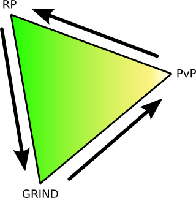

Back to: [West Karana](/posts/westkarana.md) > [2008](/posts/2008/westkarana.md) > [January](./westkarana.md)
# RP, Grind and WTFPWN -- the MMO triangle

*Posted by Tipa on 2008-01-29 08:30:03*

Openedge1 over at [Simple and Complex](http://simple-n-complex.blogspot.com/) was listing off a bunch of upcoming MMOs and he noticed that there's been a sea-change in the MMO world; games are shifting toward a PvP focus, for better or worse.

Made sense; there's a cycle going on here. MMOs have their roots in MUDs -- Multi User Dungeons, largely text based and most definitely deep wells of roleplaying. But you could take RP only so far, and so they made them more gamey. Since the barriers to entry were so low -- you could bring up a new MUD all by yourself in an evening and then do whatever you liked with it -- a hundred different styles of MUD were written.

One of them, a level based MUD with monsters and classes, called Diku, evolved into EverQuest. When it started, RP was fairly important, and grinding levels wasn't that important at all. There was really nothing gained by being level 50; all that bought you was a spot in the waiting list for the Ghoul Lord in Lower Guk.

Ultima Online preceded EQ by a year or so. That game came from a different philosophy. The world was a harsh place. There was full on PvP, so leaving town left you at the mercy of roving player death squads. Somehow, RPers were able to get by, until they opened the non-PvP shard and nearly everyone moved there, leaving the PvPers nobody to kill but themselves. Which, if you're a PvPer, is pretty dull. PvPers want prey, not competition.

This recent shift in MMO development in order to escape the behemoth that dominates Grind inspired me to come up with the MMO TRIANGLE, that tracks shifts in games.

UO would start about a third of the way from PvP toward RP. Over time, it shifted more toward RP. EQ would start about halfway between RP and GRIND, moving toward the GRIND vertex. WoW started very near GRIND on the RP-GRIND segment, swung around the corner, and is now lumbering toward PvP, driving newer games like Fury, Age of Conan, Pirates of the Burning Sea and Warhammer in front of it.

Now, this triangle has an interior. A game on the GRIND-PVP segment could bend a little toward the RP side. It's not an absolute rule. 

What does this mean for the future? 

Well, if this has any truth to it at all, it means I only have to wait a couple of years for MMOs to round the PvP corner and start heading back to RP -- but with PvP as a major component. This means -- User Generated Content. Bringing us back finally to the beginning in MUDs, where we have our worlds, and you can visit mine and I'll visit yours and we'll meet up and go play in this big commercial one. 

Second Life is planted at the RP vertex. And let's place Warhammer squarely on the PvP vertex, though I think it is still a fair ways toward GRIND. So think of the future as being something like Warhammer, but with your own castles, battlegrounds, war machines and what have you.

That'd be pretty cool, right?

And that's what we're going to get, as soon as the industry finishes getting rid of the GRIND.

(cool diagram made with Inkscape.)

## Comments!

**[Lucifrank](http://tenfoldhate.com)** writes: A game couched comfortably halfway between PvP and RP would be my dream. A game where players ARE the factions, the adversaries, the quest givers, the good guys and the bad, that make the game world come alive. The only thing ruining this gametopia of mine is--of course--the people factor. There are always gonna be jerks, griefers, and kids who feel powerless and need to exact their revenge on the world that doesn't understand them in pixilated form. But hey, I love the MM in MMO, so I'll always be willing to take the good with the bad. And I'll always have forums to whine about it, I suppose.

: )

---

**[Openedge1](http://simple-n-complex.blogspot.com)** writes: Hey...
 Great article (missed not coming to your site yesterday)
 Anyways. I think this is one reason AoC appeals to me more than Warhammer...so hear me out...
 As Lucifrank notes a game between PvP and RP is hard to find. I felt Guild Wars almost had it right also...No grind (unless you wanted to) PvP (just not open world...which gets rid of ganking) and RP in the city hubs or the beginning area (again, if you wanted..but, sometimes the cities were full of partiers moreso than RP). 
 I think this is where AoC could shine. You have a "Story based" RP single player game to get you started. I mean really...how many times do you group before level 20...I hardly ever do...so, 20 levels of single play with branching story lines (don't see that in many MMO's). Then you move into the real world...and REAL danger. 
 The almost real time combat will be more skill based than item based (take that WoW), will have sieges like WAR..
 The character creation is fuller than most games...more along the lines of EQ2 with a ton of control...but even moreso, with various body parts you could not change in EQ2.
 So...will it do well? I do not believe so. I think the license does not have as much pull today as it use to..so all I can hope for is that they concentrate on the gameplay, make it play well and then the word of mouth will pull others in..

Later (and glad your back)

---

**[Tipa](https://chasingdings.com)** writes: I'm not sure the license has any mass market pull. Sure, we MMO-obsessed people know all about Conan, but pick some random gamer like, say, my 20 year old son, and ask him how much he anticipates an MMO set in Conan's world of Hyborea, and he'll say, "Conan who? And Hypa-huh?" Now, if I mentioned this game has a lot of sex and boobies and blood and action and he might get interested, but it certainly won't be because he has always harbored a secret desire to play a thick-thewed barbarian and shout "By Crom!" all the time. Crom who? Heh...

And that 20 level single player game is a non-starter, and I believe I heard they took it out entirely. Really, though, it's a bad idea. Let's say you and I decide to start AoC together. But of course, we can't -- we have to play through the first 20 levels alone. You're excited about the game, tear through those levels; but I have a little more trouble, and get bored and don't log in for awhile. You're stuck at 20 and we're not playing together.

But then, I eventually get to level 20 and I want to play with my sister, and I somehow convince her to get the game. Well, then she gets dumped into a single player game where I can't show her around or help her out in any way, and she decides this whole MMO thing isn't for her and has grown frustrated looking for Arnie.

So it's as if they say to players, "Whoa, whoa, hold on there. You can't just start playing with your friends. We're going to make you play this other game first -- by yourself. And only then do you get to play OUR game."

Soloing in a MMO is a long sight different from playing by yourself in a single player game. I just don't see how that can work (and as I mentioned, I believe they no longer require you to play the first 20 levels solo).

---

**[Lucifrank](http://tenfoldhate.com)** writes: I haven't read anything about AoC dumping the single-player-through-level 20 mechanic yet, but I think Tipa makes the most valid argument for why right here. If I'm not mistaken, the Conan IP is still huge in Europe, but I honestly feel here in the States they're about 25 years too late. When I was a kid waaay back in the eighties first discovering D&D, we ate up Robert E. Howard's Conan tales with the gusto that children now enjoy Tolkien or Rowling. I'm not saying Howard ever had that caliber of pop culture appeal, but you have to keep in mind the license at that time was riding off the popularity of two Schwartzeneggar movies and three Marvel comic books.

---

**[Tipa](https://chasingdings.com)** writes: When I think about it, this is exactly the strategy Rudy Giuliani used to win lose Florida.

---

**[Openedge1](http://simple-n-complex.blogspot.com)** writes: @Tipa
 It has been stated that the 20 levels will still be "online" but in an instance...so, you will still be able to chat as you learn the game through their story system. As well, from what I heard, their will be an option to skip this...but, let me make sure, and find that info...
 I just grouped with my wife for the first time in EQ2, and we started from scratch...and it seems like we blazed through compared to each time I played solo...but we are now level 22, and we do need each other in the game...but, it still makes me question the first 20. 
 In our new guild, everyone that has been joining has started in TD, and played those first 20 levels...solo.
 Maybe it goes to my recent post on solo vs group...what aspect of the game makes you want to play in a group, and WHEN does the group play come into fruition...
 2008 will be interesting for MMO's...will it not?
Later..

(PS: Found it...well...one aspect of the 1-20 game...
"* With Alts: they might implement that alts have to do just levels 1-5 at the start then can go straight from Tortage instead of 1-20. (1 - 5 takes very short time) The thing is that Alt will have to do the Destiny Quests for Tortage though to continue the story off the island. So from feedback they are trying to give the player the option not for repetition with an alt.")

---

**[rmckee78](http://otherlivesthanthisone.blogspot.com/)** writes: I would love to have a game where a player can give another player a quest that would give XP as a reward, even if the quest giver had to give up their own XP to do it. I think only then can we turn that corner to good player created content and the new wave of RP.

---

**[Nuyan](http://nuyan.wordpress.com)** writes: RP and PvP are far from incompatible things. So are grind and RP actually. 

That Triangle is a nice idea though, but it doesn't really work that way. ;)

---

**[Tipa](https://chasingdings.com)** writes: And they all connect to each other; plus there is an inside to the triangle. It's more a mark of how the market seems to change over time than how any individual game places.

---

