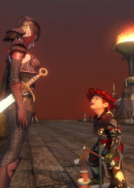

Back to: [West Karana](/posts/westkarana.md) > [2008](/posts/2008/westkarana.md) > [January](./westkarana.md)
# EQ2: Leveling the necromancer in Kylong Plains

*Posted by Tipa on 2008-01-31 10:27:10*

If you really want to impress your level 66 alt, bring them to the Kylong Plains.

No, really -- the Plains aren't just for the 70s anymore. Were they ever? Both my troubador and inquisitor were already 70 when Kunark opened, and both had a certain amount of raid gear, so aside from some bits of jewelry, neither found many upgrades here and the experience wasn't that great besides. That would all change in the Fens, but Kylong Plains was useful really as a jumping off point to the rest of Kunark.

Come in as a level 66 necromancer who had no raid gear and every single thing is a tremendous upgrade, and every quest is yellow or orange and gives substantial experience. And (for a necro at least), it is easily soloable (though when Dina isn't camped out in front of Veeshan's Peak, I two box, as I did last night, which speeds things up quite a bit.)

Long story short; completing the quests given at the docks and in Teren's Grasp gave Dorah two levels, and upgraded nearly every bit of gear she owned. Now she's off to the area around the Fens which should easily add another level or two to that.

Her spell damage has gone through the roof, along with her intelligence and stamina. I never saw this side of Kylong Plains because the place had few upgrades for raid characters. For all others, though -- what a gold mine.

I still don't like soloing. I've come to grips with the EQ2 New Game Experience, and I no longer bother looking for groups outside of the instances everyone runs after they turn 76 (though the levels for those are rising -- it is very hard for a 76 to get RoK instance groups now, where it was fairly common in the first month of the expansion).

Turns out I missed a questline when I was bringing Dina and Dera through Kylong Plains -- the one that ends up using a drachnid costume to go check on a missing person. People used to use those to harvest freely in the drachnid caves, but that was nerfed awhile back. If I'd known that this was the quest line that gave both the funny little red hat (that Dorah wears in the top picture) and the Regimental Chain Armguards, the only piece of the set Dina didn't have, I would have done it for sure. I sold off all Dina's Regimental Chain long ago, since everyone was wearing it, and who wants to look like someone else?

## Comments!

**[Kaix](http://www.insurrectioneq2.com)** writes: Lol, every necro has that outfit now :)

---

**[Tipa](https://chasingdings.com)** writes: It's a nice outfit!

---

**[Dan O'Halloran](http://www.massively.com)** writes: I've been qq'ing over the fact that my Fury isn't high enough level to experience Kunark at 62. I wasn't looking forward to grinding 8 levels, but if I only have to work out 3 or 4 to hop on the super equipment upgrade/power level express that is Kylong Plains, well that's a different matter. Thanks for the perspective.

---

**[stargrace](http://mmoquests.com)** writes: Grats on being linked to the town crier for this post hon *hugs*

---

**[Tipa](https://chasingdings.com)** writes: Wish they'd do a trackback or something; I can't read eq2players at work :(

Thanks for the heads-up!

---

