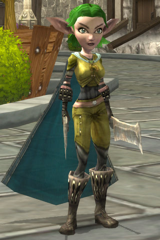

Back to: [West Karana](/posts/westkarana.md) > [2008](/posts/2008/westkarana.md) > [July](./westkarana.md)
# Exploring the Overworld in Mythos

*Posted by Tipa on 2008-07-01 09:41:04*

 As is way too often the case, I start writing a story about a MMO for Massively, and then get drawn into the game. Such was the case Sunday night with Pi Story, and last night with Mythos (both stories will show up today on Massively.com).

Mythos is an easy game to get lost in, but I have to admit I have not been playing much since Flagship introduced the Overworld. I was going to wait until all the new content was in (they are just working on Zone 2 now), and then do a weekend's worth of leveling ahead of open beta to get a good feel for the new stuff.

What with Blizzard's announcement of Diablo III, I was looking to get back into some hack and slash, action-rpg action. And so I went to Mythos to spend a minute and came out hours later.

Mythos has added a new MMO-like camera system, so when you're out in the world, anyway, you can have the camera low, like in WoW or EQ2... except not like them. It's a little off. And since Mythos, like Dungeons and Dragons Online or Age of Conan, has no targeting -- you hit what gets in the way of your weapon or spell -- it just doesn't work. Though I like being down low for looking around, fighting requires a higher perspective. Unfortunately, the old isometric view has problems in dungeons; unless you're in a very low view, it looks like you're walking through cubicles in an office instead of caverns in a dungeon.

Also, there seems to be a lot less magic in the world. My baby bloodletter is six, and only has two magic items. Even boss battles are unlikely to drop anything green or better, when in the past they used to always drop at least something. With the low level quests not granting magic items (they never really did), it's definitely a magic-scarce world out there.

I don't want to really get into a preview of Mythos, because it's still a game in heavy transition from the old instanced world to the new wide open one. It's not done, they are not saying its done, so don't come away thinking anything I say means anything with the finished game. They are introducing at least one public quest (O RLY!) which sounds like it will be a heck of a lot of fun. The devs seem totally committed to and excited by the game, and guess what -- it's still a lot of fun.

It's really the same as before, just with open zones instead of instances.

## Comments!

**[Einhorn](http://iceclad.wordpress.com)** writes: You know how in EQ2 they have the optional models for the Asian market with more smoothed and exaggerated features?

Mythos looks like the WoW version of that to me.

---

**[JoBildo](http://bildos.blogspot.com)** writes: Public Quest... O RLY indeed. Good on them.

I actually had the same itch, Tip. Instead of Mythos though I went back into Titan Quest. Such a good game... but now the developer's been crapped out because of piracy. Le Sigh. I wrote all about how much fun TQ is even still over on my blog.

There's something VERY comforting about a good, solid, Roguelike. I'm looking forward to when Mythos finally launches.

---

**[Tipa](https://chasingdings.com)** writes: "Le sigh" -- that's what bards say when they die in the EQ Nagafen monster mission (where you play Naggy and friends taking on (hopefully doomed) raids).

I never played TQ. All I ever heard were people comparing it unfavorably to D2, little incentive to pick it up. By the time I started hearing good things about it, the moment had passed.

---

**[JoBildo](http://bildos.blogspot.com)** writes: $20 nets you both the main game and the expansion these days. 

I find I miss the randomized dungeons, but it's still a great game to run through AT LEAST once. The mods and user-created missions and levels are an awesome bonus as well.

You should definitely check it out. Online is still up and running as well.

---

**[Einhorn](http://iceclad.wordpress.com)** writes: I broke down an reinstalled Diablo 2 last night - all the oozing over D3 made me giddy, and besides I want to get in all the Necromancer action I can before they kill him off (again).

---

**[Scott](http://pumpingirony.net/)** writes: *nd since Mythos, like Dungeons and Dragons Online or Age of Conan, has no targeting — you hit what gets in the way of your weapon or spell — it just doesn’t work.*

Really? I target just fine in both AoC and DDO the exact same ways I target in every other MMO: tab or left-click. Mythos? Well, Mythos is "Cute Diablo: Online" so targeting doesn't really make sense with that mouse-breaking, click-spamming game play style.

---

**[Tipa](https://chasingdings.com)** writes: lol... can you tell I never played either game? Was just going on what I (thought I) (obviously mis-)heard.

Now that they allow WASD movement, Mythos isn't quite so hard on the mouse, though you still must click to attack.

---

**[rmckee78](http://www.otherlivesthanthisone.blogspot.com)** writes: I have not played Mythos in several months now. I really enjoyed it and can't wait to see what all the changes have brought.

---

