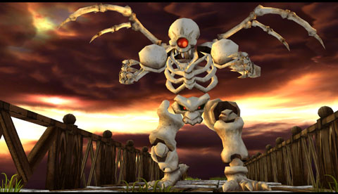

Back to: [West Karana](/posts/westkarana.md) > [2008](/posts/2008/westkarana.md) > [July](./westkarana.md)
# Chrono Trigger for the DS?

*Posted by Tipa on 2008-07-02 05:35:56*

Over at DS Fanboy, they have an article hinting that Chrono Trigger -- one of the SNES' best RPGs -- [could be making the jump to the Nintendo DS](http://www.dsfanboy.com/2008/07/02/chrono-trigger-ds-for-real/).

This would be fantastic. Especially if they don't repeat the mistakes of the FF3 port. Having to zoom in and out all the time combined with unreadably (to me) small text made that game frustrating instead of enjoyable. I have to admit I would be far more excited if they announced Chrono Trigger for the Wii Virtual Console.

I suppose I COULD dig up my SNES and plug it in... but with the PS2, PS3 and Wii there already, it's getting kind of crowded.

Picture is from a [fan-developed modern port of Chrono Trigger](http://www.opcoder.com/projects/chrono/) that was shut down by Squenix...

## Comments!

**Mallika** writes: It's been confirmed. Square Enix has put up a site for Chrono Trigger for the DS (albeit a countdown one).

http://www.square-enix.co.jp/ctds/

---

**Mallika** writes: Bah, never mind. I didn't see that the DSFanboy site already linked to it.

---

**[Tipa](https://chasingdings.com)** writes: Hope they plan to do a simultaneous English/Japanese version.

---

**Mallika** writes: I hope so too. Waiting another year or two for localization would be a downer.

---

**[Einhorn](http://iceclad.wordpress.com)** writes: Bah, I'd rather see Disciples 2 or Diablo 2 come out for the DS.

---

**[Tipa](https://chasingdings.com)** writes: Diablo 2 for the DS? Squinty squinty squinty... graphics are tiny enough on the PC!

---

**[heartless_](http://hgamer.blogspot.com)** writes: Woot! I love Chrono Trigger. This may be my first DS purchase since I bought the darn thing.

---

**[Tipa](https://chasingdings.com)** writes: Just won't be the same if I'm not sitting on the couch, playing it on the TV. Text-heavy adventure games don't work well for me on the DS.

---

**[Kanad](http://shatteredblog.wordpress.com)** writes: If any game could get me to buy a DS then Chrono Trigger would be the one. That game was amazing, and the 'upgrades' the Final Fantasy Chronicles release got weren't enough of a modernization to do it justice.

Of course, when I see news like this what I'm really hoping for is a return to Xenogears...

---

