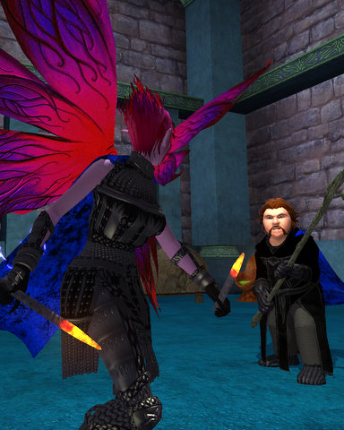

Back to: [West Karana](/posts/westkarana.md) > [2008](/posts/2008/westkarana.md) > [July](./westkarana.md)
# EQ2: Flittering furtively

*Posted by Tipa on 2008-07-07 08:14:14*

I haven't blogged about EQ2 in about a month from never. Not because I haven't been playing it -- I have -- but just because I haven't really been doing anything of interest. Running around, exploring. Being without a guild on my main characters tends to limit the time I spend on them, since EQ2 is a group-based game at all levels but especially so at higher levels, and without friends to group with, there's little incentive to log in. Part of that is due to having two jobs and entirely unable to devote the time to a raiding guild that would be required, since raid guilds are themselves a second (unpaid) job. I suppose a casual guild is the best thing I could hope for, but -- I LOVE RAiDING. Logging in and NOT raiding would make me sad. 

Luckily, I do have a guild for some of my characters -- the EQ2 branch of Nostalgia is going great. Thanks to the tireless efforts of crafters, writ-takers and heritage quest-doers, Nostalgia on the Najena server is leveling fast. I hadn't played there for months, but it was time I buckled down and did the void storm quests on at least one character, and so I woke up my Arasai assassin, Brightknife, from her slumber.

She was level 15, still had never left Darklight Woods, and her gear was best thought of as pathetic. I'd been meaning to get her out to Timorous Deep in order to do the far, far better armor quests but had never gotten around to it. Still, double xp weekend, a bar's worth of vitality, and another 5% from being mentored by her faithful companion-hobbit, Sam Gamgee Verd Tanglewood.

The goal was to get to level 20 so she could wear appearance armor, and also get all the pieces of appearance armor, PLUS the Void cloak with the hypnotically shifting pattern, PLUS two new weapons since all the weapons offered were upgrades. Go figure. You mean that rusted dagger might possibly not be the best possible tool for the assassin trade?

All totaled, that meant repeating the storm cleansing quest 21 times, 63 storms, 189 fights against 189 void beasts of her level. She went from level 15 to level 21 just fighting those creatures, and she hit 22 in her first-ever group, in Stormhold. She'd been invited to join just out of the blue, so why not? In all her new appearance armor, she looked quite the picture of a professional killer. A look beneath at the actual armor would reveal that she didn't even have all the armor slots filled...

Well, when your entire fortune consists of 2 gold (fighting void beasts gives no reward but xp; no drops, no coin, no nothing), the brokerage is not a friendly place. And even that money was eaten up by buying the apprentice II upgrades to the apprentice I combat arts. It's very very hard starting off on a new server, without the comforts that a successful level 80 character can give.

Sunday, I grouped with Said and Mayadhros and we hit up Splitpaw. Given we had no real healer, we did fairly well. We did the prequests, fought our way through Upper Splitpaw, and time had run out so we only really had time to each take a stab at the solo Arena. Once inside, Said and Mayadhros unmentored me and easily won their challenges. I managed to last until the double gnoll fight; I simply cannot take a hit. I can pretty much stunlock a single mob, but not two. I'll try again once I have improved my gear in Timorous Deep.

After that, I started work on my MMO DNA project and got quite far until a family emergency had us spending the rest of the day at the hospital (don't worry, nothing serious and everyone is fine, full details on my personal blog).

Oh, there's Verd. I originally got him the bp from the Imperceptible Beauty set -- which has no graphic (Brightknife is wearing that armor on her upper arms to look sleeveless), and he ran around most of the day bare-chested with that glowy cape hanging from his shoulders. But I decided he deserved some dignity, so he got that night black robe, and that cool staff which was a good upgrade to his hammer. Since he had points left over, he bought Brightknife the chair and end table seen in the first screenshot. 

Also, just a quick note here, I will be at the SOE Fan Faire in Las Vegas in August for Massively. Since I kinda used up so much vacation recently AND given that the date is really close to the Q3 release of the web app I help maintain as my day job, I'll just be there Saturday and Sunday, but if you'll be there, too, maybe we can say hi :) My son is also coming along. He plays EQ2 on the Befallen server as the brigand Scurvsnicker.

I had NO END of trouble registering for the Fan Faire. It was awful. Site wouldn't work for me for days. The FIFTH computer I tried, worked.

## Comments!

**[stargrace](http://mmoquests.com)** writes: Was nice to see you (and everyone else) peeking around Nostalgia 2.0 this weekend ;) Very awesome looking armor! :)

---

**[Mythokia](http://blog.mythokia.net/)** writes: Do you think you could share the link to your personal blog? :) I hope I'm not blind but I had trouble finding it linked anywhere on the sidebar.

---

**[Crookshankz](http://crookshankz.blogspot.com)** writes: HURRAY!!!!! I've missed your EQ2 Blogs!!! Next time your on Najena make sure you send me a tell and say hi!!!!

---

**[Tipa](https://chasingdings.com)** writes: I doubt my personal blog would be of any interest to anyone outside my family. It's just real life stuff with nothing to do with gaming.

---

**[Openedge1](http://simple-n-complex.blogspot.com)** writes: Good to see some EQ2 love.

I have been logging in with the wife recently. I still love to play once in a while. Of course, like how your post states, is it me, or is it like going to a second job? I have spent more time gathering and working on the Broker than running quests.
Odd.

And I feel as broke as in RL (Mastercrafted Armor = Gas Prices!)

Anyways, glad to see the stories of the Tipa crew!

Cheers

---

**[Mythokia](http://blog.mythokia.net/)** writes: I guess it's the same reason you drop by mine still even though I haven't covered much about gaming recently, just because I haven't done anything out of the ordinary in anything that I play that's really worth mentioning. Sometimes reading about other people's life is just as interesting.

---

**[Tipa](https://chasingdings.com)** writes: Well for one thing, Myth, you're an interesting person, you write well, and you live in a place I love hearing you talk about. Anyway, check your email. I don't mind friends knowing about my private life, but I doubt every visitor to WK really wants to hear about it -- that's part of the reason I split it away in the first place. The other part was that my family was tired of reading WK to find out what was happening in my real life.

---

**[Lishian](http://lishian.wordpress.com)** writes: Cool armour! Is that from the Freeport AQ?

---

**[Tipa](https://chasingdings.com)** writes: No, it, and the weapons (hot spike to the eyes goodness) are Gathering Tempest part 1 rewards.

---

