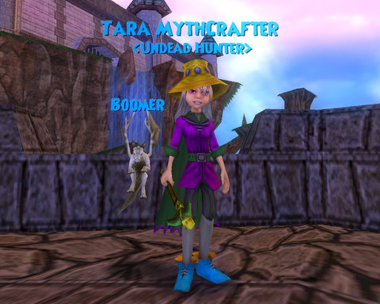

Back to: [West Karana](/posts/westkarana.md) > [2008](/posts/2008/westkarana.md) > [July](./westkarana.md)
# The new Wizardling...

*Posted by Tipa on 2008-07-10 05:52:21*

It's not the "perfect" MMO, but it's definitely different enough to make it worth a look. Deck-building, strategic card-playing, turn-based combat? Check. Automatic grouping? Check. An absolutely INSANE amount of character customization? Check. A Toon Town-ish gameplay style that lets kids and adults play safely together? Check. Friggin' baby dragon pets? Oh dear, yes, check!

I'm working on a big article about this game, but you should probably [check out the beta](https://www.wizard101.com/)... Tara Mythcrafter, level 7 Myth wizard, look me up :)

## Comments!

**[Robert](http://worldofsolitaire.com)** writes: I've seen some buzz about this lately, but your post has caused me to really think about looking into it! Thanks for posting, I REALLY look forward to your larger post!

---

**Einhorn** writes: That hat and make-up is SO Alicia Keys.

---

**[Tipa](https://chasingdings.com)** writes: I had a better-looking hat and had dyed my whole outfit to match, but this hat has way better stats. I agree, it does kinda look like an Alicia Keys hat. I just finished buying the baby dragon pet, and even the CHEAPEST color combination (white and gray) took 313 gold (you can choose your own colors, but it costs more). Plus I'd bought that hat, and some treasure cards, so I'll have to save up some more gold in order to look coordinated again.

That hat, though, I'm keeping. Maybe I should try to make a real Alicia Keys outfit? My niece is a big fan of hers, she'd probably go crazy for it :)

I didn't want to put too many pics up, like my really nice, older outfit, saving the cool stuff for the article.

---

**[Myrix](http://www.thewanderingrogue.com)** writes: My girlfriend is playing this game currently, and she's never touched an MMO before. I have a feeling this could lead her down a dark path indeed. 

She also humbly requests that you, ahem, "get your ass down to Triton Avenue and help me defeat the Harvest Lord!"

I haven't seen much of the game myself, but from what she's told me it sounds like a great, and more importantly, *safe* game for kids to play. I wish them well.

---

**[Tipa](https://chasingdings.com)** writes: I think I might have that harvest lord thing. I have to go get a stick from some tower, that might be that.

Can you help people with their battles? A bunch of us tried entering Rattlebones Tower together and we all got our own separate instance. I have no idea how I am going to be able to do the Golem Tower alone -- I barely make it through the first three floors.

---

**Einhorn** writes: Just sleight-of-hand a few Amulets of Necropotence on each golem and wait for some asshole monk with ludicrous gear to come farm them to death for you...

That'll take care of em' !

---

**[Tipa](https://chasingdings.com)** writes: Nah, won't work. All the stuff in this part of the game is Rank 2, and you can't use Rank 3 or higher abilities on them, or you don't get loot or xp.

In Wizard101, you are forced to kill mobs with level appropriate spells. If you want to see a reward. If you just want to make it to the top of the golem tower, well, even though it's rank 1, I use rank 2 stuff.

---

**[Darksuit](http://www.wizard101.com)** writes: Here is a hint, head to the libary and pick up some cheap (25 gold) buff treasure cards, to help bosot your minons. Also you will want to pick up a wand that is not the school as you are.

---

**[Tipa](https://chasingdings.com)** writes: I actually found a fire wand dropped for a mob. Er, the Symmetric Wand. I dropped my Myth wand like a fat tick. Seems half the mobs in Triton Road and Haunted Cavern are either Myth creatures themselves or guard against it. Treasure cards I have bought, but I haven't seen how to get them into my battle deck. They are in my regular deck, but I never draw them... will have to look into it, I'd love to finish the Rank 1 stuff.

---

**Ben-G** writes: One of the surprising things about this game to me was the extremely high level of polish. It's been in beta for about a month and there are barely any disastrous bugs as you are accustomed to seeing in most betas.

---

**[Tipa](https://chasingdings.com)** writes: I think it's going to be a total hit.

---

**[DanO](http://danomatic.com)** writes: Damn you, Tipa. Damn you for tempting me with this one. I spent the better part of today playing it. And I already know I'm going to be playing it most of this weekend. It's the perfect light-weight MMO. Exactly what I was looking for to balance out the more complex MMOs I regularly play.

---

**[Tipa](https://chasingdings.com)** writes: I see so many crappy MMOs that when a good one comes around, I just have to yell about it.

---

**[West Karana » Happy Birthday, Wizard101!](https://chasingdings.com/index.php/2009/09/01/happy-birthday-wizard101/)** writes: [...] in July of 2008, I downloaded a new MMO, played for several hours, and barely managed to tear myself away long enough to write about this still-in-beta Wizard101: It’s not the “perfect” MMO, but it’s definitely different enough to make it worth a look. [...]

---

