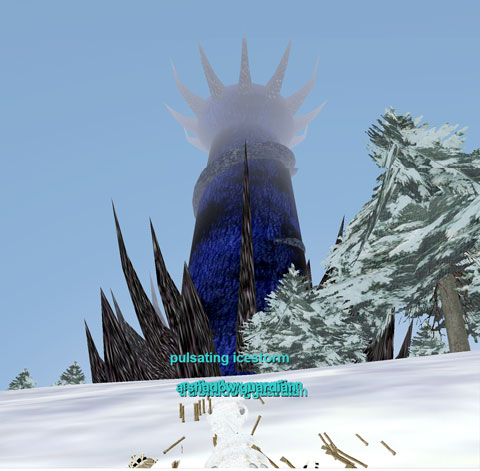

Back to: [West Karana](/posts/westkarana.md) > [2008](/posts/2008/westkarana.md) > [July](./westkarana.md)
# EQ: The Tower of Frozen Shadow

*Posted by Tipa on 2008-07-10 06:36:13*

No, I totally don't like this screen shot. My only excuse is this is the only one I took!

The Tuesday group may have found its home for the next few weeks. Yes, we've started exploring that den of mystery and key-farming, Iceclad's most notorious dungeon, the Tower of Frozen Shadow. Eschewing the standard Velious all-purpose building material, velium, the vampire queen Tserrina built her fortress instead out of the same solidified shadow that so many Luclin buildings were made from. It's seven floors of fun, and each is separated from the other by teleport mirrors that take keys. Really RARE keys. We spent half the night farming the key to the Library, floor two. That included me getting hilariously stuck in the pit and being unable to get out because the skeletons at the bottom kept stunning me (finally we killed them and I was able to get out, exhausted from all that jumping).

Once we finally made it to the second floor, we settled in for a long evening's grind farming the floor 3 (living quarters) keys. They didn't drop. Two or three pieces of Defiant plate armor dropped (yay me), a Defiant beastlord weapon dropped (yay Tesser), a bunch of cool augs dropped (yay other people), but no key.

So we'll probably head back next week and just continue from the library. ToFS was meant for exactly this sort of group -- a slow progression through the floors. Sure, once we reach floor 7, I imagine we'll farm the daylights out of Tserrina just like everyone else does, but it's gonna take us a few nights to get there, and all the time, we'll be leveling so when we DO get there, we'll be able to take her down.

It just wouldn't be a good night if it didn't start out with some hot Fada death action. And he was kind enough to die three times. Getting IN to ToFS is no easy task; it's guarded by these bone, stick and ice creatures, and if you have one now, you'll have a dozen in ten seconds and fifty half a minute later. Every strategy we tried to get outside and rez met with more death. Well, we eventually got everyone alive and inside... it wasn't a great way to start, but this is EverQuest we're talking about. "Easy" is for the other guys :)

We had a new Nostalgia member along with the Tuesday group; we were thrilled to meet and group with the iksar shaman Ebonfang. And we ALSO met a new rogue named Rayzr, both of whom seem to be headed for more dragon slayin' action with the Friday group. WELCOME!
## Comments!

**[Genda](http://www.thegrouchygamer.com)** writes: This was always my favorite EQ zone. It has so much personality and there are so many cool little places to fight. Vampires, undead, and undead wedding. Always fun, and always challenging.

That's one of the things I miss about EQ is that no one else makes zones like that. You could crawl it if you had the skills (and the keys) or you could stop and camp.

:D 

Thanks for reminding me of ToFS. Happy times there.

---

**Einhorn** writes: I remember leveling here with my old guild, Spirit Callers, waaay back in the day. We were on the floor where golems start to show up, I think that's either on the floor with the wedding or after it, not entirely sure. My internet was sketchy back then, and so of course right as we attack a golem I go LD. It takes, quite literally, an hour and a half for my connection to return. When I get back there's a golem staring me in the face. All I could do was cringe and wait for it to engage, which it did. But strangely I wasn't taking any damage.

It was attacking my guild's tank who was standing behind me. I turned around and there's the whole group I was with all sitting there. Baffled, I asked "You're all still here?". The guild leader chuckled and said "We never leave a Caller behind."

One of those truly proud moments where friendship in a guild made the whole world seem great.

---

**[Tipa](https://chasingdings.com)** writes: Those days aren't dead :)

---

**[Hudson](http://hudshideout.blogspot.com/)** writes: I so hated and Loved that place at the same time. Once I got the pattern down on the layout I actually loved to go back there. One of the greatest dungeons (?) EVAR!

---

**Egat** writes: Love the place. It reminded me of the old "pen and paper" dungeons I played in MERP and AD&D.

Lovingly designed zone and I must admit I spent hours trying to find the rumored 8th Floor.

---

**[Ahmai](http://www.spiritcallers.org)** writes: i miss EQ1 and Einhorn, you naile dit on the head, that is why. It was a different day and a different time. You never sat down to play unless you had 4-6 hours because everything took so long. You never knew when someone was gonna go LD and you never left anyone there because you knew if they woke up you would spend 3 hours getting their corpse back! So much fun and so many great memories. 

i guess if EQ2 has a fault its that there really are no "consequences" if you die alot. Its more fun but still, that fake sense of "real" is missing. EQ2 is great and the Spirit Callers of Kithicor are a GREAT group of people! i am gla dyou came back to see us, Kuron :D We missed you and you will always be one of us no matter where ya go :D

love, Ahmai (the original Ahmai not the new one)

---

**Zach** writes: I played EQ1 for about 6-7 years until I started playing WoW, I just heard about Everquest Next and I really really hope this place is brought over to the re-imagining as well. I liked the idea of the zone, it was one of my favorite places to hang out, I just wish it was fleshed out more with lore and what not.

---

