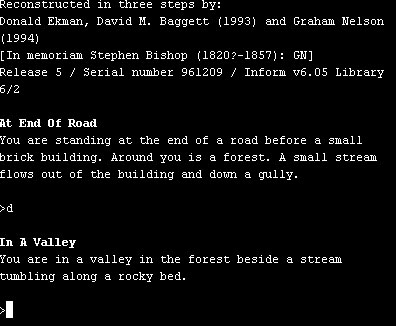
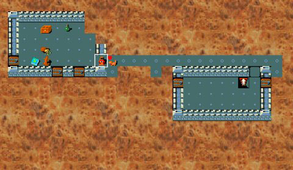
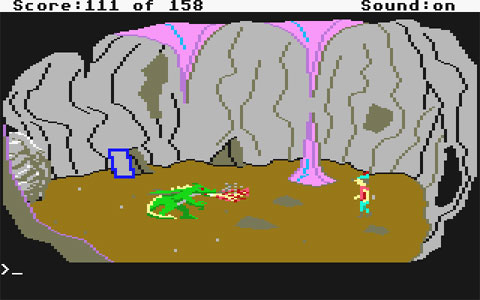
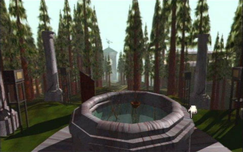
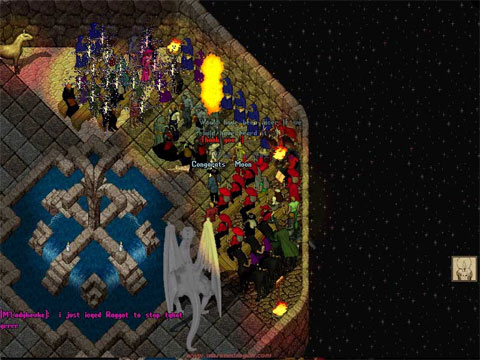
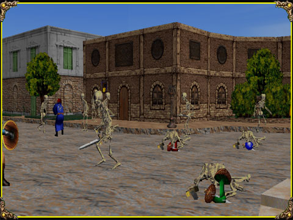

Back to: [West Karana](/posts/westkarana.md) > [2008](/posts/2008/westkarana.md) > [July](./westkarana.md)
# Innovation in RPGs: An Illustrated History

*Posted by Tipa on 2008-07-11 08:30:10*

Okay, I have looked through the history of MMORPGs trying to find examples of what I'm saying -- and why I am waiting for a new paradigm in MMOs, and why I am not that interested in the various iterations of World of Warcraft.

The first computer RPG I played was something called ADVENT on the UNH computer, better known as Colossal Cave Adventure. It looked something like this.

That inspired a number of copies (I even wrote one, now lost, and I would like to have it back!), of which the most famous was Infocom's Zork:

Zork took the basic theme and polished it. This was a huge genre at the time -- Scott Adams had a vast number of games, that soft-porn Leisure Suit Larry started out as one of these -- they were literally everywhere. But Infocom's POLISH beat them all, and though the genre still thrives today, people eventually got bored with Zork-likes and moved on.

You see where I am going with this, but let me continue.

Parallel to this ran some very, very basic graphical RPGs (also available at UNH, that corrupter of good students and making them gamers) such as the original Rogue:

There it is, the original game that spawned the absolutely monstrously huge Roguelike genre. That was polished to a sheen and brought to its highest point by Nethack:

Roguelikes didn't stop with Nethack, many more were written afterward (including Lenley's Dungeon Crawl, the one I play). This would be a poor world if the game industry had stuck with Roguelikes. This game also played similarly to the Ultima series, once personal computers were ubiquitous enough to give those kinds of games a market.

Moving on to point-and-click adventures like King's Quest. Sierra Online did a huge business with these.

If you weren't around at the time, it would be hard to conceive how much screenshots like this energized an industry. Sierra Online built their business off this, and when LucasArts got into the game industry, they polished this to a very high sheen with games such as Maniac Mansion and Monkey Island. The people over at Cyan entirely revolutionized the genre once again with their groundbreaking title, Myst, which was THE game everyone got for their new computer:

Myst itself spawned dozens of imitators, but imitating Myst was not a prescription for success.

Enter the MMORPG era. Ultima Online was the culmination of not only the Ultima game series, but also combined elements of many games at the time to offer a game in which you could do pretty much anything you wanted. That sort of freedom was intoxicating and people flocked to it, magazines were full of UO articles, everyone at the time was aware that they were on the edge of something new. And they were right.

Games like Meridian 59 (below) upped the ante with 3D graphics. EverQuest (not shown) took inspiration from MUDs and polished the 3D MMORPG to an EXTREMELY high sheen.

World of Warcraft took EverQuest, simplified gameplay, added in from the beginning things that EQ had evolved over time (like raids and what has come to be the standard group dynamic), and polished, polished, polished.

And now we're where we are now, beset by WoW-alikes, just as we had Zork-alikes, Rogue-likes, Ultima-likes, Myst-likes and so on in the past. The pattern is ALWAYS the same. An innovator makes something new. A polisher refines it and becomes wildly popular. Imitators flood the market.

We are at that last stage now. WoW-likes everywhere. THIS is what Richard Bartle meant when he said he had played WAR already -- it was called WoW. I write about MMOs because I am so, so excited about what is to come, what game being written RIGHT NOW will change the entire way we think about online gaming, that will make this current generation quaint, and something we write about in retrospectives like this one.

## Comments!

**[Ardwulf](http://ardwulfslair.wordpress.com)** writes: Wonderful! I've never actually seen a screenshot of Meridian 59 before! This kind of post is just gold!

---

**[rmckee78](http://www.otherlivesthanthisone.blogspot.com)** writes: Hey,
Matt Barton from armchairarcade.com just wrote a history of computer roleplaying games book. It is available on amazon.com. It is mostly a collection of descriptions on just about every game of note ever released in the genre. I think it is called Dungeons and Desktops. I really enjoyed it.

---

**Yeebo** writes: Great read!

So basically you're saying that someone needs to take the fall, innovate and create a niche product that someone else can polish up and get rich from. As a gamer I support this notion. However I think the financial downside is obvious. Of the "innovators" you listed only Sierra had what i would consider a real hit (for it's time). 

It also seems to indicate that if you want to become fabulously wealthy, bum around Myplace min-MMOs (once that gets off the ground) until you find that spark of innovation that you can steal and take to the mass market. Twirls mustache in anticipation . . . .

---

**[Tipa](https://chasingdings.com)** writes: It's true, I think the innovators take all the risk to bring a new idea to market, and then polishers copy it and make it great. Sierra Online's King's Quest series spawned hordes of imitators *immediately*, but their writing style and ongoing technical innovations (for the time), like adding full motion video (FMV) and stuff, did help them stay in the lead until the shifting of the online market to MMOs and other 3D RPGs left them behind. Plus, the whole FMV adventure never really got off the ground, though their 7th Guest instantly spawned a horde of imitators, some of which were rather decent.

When I think about it, we say "POLISH POLISH POLISH" all the time, but what we really mean is "STEAL STEAL STEAL". Take everyone else's good ideas and using the benefit of hindsight, avoid the pitfalls and make it better. See, this is ANOTHER reason WoW-likes can't duplicate WoW's success -- it already ripped the ideas from EverQuest, DAoC and others. But they are doing some pretty cool things for WotLK, so I would be looking out for an MMO which just basically took the WotLK things and built a new MMO around them. Like dragonback dungeon crawling, in-flight battles, the ability to temporarily change class (done first in EQ, but whatever), single group raids and so on.

You can't expect to aim your WoW-like where WoW was four years ago and succeed. You have to aim it where WoW will be in four years.

---

**[Openedge1](http://simple-n-complex.blogspot.com)** writes: @Tipa
BINGO

How can you polish that which hath been polished to a fine sparkle.
We may rip on WoW, but the fact remains. It has taken mechanics from the other games and made it better already. How do you polish...uh...polish.

WoW could do with just a couple more things
Add housing and better guild rules and tools (like Guild levels, halls and bonuses) then everyone could play WoW forever.
All Blizzard would need to do then is take that original game, enhance the graphics in one to two years, and no one would ever have to leave again!

---

**Einhorn** writes: Some of the changes they are making to Diablo 3 are making it look and feel more like a loose MMORPG. It very well may be the next "morph" of gaming people have been waiting for.

---

**[Tipa](https://chasingdings.com)** writes: Perfect example:

I [wrote an article over at Massively for today](http://www.massively.com/2008/07/11/runes-of-magic-beta-registration-and-website-opens/) about Runes of Magic, a WoW-like from China being imported to Europe and perhaps here by Frogster. This is the perfect example of a WoW-like that is aiming for where WoW was four years ago. Although the game is free to play and has fairly high production values, I can't understand why anyone would play it in a world where WoW exists.

If you're interested in more info about Runes of Magic, you can try reading [these articles](http://massively.com/category/runes-of-magic) for screen shots, music and stuff.

---

**[Crookshankz](http://crookshanknz.blogspot.com)** writes: As always Tipa, great post!!!

---

**[Sisca](http://www.gnomedepot.net)** writes: @Yeebo I don't believe there has to be a financial downside as such. Sure, it's going to be hard for a small independent studio to be the one that innovates and still be around 5 years from now but I think it's quite possible for some of the bigger studios to do just that. I think we're seeing some of that from SoE - I know, I know evil incarnate for some.

Vanguard has some innovative gameplay mechanics but can you imagine the game even seeing the light of day much less being still around a year later after that meltdown. Pirates of the Burning Sea has some interesting ideas but based on the technical issues I saw at launch I don't think they would have been able to keep their server farms running without help from a more experienced developer. Even if they had their miscalculations about populations that forced them to consolidate servers so early on and the exodus that created would have killed an independent but SoE was able to keep them afloat until they smoothed things out. Heck, they're even keeping Matrix Online up and running and continuing to evolve it - though to be honest I wonder if they're using that and Planetside to work the bugs out of mechanics for The Agency.

I'm willing to concede that SoE is probably not doing this out of the goodness of their hearts, they are a business after all, but as a gamer I think it's good for the genre. I honestly think the "WoW killer" won't be one big game but a lot of smaller, more innovative, games - the death by 1000 cuts philosophy. I also don't believe WoW will ever really go away and it will continue to dominate the numbers game for years to come but I think it's already starting to serve as the "gateway" game. I see more and more people in EQ2 and even EQ who are looking for something more from their game than WoW will ever be able to deliver.

---

