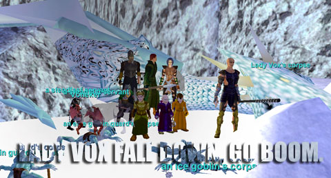

Back to: [West Karana](/posts/westkarana.md) > [2008](/posts/2008/westkarana.md) > [July](./westkarana.md)
# EQ: Ding dong, the Vox is dead.

*Posted by Tipa on 2008-07-12 00:20:05*

I haven't written up a raid report for YEARS. But I absolutely have never been as happy to do so. Tonight, ten people, level 42 to 52, waded through hundreds of goblins, dozens of giants, and a couple spiders and tentacle terrors, to take down the Queen of Permafrost, the ice dragon Lady Vox. The technique we'd figured out to get the giants out of her lair without having Vox come along worked wonderfully. We tried various pull spots in order to best bring Vox without the adds from her room, and Soaridor suggested the Flag Room, which turned out to be the perfect Vox-pulling spot.

Special thanks to Gnewton, who not only served as bait for most of the night, but also sucked Vox dry of mana so she could neither heal nor gate back. Ceipheid, who kept Vox on him the entire fight even though the rest of the raid was doing their darndest to take her away. Coldheat, for braving family and a bad cold to come heal. Rayzr, for sacrificing his own life to drag Gnewton's body from the pits. Sevaran, for swooping in with his wonderful nuking powers. Callendra and Soaridor, for being the total professionals they always are. Ebonfang for those oh so sexy slows. Said for getting disconnected :/ 

I honestly never thought we'd get to the point where we could kill dragons. We had no high level buffs, nor any high level characters clearing the way. Just us, and most of us started from scratch a couple of months ago, stabbing spiders in the tutorial.

Now we're killing dragons. If Naggy had been up, he'd be dead, too. I think he is being farmed.

Oh yes, special thanks to SOE for Defiant gear and the veteran reward, Infusion of the Faithful. Being entirely immune to her AE kinda helps.

Coldheat won the [Warhammer of Divine Grace](http://lucy.allakhazam.com/item.html?id=11611)
Ebonfang won a [Tobrin's Mystical Eyepatch](http://lucy.allakhazam.com/item.html?id=11052) (the other went into the bank)
Rayzr won [Kavruul's Mystic Pouch](http://lucy.allakhazam.com/item.html?id=17701)
Ceipheid's bard got the [White Dragon Hide](http://lucy.allakhazam.com/item.html?id=9240) for his epic a nice cloak that has nothing to do with his epic ><.

It was a triumph for the guild and all the people who worked so hard to prepare for this night.

## Comments!

**[rmckee78](http://otherlivesthanthisone.blogspot.com/)** writes: Woooooooooooooooooohoooooooooooo

---

**[Relmstein](http://relmstein.blogspot.com)** writes: Congratualations on the very impressive Vox kill. I'm sorry I couldn't also be there, but I've had to end my Nostalgia tour in classic Everquest. I expect to be hearing about Plane of Time raids next month.

---

**[Ceiphied](http://www.dcstanton.com/EQ2blog)** writes: Just as a note I did not have the infusion AA just mt fearless disc to get me through the fight =) It was great fun. I have never tanked a dragon before. Can't wait to bring the fight to naggy!

---

**[Tipa](https://chasingdings.com)** writes: Woot, even more impressive :) I did see a few people feared away. SO happy we decided not to fight her in her lair -- those people would have been feared right into pits.

---

**[Tanliel](http://www.wayfarersofveeshan.com/)** writes: Psst ... the bard needs a [White Dragon Scales](http://lucy.allakhazam.com/item.html?id=11602) for his epic, not the hide. The hide is for making the [White Dragonscale Cloak](http://everquest.allakhazam.com/db/quest.html?quest=26).

---

**[Tipa](https://chasingdings.com)** writes: OMG! Lol... thanks, failed and fading memory. Well, luckily or unluckily, no scales or books dropped. Hmmm that cloak looks pretty nice!

Thanks for the tip :P I feel so embarrassed.

---

**[Noffin](https://chasingdings.com)** writes: Yeah I got feared once but I never used infusion for the fight ; ) I am a daredevil like that.

---

**Vlcan** writes: Woot! Gratz!

---

**[Kanad](http://shatteredblog.wordpress.com)** writes: Congrats Nostalgia!

---

**Einhorn** writes: Huge congratulations everyone! I had not a doubt in my mind it could be done by Nostalgia ^\_^

Next stop: Solteris!

---

**Gnewton** writes: Thanks for the mention Tipa :) Was my pleasure!

I thought we did a wonderful job and was quite vocal once she it 30% or so (thank goodness I don't have voice activation enabled on Vent!). My wife was cheering us on over my shoulder as well!!!

Always a blast and I wouldn't miss this for the world. I look forward to Nostalgia standing over the corpse of Vox's love in the very near future.

Nostalgia! /Salute!

---

