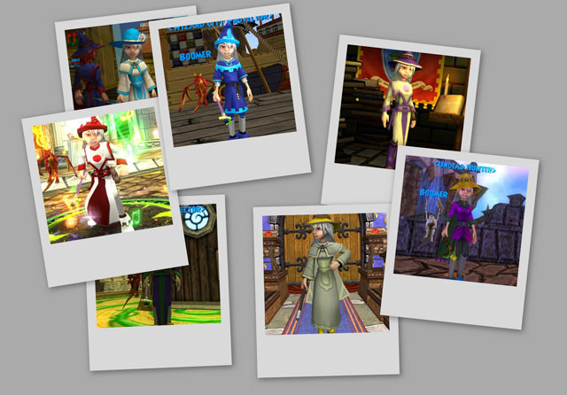

Back to: [West Karana](/posts/westkarana.md) > [2008](/posts/2008/westkarana.md) > [July](./westkarana.md)
# The many outfits of Tara Mythcrafter

*Posted by Tipa on 2008-07-13 02:08:21*

Level 13, nearly 14 and also nearly done with Wizard101's first world, Wizard City. I've done a few quests in the next world, Krokotopia, but I think I may wait until there are more people there for easier groups. Mobs start ganging up on you there.

Of course, dressing up in the various robes, hats, shoes and stuff you get all the time is pretty fun in itself :)

The outfit top center is Tara's latest; it's her quest outfit. Leveling is still fairly fast, quests give the majority of the experience but since grouping is free and easy, they get done pretty fast. Nothing special about the quests themselves.

## Comments!

**[Ryan Shwayder](http://www.nerfbat.com/)** writes: I've been messing around in Wizard101 as Patrick Pixiepants and Grace Goldenglade. I'll probably play PPP more than GGG because GGG is a healer, and the healing in the game is useless so far (you heal about half the damage one attack does, so it's much more useful to attack than heal). The game is pretty refreshing, though.

---

