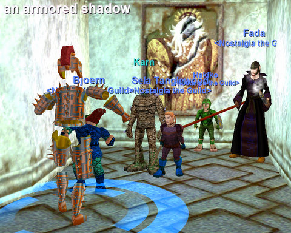

Back to: [West Karana](/posts/westkarana.md) > [2008](/posts/2008/westkarana.md) > [July](./westkarana.md)
# EQ: Tower of Frozen Shadow, floors 2 and 3.

*Posted by Tipa on 2008-07-16 07:13:38*

  
*Mayong Mistmoore looks so hunky in that portrait! He makes ALL the inky ladies swoon!*

I keep saying EverQuest isn't hard, but what I should probably say is, EverQuest isn't hard, if you have great equipment. I haven't put the same sort of care into Sela's gear as I did for Tipa's, and it shows. Empty item slots, missing spells, statless gear in at least one spot... I suspect the same is true for the other members of the Tuesday group. This gives us quite a different experience. Instead of laughing off danger as we slice through enemies without thinking, we can, and do, get overwhelmed, and die.

The Tower of Frozen Shadow is particularly deadly to us. Though we all got in safely and up to the second floor in no time, when we started crawling through the Library in search of the key to the third floor servant's quarters, a named who brought huge aggro, did us in. He wasn't too bad by himself, but attacking him seemed to arouse half the spirits on that side of the room. So that was a wipe.

Being the only rezzer, I released and used the AA to get a full xp rez and my body back, and headed back to the Tower.

I'd THOUGHT I had gone through Allakhazam's and gotten every spell for my paladin, same as I did for the ranger. But, no. I was missing some vital spells, and it was the lack of Invisibility to Undead that would kill me a second time. Lull just doesn't do the job.

Bought the spell. Summoned my corpse. Paid one of the many clerics who do a brisk business in resurrections in the guild lobby to rez me (and she threw in a temperance for free! What a nice halfling!). Headed back. With ITU working, I got everyone's corpses pulled and rezzed.

After that, it was smooth as anything, though it seems unless I am 100% focused on a mob and keeping it taunted, stunned, and warded (for undead), it goes right for the berserker, druid and mage. This is bad news for multiple pulls, because I can only keep one on me for sure. The others turn back to another victim when I turn back to my original target. The only sure way I have seen to grab aggro from everything is to start healing people. 

After about an hour in the Library, we got ourselves an enraged librarian, who gave us the key to the third floor, which was nice of her. I do wonder why we had to send so many dead scholars back to their final reward before they got upset enough to send someone in after us.

Up we went to the third floor, backs to the wall as we awaited the armored patrol. We didn't have long, and we fought the first and then the second one right after another. We moved from there to the cooks' room and took on a few of these before calling it a night.

We ended up standing in front of Randall, the Fellowship guy, making the Fellowship we should have made weeks ago. This while make wipes easier to recover from, especially as we come to places not easily returned to, like the upper floors of the Tower of Frozen Shadow.

All told, I got a neat Defiant two handed staff, in which I had almost no skill. I ended the night with skill in the 40s. I'll probably need to get a two handed slash and two handed piercing to work on, just so I have a wide variety of options. I don't really like the staff -- no bash. But I know I have to build skill in different weapon types.

Before we started, I did a quick check on Nagafen with Brita, so unless the people who seem to have been farming him can get a twink raid together to kill him before Friday, we may have a chance to add another dragon to our kill list, and hopefully find some epic drops in the entrails. I have no idea how we're going to clear his lair. Our little trick to clear Vox's lair won't work here... and Naggy, like Vox, has line-of-sight aggro. If he can see you, he will chase you. Maybe, if you can still bind inside the lair, we can just have someone with the gate spell be the puller. Even if lull works on the giants, which I doubt, the Fire Giant Magus who stands next to Naggy will still be aggroed when he aggros. I dunno. Maybe someone can kite Naggy while we kill his friend, though that idea seems crazy.

Well, we'll think of something. Rayzr and Ebonfang are 52 now, and maybe some old Nostalgians could show :)

## Comments!

**[rmckee78](http://www.otherlivesthanthisone.blogspot.com)** writes: So can you warp to that campfire even if it is in another zone?

One of the things we might have to work on as we get to harder stuff is a way to keep the mobs of Fada. Sometimes I get aggro from healing you, but it is usually early in the fight which is why I try to wait before throwing out a heal. I tend to draw multiple mob aggro when I heal Fada, the problem is Fada's HP go down fast when he starts getting hit, he is very squishy. I try not to heal Bjoern or myself during combat unless it starts to look ugly. 

I am not sure how many heals a paladin has in EQ, since I am healing for one I should probably go play one a bit to get a better idea how the class works. I know if FFXI the paladin had a fair number of heals and MP, that was the main class I played. I would always insist that if the black mage was being hit that I got to throw the first heal on him. We could try something like that with Fada if the mechanics are roughly the same in EQ.

---

**[Tipa](https://chasingdings.com)** writes: My heals are decent for the level, nothing like a druid or cleric but when I see people getting beat upon, I start healing -- I heal you a lot, for instance, and myself sometimes. Which does get me the aggro I need back, usually. Aggro is a real problem with mages, and it almost has nothing to do with the tank class. Mages and wizards really have to wait until the mob is half dead before laying into them. Mages have the advantage that they can use their pet until they can nuke. I did play a mage to 65, and in groups, that's what I would do. Send the pet in, keep the DS up on the tank, and then when it was half dead, hit it with the bolts and nukes. Otherwise, I'd be tanking. I think wizards get a deaggro.

I'm not sure when paladins get their first group heal, but when I do, I'll probably be spamming that and hoping that helps keep aggro. But it's frustrating; even when I get aggro, it I try to move to another mob, the one I just aggroed almost immediately dismisses me. So the way it has been working out is that Bjoern is doing the actual tanking, and I am running around trying to taunt stuff off people. If I try to tank, that generally means you and Fada are tanking the rest.

This is obviously something we'll have to figure out before we get too many more levels. How did you do with levels, by the way? I went from 35 to 36. Not fantastic, but it's progress, and given the horrible start, probably better than I could have expected.

---

**[Tipa](https://chasingdings.com)** writes: Note on the Naggy pull. Apparently, Naggy, unlike Vox, cannot get out of his lair, so we can just pull giants, kill them, and camp off the aggro.

---

**Loredena** writes: Bjoern CAN tank (though it's probably not optimum, he's really dps) and when Tesser is there she CAN tank as well, but again, not optimum. And her healing is barely worth bothering with ;/ Still, I think her ability to slow all the mobs has to help a bit, as it reduces the damage they are doing when they pile on Fada (and bonus! make it more likely to pile on her instead :p). Fada does need a bit of practice with aggro control (a learned skill) and I'm still tweaking what I do in terms of aggro as well (I mean, I'll purposely pull aggro on mobs that went on Hakiko or Fada so I or the warder are off-tanking instead, but that doesn't help you).

---

**[stargrace](http://mmoquests.com)** writes: I had heard (but not confirmed) that bind was changed, and now the bind affinity only works in city zones and not where ever you'd like as it used to.

---

**Egat** writes: Bind still works all over for those that can cast it themselves, with the exception of instanced zones and certain other areas.

---

**[rmckee78](http://www.otherlivesthanthisone.blogspot.com)** writes: It looks like I went from halfway through 32 to close to 34.

---

