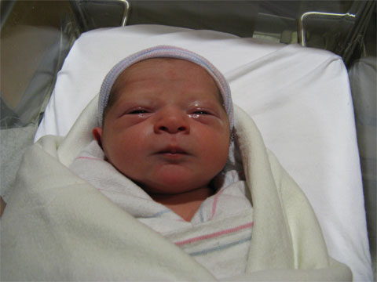

Back to: [West Karana](/posts/westkarana.md) > [2008](/posts/2008/westkarana.md) > [July](./westkarana.md)
# Happy birthday, Atticus David Shimkin

*Posted by Tipa on 2008-07-18 06:17:17*

Happy dad Brian writes:

> We're happy to introduce our son - Atticus David Shimkin. Born July 18, 2008 at 1:05 am, weighing 6 lbs 15 oz, 19 inches long.

Everything went smoothly, more details and pictures to follow. Mother and baby are doing just great. The baby's been really alert and started feeding immediately.

And I'd like to point out that I was, I think, alone in the family for predicting the baby would be a boy. I've been thinking of him as a "he" for months! I'm also very happy to see my dad's name as Atticus' middle name. It's a tradition in Brian's family not to discuss baby names with anyone, so I didn't know Atty's name until a couple of minutes ago. I wonder what his name would have been if he had been a girl?

Atticus is a name with a long and colorful pedigree. Famous people named 'Atticus' include Atticus F., Atticus K., and Atticus C., so baby Atticus is in good company!

We're just so very very happy everything went so well.

## Comments!

**[stargrace](http://mmoquests.com)** writes: Congratulations to your family! What a little cutey

---

**[almagill](http://gudeman.co.uk)** writes: Welcome to the world, Atticus D. 

You've got a lot of learning to do in the next short while, but trust me, it gets SO much better as it goes on.

(We've got the same 'tradition' about not discussing names here too)

---

**[Aaron](http://hallower1980.blogspot.com)** writes: Congratulations!

---

**[MrrX](http://mrrx.wordpress.com)** writes: Congratulations !

---

**Gnewton** writes: That is wonderful Tipa!!! Congrats to you and your family!

Great name!!!

Now, let's bring in the little one's first day with a red dragon steak! Fillet Naggy anyone? Nagafen Porterhouse?

---

