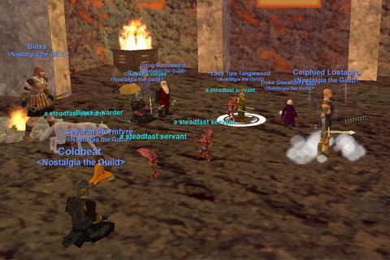
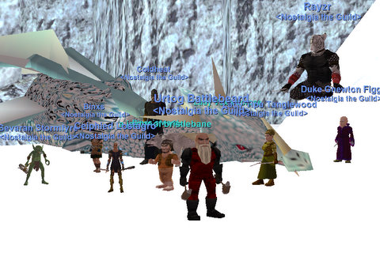

Back to: [West Karana](/posts/westkarana.md) > [2008](/posts/2008/westkarana.md) > [July](./westkarana.md)
# EQ: A Night of Terror.

*Posted by Tipa on 2008-07-19 08:05:33*

Terror -- if you're a dragon. Nostalgia the Guild set up a face-to-face for Naggy and Vox with old Veeshan, and I don't think Queen Vee will be too happy with her progeny.

We've been tracking Lord Nagafen all week to see that he remained up. And shockingly, the elder guilds with their twink brigades didn't move on the dragon, so Friday night, it was Nostalgia's turn. We were short handed and had only one healer, the incredibly overworked Coldheat, but we weren't going to be stopped. Also, we didn't have a FD puller, but we weren't going to let that stop us either.

We tried various ways to clear the room; the best way seemed to be to toss a gnome in first, and Gnewton performed amazingly as bait. I think that BBQ sauce-soaked robe he wears combines both fashion AND fine cuisine in an amazing way.

Eventually we got the fire lizard alone and we rushed in. Being very short on healers, we had our steadfast servants out for extra healing. We lost Coldheat and then Ceiphied, our tank. Thankfully, Urtog had come by, and he stepped up like a true dwarf and took the aggro and tanked, without healing, while the rest of us desperately tried to take Naggy down. Finally, the dragon turned to run -- we had him. As long as we could keep him from heading into the lava and letting the molten rock from Norrath's core heal him. He died with his head inches away.

Ceiphied got [Red Dragon Scales](http://lucy.allakhazam.com/item.html?id=11622) for his epic.
Tipa looted the [Torn, burnt book](http://lucy.allakhazam.com/item.html?id=19071) for her paladin's [Fiery Avenger](http://lucy.allakhazam.com/item.html?id=11050).
[Hierophant's Crook](http://lucy.allakhazam.com/item.html?id=11629) and [Blight, Hammer of the Scourge](http://lucy.allakhazam.com/item.html?id=11628) were looted for the guild bank.

Being only 8:30, we headed over to Permafrost and Lady Vox had apparently recovered enough from last week's beating to set up shop again.

We had a couple of dirty pulls with Vox + some trash mobs, but on the first real pull we got her alone and took her down with no more trouble than we had last week.

Lady Vox was as kind with the epic drops tonight as Lord Nagafen had been. Are they trying to convince us to move on, or something?

Ceiphied looted [White Dragon Scales](http://lucy.allakhazam.com/item.html?id=11602) for his bard's epic.
Tipa looted [Torn, Frost covered book](http://lucy.allakhazam.com/item.html?id=19070) for Sela's Fiery Avenger.
Tipa also looted [Runed Bolster Belt](http://lucy.allakhazam.com/item.html?id=11601) because apparently every melee there had same of better haste. WTF? Here I am feeling pretty cool about my [FBSS](http://lucy.allakhazam.com/item.html?id=1365) and everyone else is laughing at me. So yeah, I looted it.
The guild bank looted the [Dragon Bone Bracelet](http://lucy.allakhazam.com/item.html?id=11606).

Well, we just need another set of Red Dragon Scales so we can do the quest to make them into Green Dragon Scales for Ceiphied's epic, and then we won't need to kill the dragons anymore. Raiding, though, is fun -- and these past couple of weeks have been a real pleasure. As we level, we'll definitely be keeping an eye out for other one or two group raiding opportunities. There's a bunch of. Luclin has several single group raids; there's the nameds on the near side of the chasm in the Deep, Ssra has [Rhag 1](http://eqbeastiary.allakhazam.com/search.shtml?id=7828) and [Rhag 2](http://eqbeastiary.allakhazam.com/search.shtml?id=7829), etc. We'll see what happens. Two groups in good gear could do a lot of old world raids. Problem is, of course, that high level people in good gear can solo them, and often do...

Anyway, another triumphant night for Nostalgia. We aren't a raiding guild, but when it comes time to do a raid, it's good to know we can. That will come in handy as we try to finish our epic.

## Comments!

**[Cow Nose the 50 Pound Cat](http://cownosethe50poundcat.blogspot.com)** writes: Coolness! And I see you turned back on the title-changer picture thingie! Yayy!

---

**[stargrace](http://mmoquests.com)** writes: Congratulations! Dragon bits for everyone!

---

**[Kasul](http://shatteredblog.wordpress.com)** writes: Still waiting on my Nagafen Wing Crunchies...

Congrats Nostalgia!

---

**Gronk** writes: Big Congratz ! Nice to, once again, see the 'ol scale herd dropping.

---

**Malfi** writes: Wtg everyone! Congratulations on all the epic goodness!!!

---

