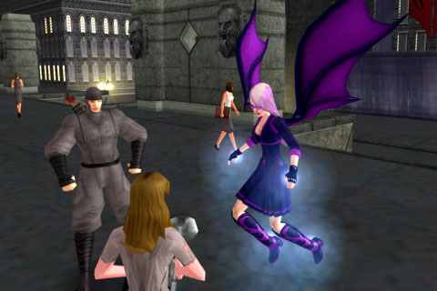

Back to: [West Karana](/posts/westkarana.md) > [2008](/posts/2008/westkarana.md) > [July](./westkarana.md)
# Separated at birth

*Posted by Tipa on 2008-07-21 01:39:25*

I was dinking around on Wizard 101, when I thought it would be really cool to see if I could take Tara from Wizard 101, and put her in City of Villains. It's supposed to let you make near any costume, right?

Well, turns out, first, CoV doesn't do a great job of modeling children. Fine, so it would be a grown up Tara. And instead of the blue/blue outfit, one with that expensive purple I can't really afford in W101. No peaked caps, so I went capless. And dragon wings because, well, they are neat. So say hello to Tara Mythcrafter -- 23 Adept Conjurer in W101, 18 Magic Mastermind in City of Villains. Her minions are ninjas. She herself controls the wind and wields the power of storms.

Turns out it was a double xp weekend in CoV, so I joined a mission group and, well, levels in mission groups are crazy.

This photographer was taking pictures of me and my boys as we took out some flying bozos in the Cape district. So when I was through, I served him with a DMCA take down notice. I showed him the notice, and then I took him down.

The funny thing was, after I checked the pictures in the camera, they weren't of me after all. Think I could get a good price for it on eBay?

*PS. Sharp-eyed readers might wonder where Tara's dragon went, and where the unicorn came from? Funny thing about that. Turns out its mating season, and Boomer went to the warm beach sands in the south to mate and lay her clutch. So I went to the pet store and asked if I could get something a little unusual. The storekeeper said, cute girl like you needs a UNICORN! And I said, no, no, everyone has those. Do you have a werewolf or a vampire or something? Maybe a basilisk or a venemous snake? Or even a spider? He said no, he didn't sell those sorts of things. I pointed to the sign above the cash register, "Ask about our Vampires, Werewolves, Basilisks, Snakes and JUST IN, Jumping Spiders!".

He said they were all out, and he gave me a unicorn. Oh, well. Lily is a nice companion, and she doesn't bite, like Boomer did. Still, I miss the old girl and hope her mating season goes well.
*
