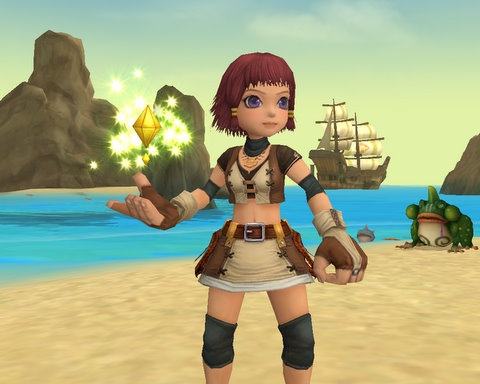
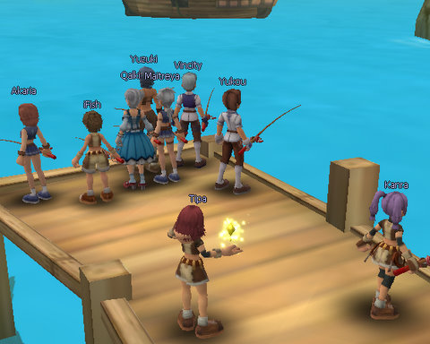
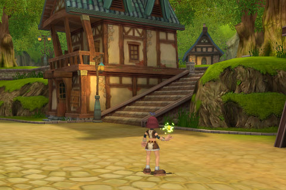

Back to: [West Karana](/posts/westkarana.md) > [2008](/posts/2008/westkarana.md) > [July](./westkarana.md)
# A first look at Florensia

*Posted by Tipa on 2008-07-25 08:15:56*

Adventure on land and sea? Lush, detailed world? Dual talent trees that let you mold your character however you like? How can it miss?

Florensia's kinship with Dream of Mirror Online couldn't be more unmistakable. That same sort of soft focus, cell-shaded look of the characters against backdrops so lush they seem to be almost painted. And these guys don't just sit around and swing at each other... they put their bodies into it, jumping and swinging and spiking stuff at the enemy. The birth of the aerobic adventurer.

You start off in the port town of Roxbury on Cardiff Island -- any relationship to actual cities is purely coincidental. This small fishing village is being assaulted from both land and sea by a variety of pests. On land, someone delved into a cave where no mortal was meant to tread, and a vile mist began corrupting the local wildlife. On the sea, the port is being harassed by gigantic lobster men who seem to be in league with some pirates.

The residents of Roxbury are going to need all your abilities on land AND on sea in order to survive. Also, you will need to fish.

Nothing says "hi, this game is from Japan" like hundreds of people all lined up against the water, fishing. And why not? Fish up some rare stuff and you can turn it in for upgrades.

The quests are thoroughly standard. Bring this thing to someone else. Go talk to that guy about something. Go kill ten of that and three of this and all the thoses you can find until you get ten wazzits from it.

The extensive tutorial leads you easily through battles on land, building and equipping a ship, and setting sail. It does fail a bit on how to actually kill stuff on the water; it took awhile before I figured out how to successfully join the fight against the Lobstermen from the Deep but yeah, I eventually got all Cloverfield on their butts.

I designed and built that ship, by the way. That ain't no tutorial ship.

There's only the one race -- humans -- and just four classes -- explorer, noble, mercenary and saint. Explorers are the rangers and hunters of Florensia. Nobles, those people in silks who never got their hands dirty with real work, are the nukers. The mercenaries are the basic tanks, and the saints are the healers. My character is a Saint. Isn't she JUST, though? Carrying a candle to show you how devout she is. A candle of FIERY DEATH she can HURL 50 FEET.

Those are just the templates. Similar to the late and lamented Mythos, you can build out your character anyway you like based on the talent trees. Each level, you buy a new skill. And each level, you get a point to put in a skill. The more points you allocate, the more powerful that skill becomes. All Saints get a basic heal, but that won't do anything unless you point points into it -- the more the better. But points in healing is points you can't spend on nukes and dots. And that's how that talent tree branches -- a healing saint, a nuking saint, or a DoT saint? It's up to you, and you can do a combination of, but you won't ever be good at all of them.

I haven't seen a respec NPC, but I can't see how there would not be one.

But is the game any good? I can't tell you that. I can tell you it isn't BAD. It does need some work -- for instance, the UI is not modifiable. These old eyes need text to be a little larger, and I'd like some of the other UI elements moved around. The movement keys are a little wacky; you can't turn in place, you can only turn while moving forward, which is weird. And you can't redefine them. The bouncy music plays continuously whether you are in battle or not, and it's always the same tune. So yeah, there's work to be done.

I feel it's impossible to actually judge how good an MMO is unless you play it for a month. Getting to land level 6 and sea level 2 hasn't taught me much about the higher level parts of the game. The animations are great, very over the top and entirely appropriate for the anime look. The talent trees are deep and it's easy to see how you can make a character that plays out just as you like it. You can just buy one skill and every level pump it higher and higher and become fantastic at that one thing, or spread out your abilities and be more a generalist. That's very nice. There's even (ahem) a menu that lets you select among the several languages Florensia supports (be sure to set this to English if you're an English speaker!)

If you can't stand cute anime characters, you're not going to like Florensia much. But if you liked Dream of Mirror Online but wanted something with a less Asian, more Western setting -- Florensia might be worth a look. And hey, it's free.

## Comments!

**Graktar** writes: I've found it passably enjoyable so far. The character building options are definitely its strong point. It does need UI work, as well as a more responsive control scheme. Lag is a bit of an issue at the moment, but then they're in open beta with only one server per region, so I'd imagine loads are pretty high.

A couple of things:

-You can turn in place by holding down the right mouse button and moving the mouse. I try not to use the keyboard keys for turning if I can help it, they just don't work very well

-There will be 12 classes eventually, as each of the 4 base classes can choose to branch into a specialist class at level 40 (or something like that). Not too much is known about it at the moment, as I don't think they're in the game yet.

The game has potential, and certainly seems like the best F2P game I've seen recently, but they've got a fair bit of work to do yet.

---

**[Einhorn](http://iceclad.wordpress.com)** writes: This makes me think of "Harry Potter: Pirates" and is therefore unquestionably awesome.

"Jumpin' Crawdads, matey! On th' horizon! It be th' dread ship of Cap'n Ron "Bloodbath" Weasley! FULL SAILS, WE GOTTA OUTRUN EM'!"

---

**[Tipa](https://chasingdings.com)** writes: Yeah, lag can be bad at times. You can go a solid minute running around without any mobs or anything, and then suddenly you're back at the zone and stuff pops up. But I imagine, as you say, this is because they are just under such a massive load.

Re: right mouse button. Yeah, this same button is used for looting and for auto attacking. Or as is usually the case for me, being low on health, going to loot, and accidentally attacking a mob who walked in front of the corpse at just the wrong time.

Luckily, there doesn't seem to be a death penalty.

Their press says you will also be able to start your own cities on other islands, so I dunno how that will work out. It kinda concerns me that there is no US publisher for the game yet, and I expect the latency to Europe will get high at times. Still, Europeans play on US servers, so maybe it won't be that bad.

---

**[Einhorn](http://iceclad.wordpress.com)** writes: "Still, Europeans play on US servers, so maybe it won’t be that bad."

SOURCE OF LAG DISCOVERED!

---

**Disgusted** writes: I would advise any parent to avoid this game like the plague if there child is under 18. The community is full of people openly talking about there love of "lolicon, aka hentai style porn of underage children". Derogatory comments to other players and GM's. Open flaming of other players who stand up to those controlling "shout" in the game. Pedophile comments by so many players have made this game a new safe heaven for such predators. I've tried to make a change in the cummunity but since I've been playing and making reports NOTHING has stopped this from going on and NETTS "claims" to have taken actions but the same people are there everyday.

---

**[Tipa](https://chasingdings.com)** writes: I didn't notice any unusually foul language when I checked in on the game the first time, but it doesn't surprise me that it's coarsened since then. One of the traps of a free-to-play game is the number of children who play, and there are very few people who behave as badly online as children without adult supervision.

Even pay-to-play games like World of Warcraft are not immune. It's almost a certainty that the more children/teens that play a game, the more hostile the community. This is one of the strengths of games meant for kids like Toontown, Wizard101 and the upcoming Free Realms. All have filters that actively censor chat. At least on Wizard 101, once people adapt to the chat system and learn the boundaries, few people even attempt to circumvent it.

I'll be doing a deeper look at Florensia when I start my F2P of the Month series in September (although I am only doing officially released games, so it will be awhile until I look at Florensia). Community is DEFINITELY going to be one of my core scores.

---

