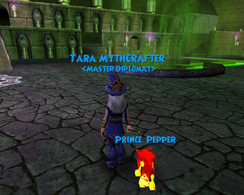

Back to: [West Karana](/posts/westkarana.md) > [2008](/posts/2008/westkarana.md) > [July](./westkarana.md)
# Let's check in on Wizard 101...

*Posted by Tipa on 2008-07-29 01:09:53*

I'm not supposed to be in Marleybone. I'm supposed to be mediating the eons-old feud between the Djesserit and Anjit clans of Kroks, a feud that started over where someone was to be buried. The Kroks are so focused on death, they love nothing else so much as the touch of the grave.

It's depressing.

That's Tara in front of the portal to the Tomb of Storms, the final zone in the world of Krokotopia. That's my work outfit, the one I use to get things done. Notice it is covered with the Sigil of Myth. My entire outfit is in the blue and gold of the Myth school. So when people ask me what kind of wizard I am, I usually say Fire.

And the funny thing is, I'm not lying. Every Wizard has a primary school, where their most powerful spells come from, and the ones they can cast the quickest. But ever wizard also has a secondary school where they spend their training points. Mine, is Fire. My wands cast ice spells or lightning spells, so no matter what I come across, I can fight it, if I have time to rebuild my deck first.

I have some nearly endless fights coming up; I've helped other people with them. I just really want to move on to the next world, the Victorian Marleybone.

I've been piggy backing off friends; teleporting to each one in turn until I find one in Marleybone. This morning I happened upon a group doing the awesomely long final series of battles in Marleybone, short of going to the fourth world, Mooshu (which I assume has to do with Oriental-themed cows). 

I did a bunch of quests in Marleybone, and have finally started the storyline quest which should bring me through the world. I have already opened up the second area in Marleybone (after Regent Park), Hyde Park. It is full of cat burglars. Who are cats. The police and the civilized folk are dogs. Sherlock Bones. McDuff the Crime Dog. Oh, yes. They aren't too far from Barkingham Palace.

Okay, I'll stop.

Since I last wrote, everyone has pretty much discovered how to set their account so they can use Dictionary Chat -- where you can write freely, as long as every single word is in their dictionary. Aside from such puzzling omissions as "one", "two", "three" and the like (though the ordinal numbers "first", "second", "third" and so on are okay) conversation is more fluid. Someone still using the choose-a-phrase menus are seen as quaint. But there is still censorship, of a sort. Big words are simply not there. You can say what you like most of the time, as long as you use little words. 

Battles are still fairly lengthy and somewhat tedious; there's no such thing as just wading through trash or ignoring fights. If you get too close to any mob, it will force you into a circle and begin to attack. And all you can do is pull out your wand and deck of cards and play it through. Because of the design of the circle, you can only meet four mobs at once. Before the patch, they would line them up in ranks if they needed more. Now they just open a door to another fight. And another fight. And another fight. The fight in the picture above was one such; we must have done a dozen cookie-cutter fights before we hit a mini-boss, after which I had to go to work. You get low on power and health and have to take quick trips back to the city to plat mini games for health and mana once your potions have run out. These long fight series would be impossible alone. Eventually you would have to leave to regain health and mana... and then you would have to start over again.

And that's where I am, and where I am supposed to be. In the Tomb of Storms. I have to solve the Anjit clan's problems, then do the Emperor's Retreat -- an instance you have to complete in one session (I think) that has some fights impossible to solo, and then the Temple of Storms which I have not unlocked, and a blocked tunnel which goes I don't know where. 

It sounds tedious and Marleybone won't be any better (though the clothes are nicer). It's a casual game and casual games aren't supposed to be about the destination, they are all about having fun where you are. And it is fun. I pop around and help friends with their fights and they help me with mine. I play with different outfits, collect pets, try out different deck builds. I've even dueled a few times.

I caught W101 as it was uploading Mooshu to my computer tonight. Looks like there is a zone called the Battleground. I don't know if that is just the name of a zone or some sort of PvP thing -- I hope the latter. That could be kind of fun.

## Comments!

**PekkaR** writes: *they can use Dictionary Chat — where you can write freely, as long as every single word is in their dictionary. ..puzzling omissions... ..Big words are simply not there.*

Sounds like a sort of hell, to me. :p

I inevitably write looong sentences to people ingame.

---

**[Tipa](https://chasingdings.com)** writes: It's a huge improvement over "pick a phrase". Nobody uses that anymore, for which I am glad.

---

**Einhorn** writes: That's one way to keep people from calling others "noob".

Unless they just change another word's meaning to something derogatory:

"God you're such a starfish, learn to play."

"Shut the frog up!"

It kind of reminds me of those Orbitz commercials.

---

**[Tipa](https://chasingdings.com)** writes: I have seen people start using 'stand in' words, actually. People will always figure out ways through any gate.

---

**[Tipa](https://chasingdings.com)** writes: I made the comic and wrote this bit last night before I went to bed. Always a bad sign. I dreamed that the folks at W101 had opened the worlds of Marleybone and Mooshu to me, and also had told me the list of the next half dozen worlds they were going to open. There was a dinosaur one and a medieval one and a bunch of others.

But I knew I was dreaming, but maybe they had opened Marleybone to me so I wouldn't have to keep teleporting to friends to get back there and do my quests (I am working on the Marleybone story quest at the moment). 

And then I fully woke up and, of course, realized that none of that would have happened, I'd still be stuck in Krokotopia. I was in Marleybone still after doing the screenshots for the comic* and figured I'd return to Wizard City and see if maybe somehow I had gotten far enough through Krokotopia that Marleybone opened anyway, but I don't know where the local entrance to the Spiral is. So I started teleporting to friends, and the very first one plopped me into the middle of a fight in Mooshu, the fourth world. As expected, it has a heavy farm animal vibe, with monkish goats and ninja pigs (both of which you can buy as pets for 5000 gold each). The world is a mish-mash of Japanese, Chinese and Buddhist elements. I'd have liked to pick up a new deck before I left, but they were level 35+, and I am only level 27.

The highest spell my professor teaches is level 44, so I am guessing W101 goes to 50. If Mooshu is 35+, and it's the highest level world, it must be pretty extensive to cover the levels up to 50.

* the comic was a chore. I had storyboarded it using screenshots I already had, but I had taken them without turning names off. Removing them with Photoshop left a lighter patch. I could have worked more and removed that, too, but it was easier to just retake the shots. I had redyed the Marleybone outfit in the interim, so I had to return everything to its original colors, retake the shots, deal with tells from someone who wanted me to come help him kill some rank 2 trash, etc etc etc.

---

**Graktar** writes: I thought W101 was surprisingly enjoyable, but also surprisingly grindy and tedious. It just didn't flow well, and you spend an inordinate amount of time dueling with monsters for very little reward. As a casual game for kids, I expected a more lenient, free-flowing advancement process, rather than one that makes everquest (the release version) seem fluid and fast paced in comparison.

---

**[Tipa](https://chasingdings.com)** writes: It is in fact grindy and tedious, and talking with my friends who just reached Mooshu makes it clear it doesn't get any better. Wizard City is pretty fast-paced, Krokotopia slows things down a lot, Marleybone introduces epic serial battles that take hours, and apparently Mooshu takes that to a whole new level -- as well, by then, of really requiring a group.

Card battles don't make much sense when clearing trash.

I still like the look of the game and I love the idea of a card battle metaphor. And this being beta, they are still tuning things. As far as I can tell though, that's all there is to the game. I looked around Mooshu and saw no signs of a FFA battleground, though I didn't go everywhere.

---

**Egat** writes: Your comic reminded me of the wonderful news blurbs you created for us in CE! I still think those did more for our recruiting than any successes we may have had on the battlefield.

---

**[Tipa](https://chasingdings.com)** writes: I dunno about that, but I do know that the people who came to our web site totally ballooned whenever I posted a new one. They were fun to do, but trying to form a narrative out of random screenshots was tough. But a couple of them came out nice. They're all in the EQ Comics tab on this site, by the way.

---

**Michael** writes: Great stuff Tipa. As far as PvP, I've heard the system is going to be implemented after launch. And there is a 5th world after mooshu to cover up to 50.

---

**andrew** writes: how do you get an animal

---

**[Tipa](https://chasingdings.com)** writes: You buy pets at the pet stores.

---

