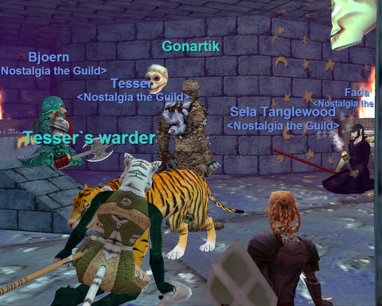

Back to: [West Karana](/posts/westkarana.md) > [2008](/posts/2008/westkarana.md) > [June](./westkarana.md)
# EverQuest: Down at the farm

*Posted by Tipa on 2008-06-04 08:23:20*

SOE loves reinventing their flagship games. Last fall, SOE decided that their latest EQ2 expansion, Rise of Kunark, should focus on mostly-soloable quests instead of the mostly-groupable open experience zones that had been EQ2's signature style of play since release. Since those people who prefer to solo had largely already gravitated to World of Warcraft, it came as a shock to those people who played EQ2 for the strong social and community aspects. Many group loving players had a hard time soloing the quests in RoK, since after an initial flurry of activity while everyone leveled to 80, finding groups for the 70-80 quest grind is now virtually impossible.

This week, SOE did something equally game changing to its venerable EverQuest. EQ, like most MMOs of its era, is intensely gear based. Striving for the latest and greatest stuff drove grouping and exploration, and when you joined a group, it was always either for experience or some specific bit of loot.

The introduction of Defiant armor to lure people back in with top-of-the-line, raid quality armor, has changed all that. In a stroke of a pen, SOE signed away any reason at all to explore or try difficult dungeons. Defiant armor is SO GOOD that going to Nagafen's Lair for the 40-ish armor drops there (Runed Mithril Bracer, Black Chitin Leggings, etc), is insane. Since the gear drops from any mob in any zone, the best strategy is to find a place with lots of easy-to-kill mobs near your level, and just chain pull random mobs for armor and weapon drops.

Our experiment in going through our old haunts as people once did is very much in danger. Last night, a Defiant plate helm dropped off Bonecracker in Najena that might well have been, by itself, better than any three pieces of gear currently equipped.

What they really SHOULD have done is gone through and placed pieces of this cool stuff as the boss loot for mobs already in the world. For instance, those RMBs in Sol B? Pump up their stats to Defiant armor levels. We'd go! We definitely would! As it is, there's no point. 

Well, on to the recap of last night's Najena run.

Some file refused to patch last night, leaving us with a number of people who simply could not log in. The patcher would stall at some LoN file and just hang there forever. Those of us who got in used a hack to bypass the patcher, but that, alas, did not include our healer, Hakiko. Last week, business had called him away and we did not meet. This week, since the dungeon of Najena was relatively low level, we decided to forge ahead anyway in hopes Hakiko would be able to join us at some point.

Najena, the dungeon, is a dungeon of keys. You go through the dungeon collecting keys to let you get to the next bit. The key off Bonecracker lets you into the anteroom of Rahyl's room; a mage there drops the key to Rahyl's room, he himself carries the key to Drelzna's room, and she drops the key to Najena's room.

And so we worked our way through the dungeon, with Tesser (beastlord) and I (paladin) sharing healing duties. Some rooms, like the guard captain room, absolutely brought us so close to a deat that would ahave turned quickly into a wipe that I was literally sweating, but we had no deaths for the night, not even from mage Fada, whose inevitable deaths early in usually mark the start of the evening.

After a lot of key camping (Drelzna was being unusually tardy), we finally made it to Najena's room. Bjeorn cracked open the door with the key he had from Drelzna and... there was a high level necromancer in the room, feigned on the floor, with his pet killing stuff as it spawned. We had no idea how this worked, we thought pets were non-aggro now. But a magician would pop, and the pet would bring it expertly down, meanwhile, no motion from the necro.

He wouldn't respond to our tells, so we decided he was AFK and set out to take Najena for ourselves. She spawned in short order, and Fada had himself a sharp-looking Flowing Black Robe. After a few minutes, the necro stood up and asked what we were doing there.

My guess? Some sort of macro that continually sends his pet at anything in range, and some sort of alert to bring the necro back to the keyboard when the pet has killed Najena, so that he can loot. I have no proof, but it's the only thing that explains what we saw.

We waited around for a bit to see if Najena would pop again and drop the silver threaded tome for Fada, but she didn't, and it was getting late, so we gated out and left Najena -- the dungeon AND the sorceress -- behind.

It was a great group marred by login issues and a high level farmer. I went from level 24 to 26, far from our nornal five levels. The dungeon was, after all, easy enough so that we could do it without a healer.

That didn't stop the night from being FUN, though! I had a blast, as always.

## Comments!

**[stargrace](http://mmoquests.com)** writes: I completely agree with the defiant incidents. I want to farm old world zones for old world drops. What's the point though. We all want our characters to be the best of the best, and lets face it, if you're spending time doing those old world camps instead of grinding away for defiant gear, you're not going to be the best you can be, so to speak. 

Sure, we COULD ignore the defiant stuff. 
But again, we still want to take pride in our characters. 

It's a shame, really.
Glad to see you had fun though.

---

**[Tipa](https://chasingdings.com)** writes: Well, we didn't ignore the racial armor quests, CR armor quests, or new crafted armors, I doubt we're gonna start nerfing ourselves now. As of course, we aren't. Most everyone has one or several bits of Defiant armor now.

The one bright spot is that maybe our gear will become good enough so that we can two-group Nagafen.

---

**[Cameron Sorden](http://random-battle.com)** writes: Naggy was a challenge even with AAs (which my old progression group allowed so that people wouldn't get bored). Two-grouping him at level 50 would be *really* hard unless the armor is amazing.

I didn't know about the defiant armor. From what you're saying, it drops anywhere? It seems to me that maybe that could encourage players to pick up and check out new locales, then, and always be assured of good drops. Sol B is a fun dungeon... but yeah, if the XP isn't great there anymore (and I don't recall it being great), it's also kind of a death trap. I don't know.

---

**[rmckee78](http://www.otherlivesthanthisone.blogspot.com)** writes: I still haven't managed to get onto EQ. I'll try again when I get home from work. I personally have no problem with the Defiant gear. I just like hanging out and having fun killing stuff with you guys. I was really looking forward to last night too. I was in group withdraw due to last week.

---

**[The Grouchy Gamer &raquo; Blog Archive &raquo; SOE Still Can&#8217;t Get Out of Their Own Way](http://www.thegrouchygamer.com/?p=130)** writes: [...] sure.  There are just a couple of problems with this.  The Ancient Gaming Noob and Tipa at West Karana and her Nostalgia Guild (about halfway down her article) have both run into something that I also ran into a couple of [...]

---

**[Tipa](https://chasingdings.com)** writes: Well, here's what's happening on EQ right now. People are finding the hot zone for their level -- Blightfire, Stone Hive and Dulak for folks our level -- nice open zones with easy pulls -- and just pulling everything. No incentive to go into dungeons for high risk and relatively few rewards. The next dungeon hot zone up is Skyshrine, which some people refuse to do for faction reasons (hurting dragon faction by hunting them and their kin in Skyshrine makes travel in the more distant parts of Velious hard). Which is too bad, really, because Skyshrine is pretty neat. Anyway, we're gonna be doing Dulak this week, hopefully it will give us enough xp to lock at 51 and start building up AAs for our push into the higher level dungeons of Karnor's Castle, Howling Stones, Old Sebilis, Velketor's Labyrinth and probably Akheva Ruins, since it is the level 50 hot zone, and is a fairly easy dungeon -- we used to duo/trio it when working on Vex Thal keys. Of course, we were 60 at the time... but then again, our gear now is far superior.

Heck, we were still largely in planar gear at that time.

I'm trying to think of the equivalent analogy as to what devs could do in WoW, but they have already substantially made purples easier to get, which is essentially what has happened here. Purples dropping from trash mobs. How would that go over in WoW? Why raid? Why PvP? Why do instances? Questions that might be asked, should this happen in WoW. If you can get the best gear in the game by choosing any random zone and killing trash... what does that do to the rest of the content?

---

**[Tipa](https://chasingdings.com)** writes: @rmckee47 -- I was able to get into EQ this morning without any weird patch tricks. Hope to see you online soon :( We DEFINITELY missed you!!!

---

**Loredena** writes: Cameron -- my guild 2 grouped Vox a few years ago, all of as at level 51 with AAs and no raid gear. It would definitely be doable, but the right class makeup is key. We had resist gear, resist AAs, and a bard....

I love dungeon crawls, and I'm really indifferent to whether or not I get any gear out of them -- gear is nice, but the crawl is the point. I'd actually like to see us push the boundaries a bit and try zones originally aimed at groups 5 levels higher -- we *are* getting good gear, leverage that by going on the edge a bit more!

---

**[Tipa](https://chasingdings.com)** writes: EQ has a rather strict resist/mitigation formula that limits the amount of damage you can do to mobs too far above your level. No matter how good your gear is, a level 50 won't be very effective against a level 60 mob. Similarly, a level 60 mob will hit a level 50 nearly every time with melee and spells. Gear just lets you kill things faster and take less damage in doing it; it doesn't really let you go places you couldn't go before. If we took our level 45 group into KC, we might be able to do the zone mobs, but it wouldn't be quick and it would hurt a lot. We certainly wouldn't be able to go camp the drolvarg captain spawn -- but we might at 50 even without such good gear.

Naggy and Vox were meant to be done by level 50s in Sol B/LGuk/Planar gear. They themselves are level 54 iirc. They have 32000 hit points, a dispel that wipes a buff, and a elemental-based AE. Vox complete heals herself. Naggy can heal if he chases someone into lava. Both dragons have fast-respawning mobs in the area. Vox, again, is especially bad for this, since the tentacle terrors scattered around the room can fling you through traps that bring you to a basement filled with mobs, which usually kill the flingee and then come on up and help Vox eat the raid.

Circle of Summer/Winter and Circle of Seasons can help a lot with resists. Farming the shrunken goblin skull earring in Warslick Woods can help with keeping the buffs. It is important to (a) do insane DPS, the dragons should die in less than a minute, and (b) resist the damn AEs. How many dragon raids have I gone on where all the dps dies in the first AE? Lots. I remember how bad that was with Sontalak. Level 52 players can take many high level buffs, which would again be key to survival. With sufficient DPS, and high level buffs, a two group raid could even eat several AEs and still win.

---

**[SOE Living Legacy Promotion Striking the Right Chord? &laquo; Clockwork Gamer](http://clockworkgamer.com/2008/06/04/soe-living-legacy-promotion-striking-the-right-chord/)** writes: [...] “In a stroke of a pen, SOE signed away any reason at all to explore or try difficult dungeons.” - Tipa, West Karana [...]

---

**Joe** writes: You miss the point of the Defiant armors altogether. The point is to get you geared up so you don't have to go through the slog of normal progression. It's not only for the sake of newbies, but also for those who got left behind at various expansions in the past. People get frustrated as newbies or when they fall behind the curve because they can't easily find groups and most of the hardcore guilds won't take you if your gear is crap because you won't be able to keep up with their pace. Having to do the normal progression through each expansion to get geared takes forever if you can even find anyone to help you to raid in the older content and to get all the flags and keys that are required.

Leveling to max level with all the important AA's is also easier with Defiant than without. Again, the top guilds are less likely to take you in if you don't at least have all the AA's critical to your class.

With Defiant armor you can bypass huge swaths of the game and get into one of the more recent expansions quickly with one of the more casual guilds so you don't lag too far behind. Players who lag behind are more likely to quit in frustration and less likely to buy expansions since there is so much game world that they haven't seen yet, so why should they add more to it? Anything that they can do to shortcut people to the top of the game can only help the game as a whole since there will be more expansions bought and more subscription fees brought in. Allowing people to lag behind like they did for the longest time can only kill this game not make it better. I know that when tradeskill items starting rivaling raid loots those at the front of the game screamed bloody murder and I'm sure some screamed about the Defiant armors, too, but it's either that or watch EQ continue to lose it's customer base to frustration until it is no longer viable and the servers must come down.

---

**Joe** writes: Oh, and you say you want to two group Nagafen? You can duo Nagafen now with a Mercenary or a partner. You just need a MT and a healer and you're good to go. Nagafen isn't even considered group content anymore.

---

**[Tipa](https://chasingdings.com)** writes: Poor Naggy. I remember my first Nagafen raid back in original, classic EQ. We had like fifty people and we all had to get buffs and then camp to a chat room where we would be told when we could log in for the rush. All our regular gear was replaced with Gnomish Environment Suits and crafted jewelry with FR on it :)

Naggy wasn't that hard for us (in our defiant armor, natch); the problem was splitting him from the adds. And even when we did get an add we could sometimes get close to winning.

---

