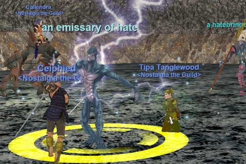

Back to: [West Karana](/posts/westkarana.md) > [2008](/posts/2008/westkarana.md) > [June](./westkarana.md)
# A look back in (r)anger

*Posted by Tipa on 2008-06-09 07:56:51*

  
*Call of Sky FTW, beyotch*

Friday's journey into the Luggald caves of Dulak's Harbor brought all of us many more levels and some of us have even strayed perilously close to level 52, the current max level for us in Nostalgia the Guild. I have locked my experience at level 51 for now so that I can work on AAs. I've gotten three so far; the plan is to have a bunch saved up so we can spend them as we reach the next milestones.

We're locked at 52 so the newer members have plenty of time to catch up, and we're locking at level 52 so that when everyone is caught up, we can go together into Nagafen's Lair and Permafrost and take on those scourges of the Old World, Lord Nagafen and Lady Vox.

There's a reason that Lord Nagafen never dared attack me in EQ2. He remembered what I'm about to do to him in EQ1. Time travel really does wonders with tense.

Saturday I tested out the veteran rewards we will use to make dragon killing possible with just a couple of groups. There's one that provides you with fantastic armor and lets you crit a lot, and another that improves your health and raises all your stats to their caps. With those running, I soloed the dragon Wuoshi in Wakening Lands with my *cleric*. Not usually known as big soloers, clerics, but Wuoshi (a druid) never landed any spell on me, and his melee attacks were met with my 660 point damage shield and my stun/nuke landed just fine. Most of the fight was spent chasing Wuoshi all over Wakening Lands as he tried to run away. He dropped some nice spells, but the loot was decidedly out of date. I wouldn't have even attacked him at all, but he attacked me when I ported in to WL. I don't care who you are, drake or dragon, if you try to kill me, I will try to kill you back. It does show that Stargrace's idea to use vet rewards to protect us from the dragons' punishing AEs is likely a winning strategy that will let even very casual players like ourselves succeed at the dragon kills we need for our epics.

It's been less than two months since I returned to EQ with an entirely new character (we started April 19th). Playing very casually, I leveled to 51 in what would have been an astonishing speed back when EQ was young. Even if you AREN'T a Living Legacy returnee, the addition of hot zones and the easy availability of decent gear has lowered the bar of entry considerably. Restarting with a few friends has made all the difference as well. With no real reason to level quickly, we just do whatever seems the most fun at the time, and levels take care of themselves. A few hours spent chatting with friends while sitting in Shadowhaven working on fletching is just as much fun as raiding, maybe more so.

EverQuest is in the news again because of the Living Legacy promotion. And I see a lot of anger about this in the blogs and news posts I read about it. Why? Not just because it seems new players are getting rewarded where existing players are not, but because the common wisdom is that EverQuest is a BAD GAME, and people who profess to enjoy it are HAVING FUN THE WRONG WAY. We're SUPPOSED to be having fun in WoW or AoC while looking forward to having fun in WAR. Having fun meaning, rushing to max level, and then raiding or doing PvP. Having fun by rejoining an OLD game and NOT rushing to max level and NOT raiding... there's nothing quite as wrong as that.

EQ is still the same game that once boasted nearly half a million players, but has now been largely lain aside by players looking for newer games. EQ hasn't really changed, it's natural for people to get tired of a game, or frustrated with the people they play with, or just to want that newbie feeling again, and move on. I did. I came back. I will probably leave again at some point.

But you know what? I wouldn't trade the friends I have met in EQ for all the spiky shoulderpads in WoW. Because when you total up all the good things in your life, the number of times you cleared Karazhan or the number of purples you wear don't matter at all. But friends, even friends you meet while playing a game, those last.

I played EQ for seven years because of friends, and I am playing it again because of friends both old and new. Want to know why I am playing EQ, and why it is still a fantastic game after all those years? It's because it is a game that requires making friends. It's a game that nearly forces you... to care about other people. It's a subscription-based social club.

EQ was never really about being uber, though lots of people thought it was. It was about meeting people you could share the ups and downs of your life with, about making friends. Friendships that have endured in some cases nearly a decade.

## Comments!

**[stargrace](http://mmoquests.com)** writes: I count myself lucky to be fighting in Norrath this time around with some of the most amazing people I've ever met. :)

---

**[Einhorn](http://iceclad.wordpress.com)** writes: *sniffles* I love you Tipa! I love you Stargrace! I love you Malfi, but stop grabbing me there!

---

**[stargrace](http://mmoquests.com)** writes: You know you like it..

---

**Gnewton** writes: What about me Einhorn! /sniff

I couldn't agree more Tipa. I've had the most amazing time the last couple of weeks. I owe it all to Nostalgia :)

---

**Malfi** writes: I love you guys too! Hooray for Nostalgia!

And Einy, it wouldn't be there if it didn't want to be grabbed!!!!

---

