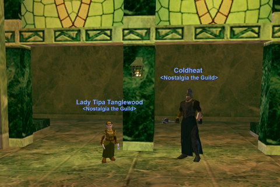
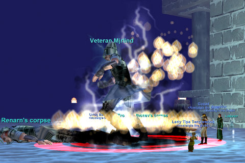

Back to: [West Karana](/posts/westkarana.md) > [2008](/posts/2008/westkarana.md) > [June](./westkarana.md)
# Dungeons beginning with 'K', for $100

*Posted by Tipa on 2008-06-14 07:19:04*

I really have to start scouting out dungeons before I put them on the schedule. I really thought I remembered Kaesora being higher in level, but when Coldheat and I reached it, all I saw on track was an endless sea of gray and green. Kaesora still has this odd power I ave never fully understood, and before we knew it, we found ourselves looking back up at the two hundred foot drop we'd just come down, and we were forced to fight legions of scary skeletons and stealthy spiders to return to the entrance. Here's Coldheat and I appreciating the wonderful architecture of the Library. Other people were logging in, so we cut short our trip and fought back to the entrance. Kaesora wasn't a challenge, and without a challenge, adventuring is no fun.

Urtog came up with a list of possible other places to group. Karnor's Castle was on the list, as was Nadox, Tower of Frozen Shadow and the Plane of Growth. Well, I can't kill in the Plane of Growth and also complete my epic, so that was out. ToFS is a little low for us unless we are headed to the very top. Karnor's Castle would be a little high for most of us, unless we wanted to just stay at the front. In the end, we headed off to Kael Drakkel, the city of the frost giants in Velious.

Before Defiant armor started dropping, Kael was on the schedule for Thurgadin quest armor. But now, nightly Kael farming for maybe one or two pieces of armor per night is silly when you can buy better in the bazaar, several pieces for the price of one LoN booster pack. It's weird how the EQ economy has changed so much. LoN booster packs finance the acquisition of insanely great armor, completely bypassing the old economy. Urtog tells me that the armor will stop dropping when the Living Legacy event ends. While it will be nice to have a reason to adventure again, that's going to make a huge gap between the people who played during these two months, and those who did not. Speculators are already paying top dollar for the top tier Defiant gear in hopes of waiting for the price to grow by a couple of orders of magnitude this fall.

I think SOE will be dealing with the severe damage Defiant armor has done to the economy for a long time. While it would have sparked even more complaints, making the armor no drop and available only to returnees would have given the returnees the leg up they were intended to get, without making most other non-raid armor worthless. Our little guild was working on cultural crafting and other useful arts; that all stopped the moment Defiant started dropping.

I am scrambling to get Intricate Defiant armor (level 48-60) for Tipa. That will easily last me through my 60s, and is a fantastic investment. I am paying for it with LoN booster packs, of course. From discussion in the Bazaar, it sure sounds like crafted armor is the non-raider high level armor. I'll bet the components for it are pretty rare, though.

8 AAs now! Even though Kael wasn't fantastic experience, most people got at least a level, some got two, and one-two AA for those who were working on them.

Said had changed the Guild Message of the Day to "Work on your epic!". Soundly chastised, I went to work on mine when I was bored one evening. Luckily I have my druid, Etha, to port me everywhere and to handle any fights that might happen. For the elf druid in Greater Faydark, Tipa could stay at her spawn point while Etha tracked down and killed any potential Orc Pawn placeholders. And while Tipa turned in the seals and necklaces to the druids in East Karana, Etha could be ready to kill the Dark Elf Corrupter and his two Reaver friends.

She kept them busy when they spawned long enough for me to run there and help with the killing. The druid circle fled after I handed them the Corrupter's book; I handed the note they gave me before they split to Ella in Misty Thicket, and am now doing my epic harvesting. After that, it's some tedious factioning in Felwithe and the fight against Venril Sathir's Remains in Karnor's Castle.

Next week, we're doing another Hot Zone for levels and AAs as we prepare to kill Naggy and Vox. It will either be Nadox or Akheva Ruins, whichever looks more fun. Personally, I'm tipping toward AR, because of the spells that drop there -- some drop only in that zone.

## Comments!

**[stargrace](http://mmoquests.com)** writes: Sounds like it was oodles of fun, no matter where ya'll ended up! :) Sorry I couldn't make it this week, but I did get a nice full sleep for the festival (today *cheers*) - congratulations on the epic bits!!

---

**loredena** writes: I love Nadox, but we took a brief run in there Sunday night, and there were literally 2 dozen people in there. I flipped on track and there were ZERO mobs in range (admittedly my track isn't that great, but still)

---

