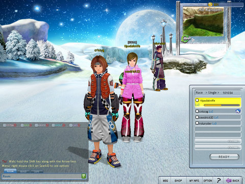

Back to: [West Karana](/posts/westkarana.md) > [2008](/posts/2008/westkarana.md) > [June](./westkarana.md)
# Project Powder: Shredding the Galaxy

*Posted by Tipa on 2008-06-26 07:19:36*

It looked like it might have been an MMO, and I wrote up [a quick article](http://www.massively.com/2008/06/20/shredding-the-galaxy-in-project-powder/) thinking it *might* be, but Project Powder really isn't. What it is, is a helluva fun online snowboarding sim with chat channels, guilds/clans/crews, levels, more tricks than you can handle, and an item shop.

Here's a really terrible video I took from one of my first runs through the game. Yeah, I don't win and I fall a lot, but I was still learning, and this video covers the entire action, from the snowball-throwing lobby to the finish line. For some reason, Fraps didn't catch the hp-hop soundtrack, so I replaced it with selections from the .hack//sign sound track, Ayreon, and Phish. Sorry, no ear-killing death metal. I can feel your disappointment from here. Also contributing to the terribleness of this video is the fact that it is squashed horribly. This was widescreen, hi-def and looked fine on my PS3 when I uploaded it, folks.

  
[ProjectPowder.wmv](http://files.filefront.com/ProjectPowderwmv/;10803595;/fileinfo.html "ProjectPowder.wmv")

And just to prove that yes, I CAN win:

Before you get out on the slopes, you need to learn how to play and how to do tricks. The excellent tutorial will get you used to moving around on the course (though their battle mode left me confused), and the license system feeds you a couple of tricks a time to learn as you level, so you're not overwhelmed all at once, though when you see higher level people on the course busting moves and racking up points two or three times yours, well, you just want to get another level. You'll soon learn to do little quick tricks when you find yourself in the air, and big, long elaborate ones to do while you're plummeting off a cliff. In fact, you only really need those two moves, but you'll want to mix them up.

Project Powder is at its core a racing game. Most of your time will be spent out on the slopes, racing. That's the only way to get experience, and that's the only way to earn money Sparkcash. You can *buy* money Sparkcash, of course, but that won't get you as much as you think.

Most of the things you would want to buy, are only rented. A couple dozen races will land you a new outfit and a hot board, but you're only renting them. After 7 days, or a month if you pay a bit more, your stuff goes back to the shop. No problem if you're racing every day and always changing out your outfit anyway. but take a few days off and you'll come back wearing nothing but your newbie clothes.

That's kinda why it's important to [reach level 5 in closed beta](http://projectpowder.outspark.com/cbLayer/announcement/1404/?keepThis=true&TB_iframe=true&height=395&width=581). If you manage it (and it isn't that hard; I was within easy reach of level 4 when they closed the servers last night), you get to earn a closed beta test hoodie that won't go away after seven days.

You can also (for 50,000 points) buy whichever of the three closed beta characters you didn't start with. These characters are yours permanently, and I fully imagine more will become available when the game goes live.

The lobby is a gentle snowfield on this snow-filled world you've discovered (in the game's backstory, global warming has made snow vanish across the Earth). You can chat, you can discuss your clan (the clan I'm in: BDSM. ALWAYS ask about the name of a clan before you join.), you can talk about the gold farmers who will join the game and just sit near the starting line for the cash, you can throw snowballs (click on the snow to make a snowball, click on another player to hurl it at them).

Once everyone clicks READY, the room host (and, I suspect, the person whose computer is running the race, typical of lobby-based games) starts the race and you're off. 

Your experience gain is based upon your distance from last place. Last place finishers, or non-finishers, get very little experience. So if you're shredding by yourself, you will take a long time to level. With two people, the second place finisher, no matter how good, will get nearly no experience points. Get four people in a game and just avoid being last, and you're all set. 

The racing is exhilarating. The animations are great, the characters -- all three of them -- are cute and expressive. The outfits and accessories you can buy to customize your character are very nice and very affordable, though having to keep buying them is an epic fail with me. If I work hard for an outfit only to see it evaporate after a week, I doubt I will bother buying it again, much less spend real money on it. Though if buying it with real money gets a permanent copy, well, then I just might do it. Not having put money into this game, I don't know.

I could totally see an MMO or an anime based on snowboarding. Sadly, this isn't it. Project Powder is a well-executed, free-to-play, lobby-based snowboarding sim, and why not? [Sign up on their web page](http://projectpowder.outspark.com/), and check out their other games, some of which really are MMOs. If they are anything up to the quality of Project Powder, they might be one of the few Asian imports worth playing.

## Comments!

**[Cow Nose the 50 Pound Cat](http://cownosethe50poundcat.blogspot.com)** writes: If I wasn't so terrible at racing games I would totally play this!

---

