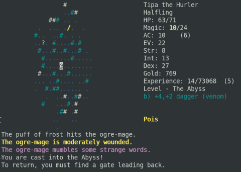

Back to: [West Karana](/posts/westkarana.md) > [2008](/posts/2008/westkarana.md) > [June](./westkarana.md)
# Floating in the abyss with Dungeon Crawl

*Posted by Tipa on 2008-06-27 08:11:38*

I've been traveling a lot lately, and have had a lot less time to sit in front of a computer and game for any length of time. Luckily, I have my Asus Eee -- the latest electronic device to beg its way into my heart -- and [Dungeon Crawl](http://www.dungeoncrawl.org/).

Way way WAY back in 1980 or so, there was a game on UNH's DEC-10 server called "[rogue](http://en.wikipedia.org/wiki/Rogue_(computer_game))". It was resplendent in glorious 80x24 text graphics, but was buggy and crashed a lot. Still, there was something lurking in those randomly created dungeons that I wanted to play more. After I moved out to California, I discovered Hack, a re-imagining of Rogue, and Net-Hack, an open source, collaborative version of Hack; and I played that for years and made some minor contributions of my own (mostly new traps, IIRC).

When I started getting into Linux, Nethack was one of the first programs I put on it. But the magic had gone. The game was still insanely difficult -- like all variations on Rogue, you had just one life, and when you died, you were gone, all save files deleted, a tombstone placed, and your ghost set wandering through the dungeon to ambush future explorers.

While Nethack was a fun sandbox to play in, I preferred the more game-like Moria and Larn. Yeah, back in the 80s, these were a HUGE genre that survives today in games like Diablo II, Mythos, Pokemon Mystery Dungeon and Dark Cloud.

Anyway, I was looking for a more modern Rogue-like, and I happened upon Linley's Dungeon Crawl. This had dozens of races and classes and the same sort of evil genius and unlimited creativity as Nethack (well, not quite up to Nethack. In Nethack, the saying was that the devs had thought of EVERYTHING.)

I'd played with Dungeon Crawl awhile, but was frustrated by always getting really invested in my character, and then having it die, deep in the dungeon, meaning not only would I have to restart from the beginning, I'd have to fight my previous character once I got to that level. As well as any random (NPC) adventurers who also were exploring the dungeons.

That was pretty much the same thing all over again when I went to the Bronx last weekend to see my niece's dance recital. I'd start down the dungeon, carefully testing the various potions, scrolls and armors along the way (you have no knowledge of the effects or magics on anything until you try it and hopefully can figure out what it does. Sometimes even trying it doesn't help). I left a dozen characters dead at various spots in the dungeon. Since there were so many classes and races, I just let the game give me one randomly. It eventually rolled me up as a Merfolk Stalker.

Merfolk are water people who can swim fast, but whose tails turn into legs when they reach land. Given the trouble of traveling and fighting in Crawl's subterranean lakes and rivers, they have a natural advantage. Stalkers are stealth-based characters similar to Thieves and Assassins, except their stealth powers are supplemented by a certain skill in poison magics.

Since none of the stealth classes can really take a hit, the best opening attack possible is an arrow through the heart of a resting or unaware creature. When that opening attack is a magically-summoned poison sting, even if the surprise attack doesn't get them, the poison might.

That uber character made it to level 8. Stealth doesn't matter much when you have half a dozen monsters running after you, many casting spells.

Once back at home, I installed Crawl on my Linux desktop and got serious about it. The FIRST thing I did was to cheat. I wrote a script that would back up save files so Crawl wouldn't be able to delete them when I died. That wouldn't make me a god in game (demi-god, btw, is a possible character race), nor make me magically able to kill things I couldn't kill (like hydras...), but at least I might be able to see the game.

Then I got busy with Tipa, the Halfling Stalker.

Gameplay in Crawl is wide-open. Just because I started out as a Stalker didn't limit me in any way as to what I could learn. And in fact, learning different combat styles and magics is key to succeeding, since stealth becomes less and less useful as you descend, and you need to do more and more dps to survive fights. Tipa, at level 15, is on the verge of learning the ultimate Stalker ability, Invisibility, which should allow me to assassinate, or at least heavily wound, many monsters on my first hit. But I also have a certain ability in ice magics, and a wide variety of skills to let me better get through the dungeon -- including an incredibly handy spell that reveals every secret door in a dungeon level. Knowing where to find safe havens where I can duck into, slam the door shut behind me and rest up to full health (or to wait off poison and sickness) is great.

Even with the save game cheat, winning would be impossible but for a special amulet I found. Linley keeps you moving through Dungeon Crawl by forcing you to always be seeking food. Just moving around makes you hungrier. Casting spells (and Stalkers are a poison magic based class) makes you hungrier, FAILING to cast a spell makes you even HUNGRIER, and there is very little food in the dungeon (sometimes you come across food-rich places like strawberry groves... tended by swarms of killer bees, of course). If you relied only on that, you wouldn't get past the first five levels. If you are VERY hungry, you can cut up a corpse of a monster and eat that to take the edge off. Unfortunately, many monsters are not good to eat, and can poison you or make you sick, at which time you usually die.

I found an Amulet of the Gourmand, though. This lets you eat dead things without being hungry, and somewhat widens the kinds of creatures you devour. So I am never hungry for long. I can just eat my next kill. This lets me pick up more magics because though learning new spells makes me very hungry, new food is waiting around every corner. My ring of poison resistance helps a lot, too. The Amulet comes with a warning, though, that eating too much monster flesh using its power may come back to haunt me. Because using magic of any sort can change you.

I briefly had horns after an experiment with a potion I found. It cut my strength, but made me more dexterous and with the horns, I could do a head-butt attack occasionally. Unfortunately, further potion experiments cured that mutation.

I also have a love-hate relationship with my god, Zin. He is a good god who hates necromancy, so I have avoided learning those sorts of skills. He loves it when I give him all my stuff, so when I pass by his altar, I sacrifice all my magic items I am not using to him. And he loves me killing the undead, so I do that when I can, dedicating the kills to him. I am now an Elder in the Church of Zin, and he has granted me the powers of repel undead, minor healing, and plague. If I anger him, though, he will take all those away, and has. There's a whole school of summoning magic, which calls animals and monsters to your aid. Letting any of these summoned creatures die -- angers Zin, and you get put right on his shit list. Using magics to charm a hostile monster is fine with Zin, but if that charmed monsters dies... you get put on Zin's shit list. Everything you do, you have to ask -- will this anger Zin? Or will he reward me for it? I once spent hours performing penance for Zin after I summoned a bunch of bats and one got in the way and I accidentally killed it. So mostly I don't use summons or charms these days unless I really have to. The ghosts of my dead selves I meet occasionally don't care. Tipa's Ghost typically summons at least a dozen monsters to harass me while she stands off at a distance and hurls poisoned darts at me. Man, I'm an annoying mob.

I'm still nowhere near done. Typical of open source games, people take the game, add even yet more stuff to it, and merge that back into the original. I have been thrown into the Abyss, descended into the Lair of Beasts, found hidden temples, a swamp filled with slime, been trapped in the Snake Pits, chased through the Orc Mines, and am currently exploring someplace called The Vaults.

Modern RPGs don't have one tenth the complexity and depth of Dungeon Crawl. They also don't have text graphics. Modern games are graphically astounding but have lost a LOT of of the play value of these RPGs from the 80s and 90s. This is the root of my frustration with modern-day MMOs. Way too much focus on making beautiful screenshots. Almost no focus on letting you stretch the boundaries and go your own way. A game like WoW forces you into such a narrow track -- every class has pretty much one best way to kill something -- that there's no surprise people get bored so quickly.

I realize I may never finish Dungeon Crawl. I have tried before and never have been able to finish it (or Nethack). I may and probably will come up against a challenge I just can't meet. Maybe I'll have to go back through the dungeon looking for more items and magics to help, and maybe even they won't be enough. But shouldn't RPGs, even MMORPGs, be more about the journey than the end? Racing through content to get to the GOOD stuff is the mark of a game without imagination. The game should be as fun and rewarding at level 10 as at level 100. If old, free, text-based RPGs can do it, why not games with hundreds of millions of dollars behind it, like WoW?

There's really no excuse.

## Comments!

**Einhorn** writes: I used to really enjoy the text-based MUD I played for a while. The Immortals (the GMs) of that game would occasionally take over the actions of a particular NPC and make him do crazy things when they got bored.

My character was a Ranger, and because the giant oak that served as the Ranger Guild was one of the few safe-from-PVP havens in the game, I often would idle there. Within the great oak was the leader of both the Druid and Ranger classes, Brother Oak. He was once a man, but because of his dedication to nature he was slowly becoming more tree than man. He was a solemn, holy, blessed denizen of the forests who watched over them with a quiet dignity. What a perfect NPC to be corrupted by bored GMs!

So one day as I'm idling next to "Old Oaky" he's doing his normal, scripted, idle emotes:

Brother Oak smiles warmly.

Brother Oak says: Nature is all around us, we must cherish it.

Brother Oak hums a soft tune.

-----------

Here's where the GM got bored, noticed me idling next to him, and decided to get "creative":

Brother Oak slowly places a bark-covered hand on your ass.

Brother Oak squeezes gently.

Brother Oak says: I'm about to cherish THIS!

Kuron shouts: HELP! BROTHER OAK IS TOUCHING ME!

Brother Oak binds your arms and legs with strong roots and places a handful of leaves in your mouth.

Brother Oak says: Shhhhh shhh...no more words....

/exit tree

You climb down the tree and touch ground below.

You are below The Great Oak. All around you the forest is dark and quiet. This peaceful grove has an aura of calm within it. A deer nibbles at some grasses in the mist nearby, wary of you but unafraid it continues enjoying its meal. There is a rope dangling from a high branch that you might be able to reach. The path continues passed the tree and deeper into the forest.

You can go: Up, East, West, North.

Brother Oak shouts: COME BACK! I'VE STILL GOT WOOD!

----------

Shortly after this I received a private message from Arcturus, the GM responsible, laughing at me. He coded himself into the game as a Penguin - and this is just the sort of antics I'd expect from someone who would do that!

---

**[Tipa](https://chasingdings.com)** writes: lol :) MUDs are cool, but I never got into them the same way I got into roguelikes.

---

**[Captain Angry](http://www.captain-angry.com)** writes: Angband was/is my rogue of choice. It was a pain in the ass when Smeagol showed up in a level, he would steal your money and items, immediately stealth and be impossible to catch.

---

**[Openedge1](http://simple-n-complex.blogspot.com)** writes: OMG

Flashbacks. You always do this to me. Acid was very bad ...did you know this? I didn't when I was a teen (Oh My)

Anyways, all grown up now, and looking at this just made me think of how good these games use to be. BBS'ing for downloads, that would take 2-3 days on my 2400 baud. My 300+ phone bill afterward.

Ok...NVM...flashback over. Glad to be an adult with real graphics.

Back to work...cya!

---

**Gnewton** writes: Great stuff Tipa :)

My first adventures across the world wide web were in a world known as Kobra. It was a Star Wars based MUD and I was hooked. I remember killing scruffy nerfherders, some kind of druggies, etc. It was awesome. I used to spend HOURS and HOURS in the college computer lab located under engineering building. Hours.

Ah... the memories!

---

**[Kanad](http://shatteredblog.wordpress.com)** writes: I loved Nethack, but I think I've said before that I used one of the tile graphics engines to play (my favorite was NoeGNUd.) I was excited when the recent PS2/Wii game Baroque was described as a roguelike, but it just isn't as deep or as interesting as those old games.

Do you think it's just the community influence that drives a game to become so complex? I know that recent games that have been released with editing tools like Neverwinter Nights and Oblivion have huge communities of content developers but it is created and used in a different way... there's no one huge release that continues to get more and more complex. I wonder what the difference is?

---

**[Tipa](https://chasingdings.com)** writes: Roguelikes are made for programmers. You can *see* the objects and their behaviors moving around; it's about as direct translation as to how programs work in graphical form as you can find. It's easy to see how changing a class behavior would translate into the game. I was browsing the Crawl developer's mailing list, and they were discussing whether a skeletal dragon should behave more like a skeleton, or a dragon.

NWN and those sorts require a lot of talents -- modeling, writing, scripting, but not much programming. Where I think tacking a rudimentary faction system onto Crawl would be kind of fun and lead to some interesting gameplay strategies, I would have no idea how to go about it in NWN... and I'd also have to write an adventure that used it, and it wouldn't change the main game at all.

---

**[rmckee78](http://www.otherlivesthanthisone.blogspot.com)** writes: I love roguelikes. One of my favorite blogs is @Play over on gamesetwatch.com (http://www.gamesetwatch.com/column\_at\_play/). It is soley based around rogulikes. here are some that I enjoy:
Doom Roguelike: this is one of the most polished roguelikes I have ever played. Best use of sound, hands down
Shiren the Wanderer (DS): I was so excited when this was released. It is very well done and probably has the best graphics of any true roguelike
Dwarf Fortress: Not truely a roguelike by the most puritanical standards but it is still a complex game that it is possible to lose.
D+D: various editions (including 4) have come with random dungeon generators and wandering monster tables. You can literally play the game by yourself with this if you want.

To me the roguelike, the sports game, and the limited lives shooter are the only remaining video games that are still games. This is because you can lose them. I would love to have an MMO with a very short leveling curve, permadeath, and item identifying in it.

---

**Graktar** writes: My first (and only real) experience with a roguelike was Moria on the Commodore Amiga (sometimes referred to as UMoria or Graphical Moria). Unlike most roguelikes it had basic sprite graphics, which really made a huge difference to getting into the game. It was still obscenely hard, and since I had no hard drive and loading from a floppy disk always resulted in a crash I couldn't save and couldn't get very far in the game. I think level 20 is the deepest dungeon level I ever saw and level 27 or so is the highest level I ever attained. My best character ever managed to get himself killed on the town level by randomly polymorphing hapless citizens into monsters - one of them became a Dark and Stormy Knight and killed me almost instantly.

I'd love to play a roguelike again, but I just can't handle the text graphics thing. Mostly I'd like to be able to play graphical Moria (with the ability to actually save a character) but I've never been able to find an emulated version quite like it.

---

**[Toldain](http://toldaintalks.blogspot.com)** writes: Change UNH to Stanford, and Dec-10 to Vaxen, and your experience is mine, Tipa. Did you ever run across the "magic arrow" in rogue? When mobs shot an arrow at you and it missed, you would sometimes be able to pick it up. And very rarely, you would get one where the damage modifier would be trashed, and have a value of +153943229 or so. Give or take a few million. 

Of course, you would think you were invincible, going around stabbing people with the arrow. (Just like Legolas!) And then you'd die to a poison arrow trap or something. Or get petrified and killed.

Vicious, but I have fond memories.

---

