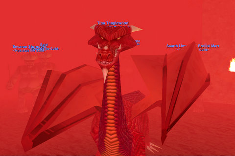

Back to: [West Karana](/posts/westkarana.md) > [2008](/posts/2008/westkarana.md) > [June](./westkarana.md)
# Being Lord Nagafen

*Posted by Tipa on 2008-06-28 01:54:38*

We'll talk about this picture in a little bit :)

Now that everyone in the Friday group is 51 or 52, it was time to stretch our wings a little bit and do something even casual guilds do on occasion -- raid. And we being a Nostalgia guild, the only POSSIBLE thing to raid would be the scourges of the old world, Lord Nagafen and Lady Vox.

These dragons have some restrictions -- anyone higher than level 52 gets punted from the zone. The condition arose when the Ruins of Kunark expansion let everyone level to 60, and the dragons suddenly became trivial to kill. So they added the level cap, and ever since, level 52 has acquired an unholy reverence, your one chance to kill the dragons before departing for more mundane challenges.

We've known for awhile that the dragons were on our list, and so we stopped ourselves at 52, and there we will stay until we have killed both these dragons at least a couple of times each.

I kinda knew we were going to be disappointed with Naggy when he didn't show on tracking even as we neared his lair. Ssrath (Egat from Erollisi Marr and Crimson Eternity) earned his scales by learning how to pull the giants as we went along. By the end, we were getting just the number of giants we wanted just when we needed them -- perfect! Though Naggy wasn't home, most of his friends were. We got a lot of uber loot -- uber for 1999. Unfortunately, none of it was any upgrade for anyone.

We'll be back when Naggy is home. We know -- KNOW -- we can kill him.

How can we be sure? Because we nearly took down Vox in the worst possible circumstances. When we finished in Nagafen's Lair, we made our way to Permafrost, because there was dragon steak on the menu and a restaurant full of hungry raiders.

While Naggy's lair is fairly empty, Vox has a LOT of friends. Friends she cares about, and wants to help when they are hurt. Because she's a cleric. and helping her friends is not just her job, it's the entire reason she gets up in the morning. 

We just could not separate her from her giants. Sometimes five or six would come along, sometimes she'd only show up later. One time, we got her alone, and were doing mean things to her, when her loyal friends arrived. We were so close, but we had no real way of stopping her from completely healing herself aside from just hoping she would run out of mana. The Infusion of the Faithful veteran reward AA worked fine, but nothing could stop her slowly stripping our buffs. It didn't matter, the giant adds ate our healers and then everyone else.

Next time, we'll have new strats for clearing out her lair. The traditional way to kill her is to drain her of mana so she can neither CH nor gate home. We'll see how that goes.

A couple of upgrades dropped from random named mobs, and that is always a nice thing. We'll get Vox. And we'll get Naggy. These dragons are not beyond us; we just need to get the adds dead before we take on the dragons. Without Vox's adds and complete heals, Naggy should be easy-peasy. If we can find him up.

We'd done what we set out to do -- get some experience with the encounters. We didn't expect we'd kill any dragons tonight. We wanted to see if it was possible for us to kill dragons. The answer was a definite yes. Vox never hit me for over 200 points -- her friends and her CH is all she's got. Naggy won't even have those.

Still, we wanted to see Naggy. And with the Nagafen Monster Mission, you can. You and your group take the part of Lord Nagafen and five of his fire giants, and kill and keep killing everyone in this annoying guild that wants to kill you all. After a quick defeat on our first try, we figured out the winning strategy. I, as Naggy, would pick off the raid one by one while the warriors kept the clerics busy, and the fire giant cleric kept me alive (I didn't do so well keeping HIM alive a lot of the time, but he'd respawn and anyway, there were sixteen people trying to kill ME). The clerics happily wasted their CHs trying to keep themselves alive while I breathed living flame all over the place. After six tries, the NPC guild gave up, and left behind experience and some caster gloves which Gnewton won and were an upgrade!

Next week is Independence Day, so we won't be meeting. The week after that, though -- dragon steaks for everyone.

## Comments!

**[Michael](http://www.mmognation.com)** writes: This is how out of touch I am: I didn't even know you could *do* that in Monster Missions. That's fantastic! :D

Thanks, Tipa.

---

**[Tipa](https://chasingdings.com)** writes: Yeah, monster missions are pretty cool. They're all over the place; this one starts (predictably) in Lavastorm.

EverQuest has always pushed the bar of innovation. One of the most absolutely frustrating things about playing EQ back in the day was people going ga-ga about new features in other MMOs that EQ had had for years. But because they had been on EQ first, they didn't *count*.

The three linked monster missions where you play the first Coldain dwarves to discover Thurgadin and make that their home -- and teach the frost giants not to stray too near -- is a popular way to level. There's a cute one where you and your friends play some fairies who are trying to rescue someone from horrible goblins (IIRC) in Nektulos.

Maybe some day a modern MMO will add monster missions (LotRO monster play is not the same thing) and shrouds, but I dunno. Most modern games don't even let you turn off your adventuring experience so that everyone can stay at the same level and yet play as much as they like. In EQ, we're shunting off all our experience into AAs.

---

**[stargrace](http://mmoquests.com)** writes: Sounds like it was still oodles of fun, despite Naggy not being at home. Best of luck to catch them up next time!!

---

