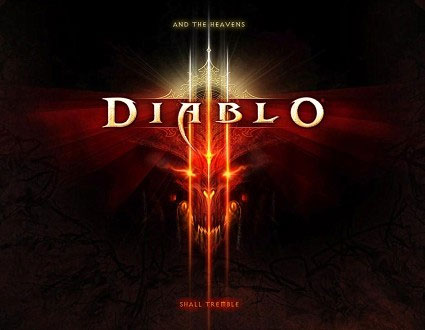

Back to: [West Karana](/posts/westkarana.md) > [2008](/posts/2008/westkarana.md) > [June](./westkarana.md)
# Blizzard announces Diablo III!

*Posted by Tipa on 2008-06-28 07:04:40*

Ooooo.... [Diablo III](http://blizzard.com/diablo3/) looks so cool....

Oh, I know this is the millionth blog to announce it, but whatever :) But it seems [Diablo 3 is real](http://news.bigdownload.com/2008/06/28/blizzards-newest-game-diablo-3/)! My kids and I all played D1 and D2 back in the day, though I'm not sure we ever played it *together*, this being before we got that whole LAN thing worked out.

With D3 on its way, the people over at Flagship Studios (many of whom worked on Diablo II) must be wondering how D3 will impact the forthcoming Mythos and the already-out Hellgate: London.

Mythos is still technically an MMO, but since it is soloable, there likely won't be much difference in actual play between that and D3. Soloable MMOs, after all, are just single player games with the occasional PC thrown in. I doubt playing D3 with a few friends will feel any different than doing an instance group in WoW.

Anyway, exciting news, I'm definitely looking forward to seeing it.

## Comments!

**[Ally](http://www.toomanyanimals.blogspot.com)** writes: Yay! Can't wait! Sean, Matt and I are super excited. Finally, a game suitable for Matt to begin on. :-D

---

**[Captain Angry](http://www.captain-angry.com)** writes: WOOOOOOOOOOOOOOOOOOOOOOOOOOOOOOOOOOOOOOOOOOOO OOOOOOOOOOOOOOOOOOOOOOOOOOOOOOOOOOOOOOOOOOOOO OOOOOOOOOOOOOOOOOOOOOOOOOOOOOOOOOOOOOOO!!

---

**[Captain Angry](http://www.captain-angry.com)** writes: Sorry didn't mean to break your theme. That was the barbarian in me coming out.

---

**[Tipa](https://chasingdings.com)** writes: I'm really looking forward to it, too. I bet it won't be out for ages though.

---

**TheRemedy** writes: Only time is needed to kill Hellgate, not D3.

---

**[Tipa](https://chasingdings.com)** writes: Is H:L doing poorly because it is a bad game, or because it wasn't enough like Diablo II?

---

**TheRemedy** writes: Probably a lil of both and more. I think the biggest flaw was the subscription model when it didn't really fit. The world was primed to be ad supported in most places (could have made the ads gritty and such to fit) and to release the content as dlc/expansions.

Don't get me wrong though, if you enjoy a hack n' slash you will get some enjoyment out of hellgate. I just don't think it has what it takes to keep players there.

---

**Einhorn** writes: I liked Hellgate: London only as a way to pass time.

"Hey I'm bored and I have exactly 32 minutes before work...I think I'll go do the Museum again and see if I can get some loot."

The game, for me, was just "something to do between doing other things". Other than that it never really grabbed my attention too much. The one thing I really like about it is when you group you don't have to share anything that drops because you get your own big pile of loot after a boss kill. All the loot that you see dropping, only you can see.

---

**[Tipa](https://chasingdings.com)** writes: Mythos and Dungeon Runners has that too. I imagine D3 will, too :)

---

**Einhorn** writes: For the passed 3 hours now I've been completely sucked into the D3 site. I played D1 all the way through once and that was enough, but played and loved D2 many, many times over - since those good years playing D2 there have been a lot of imitation-Diablo games I've tried and none of them had the quality that a Blizzard game does. Out of all of the games I played to get that Diablo feeling, Titan Quest came the closest. It was the most well-made and had a lot of atmosphere. However, it sill wasn't Diablo!

Really looking forward to playing this! The new Wicthdoctor class looks interesting, but I'm curious why they felt it necessary to awkwardly tack on "he can also raise undead creatures" at the end of his descriptive paragraph.

That was the Necromancer's main claim to fame...why would they make another class that can- oh dear...

The paranoid little creature in my head is screaming conspiracy now and insisting they are not including the Necromancer class in this game, and are attempting to pass off the Witchdoctor as a replacement.

I, of course, am doing my best to silence him, because that's completely insane - isn't it?

*reads the writeup on Skeletons and Dark Cultists*

Well, THAT didn't help... now I'm even more paranoid.

*takes deep breath* Now now, Einy, calm down....Blizzard wouldn't dare screw this up...*rocks self*

---

**[Tipa](https://chasingdings.com)** writes: Mmm the people I have talked to assume the WD is the new Necro.

---

**Einhorn** writes: Oh...and like Tipa said, I'm sure in Q4 2037 when the game is finally released that none of us will be disappointed.

---

**Einhorn** writes: DON'T CONFIRM MY INSANE RANTINGS!

How could they POSSIBLY remove one of the most popular characters?! That's insane!

I guarantee they will add some kind of Monk though, playing upon the "hidden" monk class in Diablo 1.

---

**[Tipa](https://chasingdings.com)** writes: My class was always the Sorceress. I tried the Druid when it came out in the expansion, but soon went back to my ol' fave.

You'd be surprised how many people are NOT looking forward to D3. They feel it isn't that different from its predecessor. As Richard Bartle might say, "I've played Diablo 3 already. It was called Diablo 2."

---

**Einhorn** writes: All those people can go screw a birdhouse.

There's certain games where I want more of the same, with only a tiny bit better - Diablo is one of them - and in the bits and pieces I've seen provided on this website I think they nailed it.

There was a time a few years ago when just saying "Fallout 3" to a certain crowd of gamers produced involuntary leg-humping. Now, thanks to Bethesda, things have "de-developed" with that title to the point where uttering that same phrase today will force most of that same crowd of gamers to make the sneering face of the old farmer hobbit from the beginning of Lord of the Rings: Fellowship. You know the one I'm talking about.

In just a few short months what was once a dreamed-about concept has become "Oblivion with Guns!".

I say more power to Blizzard for understanding Diablo 3 should be Diablo 2 with new things added to it instead of a big pile of new things with Diablo 3 built around it. That would never pass fire-inspection, and it's been a death sentence to many, many games.

---

**[Captain Angry](http://www.captain-angry.com)** writes: Exactly right comparing Diablo 3 to Fallout 3. 

Its obvious to me that anybody who is taking such a ho hum attitude towards D3 doesn't actually like the Diablo series, and is just trying to take a cheap shot at it. Its never been a complicated formula: an easy to pick up game played mostly with the mouse, click around a few interesting looking levels, see some interesting looking creatures, kill them and pick up loot. Kill more creatures to get more loot. Kill more creatures to get more loot. Why the hell would they change that?

Diablo, and its nerdier cousin Fallout have always been way up there in my top favorite games of all time. I too worry that Bethesda might be taking the Fallout franchise in the wrong direction with their new installment, but I'll still buy it. I like it that much. Meanwhile, Diablo 3 looks like everything that Diablo-clones have tried to be for the last 7 years, but when you look at the gameplay video, its not a quantum leap to guess that Blizzard, being able to print their own money thanks to WoW, has much potential to put out a truly awesome sequel. Why would they screw that up? Just give us more.

In any case, I'm excited. I take back anything bad I ever said about Blizzard. I'd also step over my own mother to get on that playtesting team, but don't worry mom I doubt they'll be calling me.

---

**Einhorn** writes: Thank you Cap'n! I thought it was a good example as well.

Clarification: I am aware that the Fallout 3 title was traded/exchanged/bought between a few sets of hands - so I'd expect it to be off the beaten path by a marginal amount. My only complaint with Bethesda is that they are touting, flaunting, BOASTING that they are the only ones who can do this right, and bragging how much they are going to honor the original. "We think we're up to the task!"

Bullshit - you haven't even finished the game and you've already removed 3rd person isometric, turn-based, and the SPECIAL system. Aren't those things like...oh I don't know...the CORE of Fallout? So basically they have made us a PBJ sandwich consisting of only two slices of bread, and they are fucking raving about what great chefs they are.

Some words of wisdom for you Bethesda: 

"It's a piece of cake to bake a pretty cake
Unless the way is hazy
You gotta do the cooking by the book
You know you can't be lazy
Never use a messy recipe
The cake will end up crazy
If you do the cooking by the book
Then you'll have a cake"

FACE!

---

