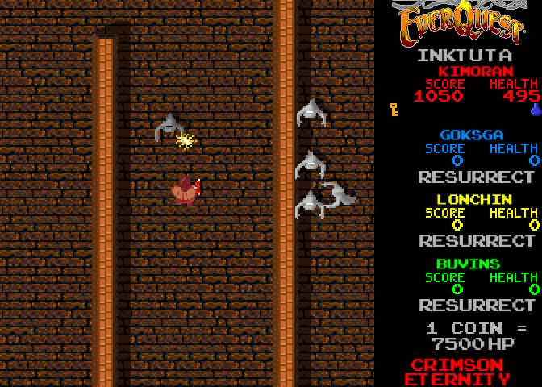

Back to: [West Karana](/posts/westkarana.md) > [2008](/posts/2008/westkarana.md) > [March](./westkarana.md)
# EQ1: Pics from pre-Alpha

*Posted by Tipa on 2008-03-01 08:19:45*

EQ1 wasn't always the raiding powerhouse game it is today. In fact, the game had very humble roots, with little in its first implementation to suggest the game it would become.

Still, it was fun and even at the beginning, was totally addicting.

Screenshots after the jump.

So shoot me :P

Just came across it while looking for old raid screenshots for another article. I made this when I was bored one day and didn't feel like posting yet another screenshot of us dying to grubs in Inktu'ta...

## Comments!

**[Cow Nose the 50 Pound Cat](http://cownosethe50poundcat.blogspot.com)** writes: What the hell? XD

---

**[almagill](http://gudeman.co.uk)** writes: EQII looks like that when you turn all the settings right down.

True. ;)

---

**Stevie Classic** writes: Remember when trolls and ogres were fatties? Yeah...

---

**[wilhelm2451](http://tagn.wordpress.com)** writes: Half elf need food!

---

**Kanad** writes: Reminds me of raiding in Akheva with all the shadows... is the warrior pulling Itraer Vius?

---

**[Tipa](https://chasingdings.com)** writes: Inktu'ta, off of Qvic in the Gates of Discord. It was filled with spooky ghosts. In fact one of the fights was running from ghosts -- one would start to come after you, and you had to run around the room until the raid killed it, because if it touched you, you DIED. And I think spawned another ghost too.

---

**Noffin** writes: What no pics of me????

/sigh

/hug

---

**[Ogrebears](http://www.ogrebear.com)** writes: wow that must of been after the graphic revamp!!!

---

**[Tipa](https://chasingdings.com)** writes: Pics of Noffin inc!

I was getting you to model that cool looking Velious armor. Ah, good old EC tunnel.

Minutes after plunging you to death at the entrance to Kael. Notice you STILL don't have SoE. Actually I'm not sure I had SoE then. I think all I had was a levitate/SoW combo, and levitate took a bat wing as a material component.

Remember this Kaesora trip? Kaesora has always been one of my favorite zones. Can you tell I spent a lot of time in Sol B?

Stabbing Cara in ToFS. Did you ever get her dagger of bandages?

Another pic from one of our many ToFS 4th floor runs while BC mapped the place.

Good old PoK! Weird to think that in all pics but the last one, I still played a druid as my main. I went through rogue and cleric, but you have always been a rogue. You and Anavrin made me want to be one too :)

---

**[Crookshankz](http://crookshankz.blogspot.com)** writes: amazing how the old EQ looks just like an arcade game i think was called Gauntlet 8P

---

**Noffin** writes: I miss all the wild adventures we used to have and all the directionally impaired deaths I incurred :)

---

**Kanad** writes: Heh, I totally missed that it said Inktu'ta under the logo :P The guild I was part of imploded before we got far along in Gates of Discord so it didn't ring a bell :( I miss the old days though.

---

**[Genda](http://www.thegrouchygamer.com)** writes: OMG Noffin! Come visit my blog too! grouchygamer.com

---

**[Tipa](https://chasingdings.com)** writes: I wonder how many people from the old days are still lurking around? I get the sense that a lot of them probably have quit MMOs because they took up too much of their lives.

---

**[Keen](http://www.keenandgraev.com)** writes: The first pic of Noffin looks like my halfling. :D I loved him.

---

